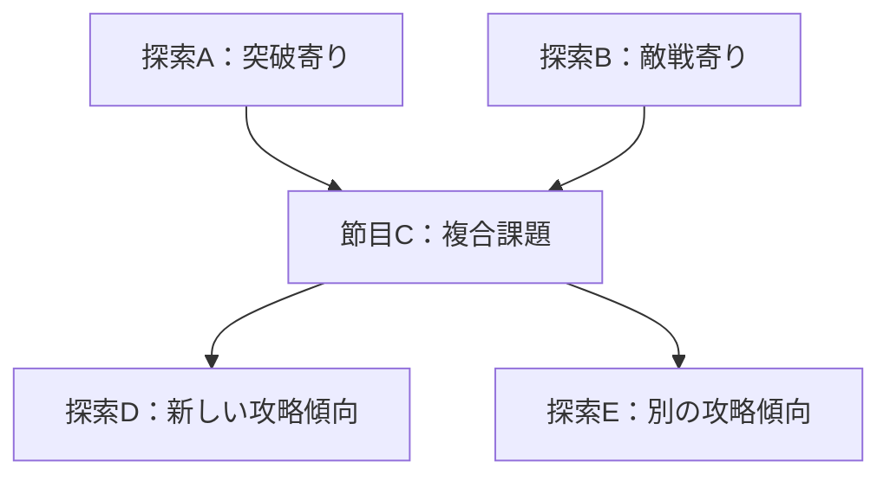

# カード探索ゲーム — 探索全体の設計

更新：2026-09-12。初回比較の参照基点：`f9078a0ba76d833d7f078fa5a9f41931f6ef96e1`。D47反映時の開始HEAD：`94509068fe777bdbb00742ec4e40b757180a7612`。現行の対応は基本設計0.53。ARの比較基点：`4678bdf2d77f118a1d508c0ac75b667440bf1be9`。担当：設計Work `20260909-design-assembly`。

**区分：未決定詳細・未採用案と比較経緯。** 探索先選択・準備・探索・帰還・成長・再挑戦の関係を検討する。2章B・8章の基本方向はD44、9.5の難度方針はD45、12.5の全体進行はD46として採用済み。成長ポイントによるパッシブ習得と帰還後の無料取り直しはD47として採用し、19章に範囲と具体候補を整理した。17章の基礎値配分案は修正前の履歴。具体効果・数値・枠・素材用途・探索内容例は未採用案で、AGの実行範囲は14.5に限定する。体勢採用・調整と操作接続は24章、世界観受入れは25章。基礎パッシブ全習得と修飾による収集はD50・27章。複数入手と資源変換はD51・28章で、所持数量と同時発動数を区分する。同種の限定的な同時利用と制限はD52・29章。探索・取得比較は30章AR、全習得後の用途比較は31章AS、候補取得の採用と可変方針は32章D53、購入接続の結果は33章AT。26章の段階追加案は補足前の経緯、22〜23章はAJと体勢提案時の経緯。採用済みの仕組みは[基本設計](../確定仕様/カード探索ゲーム_基本設計.md)、判断待ちと進捗は[要検討事項](../作業資料/カード探索ゲーム_要検討事項.md)を正本とする。

## 1. 全体設計を再開した時点の優先順位

現在の担当課題と着手順は[別Work始動後の全体優先順位](../作業資料/カード探索ゲーム_要検討事項.md#design-priorities-after-work-split)を参照する。シナリオ・探索内容Workの原引継ぎは、代表案件の対象・選択・帰還と次の準備までを含み、別途提案した探索コンテンツ設計と重なる。[追加指示](../作業資料/引継ぎ/カード探索ゲーム_シナリオ探索内容Work_追加指示.md)で比較条件と受け渡しを補い、本Workは共通規則・数値と進行全体の調整を続ける。

以下は全体設計の再開時に定めた順序であり、D47で成長対象をパッシブ習得へ明確化している。24章は体勢採用後の一次調整時点、33章は最新ATの取得接続時点の課題として読む。

ユーザーから、世界観設定をいったん必要としない設計を再開し、局所的なタスクへ傾倒せず広い観点で重要な設計を詰めるよう依頼された。

既存資料では、札・対象を選ぶ一手、札循環、イベント移行、獲得物の精算を個別に具体化している。一方、どの探索を選び、何を準備し、どんな経験を次の選択へ使うかを決める内容設計は薄い。AE/AFは探索間の処理を接続したが、複数の探索先から本人が目的を選んだ試遊ではない。接続済みの処理量を、探索全体の面白さの確認量と取り違えない。

| 優先 | 全体の論点 | 決まっている前提 | 今回整理する残りの設計と、優先する理由 |
|---|---|---|---|
| 1 | 探索先の違いと再挑戦で変わる内容 | 初見でも攻略傾向を示す。知識を保持し、初攻略で対象の基本構成を知る | 同じ探索先が何を維持し、何を変えるか。ここが決まらないと、対策構築・知識・反復の価値を評価しにくい |
| 2 | 構築・恒久成長・現地での適応の役割 | 成長ポイント＋用途限定報酬、帰還後反映、探索中の共有循環 | 成長で何が楽になり、構築や判断で何を選び分けるか。能力の名前より先に、強くなる体験を整理する |
| 3 | 一回の探索の長さ・緩急と進退判断 | 入口から出発、消耗を継続、踏破による保護、任意撤退と死亡を区別 | 続ける理由と帰る理由を、複数区間の内容・得られる成果・現在の手段へ結び付ける。敵なし区間を自動的な休憩と扱わない |
| 4 | ゲーム全体の進行と挑戦の更新 | 自己強化してさらに探索することが基軸 | 探索先や難しい内容の解放条件、既知の場所へ戻る役割、初攻略後の目標。先の三点を使って進行構成を比較する |
| 横断 | 判断の読み取りやすさと一手の手応え | 確定する今回の結果・行動順の表示、札の性能参照 | UI改善と仕組みの複雑さを別々に評価する。画面を整理しても意味の薄い判断が多ければ設計側で見直す |
| 必要時 | 処理境界・数値・個々の札と環境 | 多くの基礎処理と固定試験がある | 上の比較を妨げる問題や明確な不具合を先に解消する。問題のない局所比較だけを増やして全体設計を後回しにしない |

これは検討の優先順位であり、採用仕様や開発工程を新しく固定するものではない。対応する既存課題はQ01〜Q05、R04・R05・R07。新しい設計案は本書へまとめ、個々の試験が増えても優先する全体の問いを見失わないようにする。

## 2. 同じ探索先への再挑戦をどう変えるか【基本方向はD44採用済み】

### 三つの構成方式

初回比較時には、D34の「入口から再出発する」と、その新しい探索の遭遇内容を固定するか変動させるかは別の判断だった。2026-09-10にBの基本方向をD44へ採用した。以下の三方式は比較経緯として残す。D40〜D42の知識の扱いは維持する。

| 方式 | 再挑戦で維持・変動するもの | 強み | 設計上の負担 |
|---|---|---|---|
| A：遭遇内容を固定 | 敵・環境・後続の構成を維持。札順・共有循環・行動による展開差は残る | 準備を変えた効果や学習を感じやすい。作り込んだ連続状況を攻略できる | 慣れた前半を反復する負担。変化を増やす場合は札・戦術の幅や別の探索内容が重要になる |
| B：探索先の特徴を保って変動【基本方向をD44採用】 | 攻略傾向と狙える成果の系統を維持。その範囲で遭遇する対象の組合せ・順番等が変化し得る | 目的に合わせて準備でき、現地でも状況を読み直す余地を作れる | 変動範囲の設計が必要。傾向の説明が同じでも必要な対策が正反対になると準備の意味が薄れる |
| C：遭遇内容を広く変動 | 同じ入口でも攻略要求や対象が大きく変わる | 未知への対応や、得られた手段を使う即興性を強く出せる | 出発前の対策が外れやすい。探索中の能力成長を使わない現行方針では、対応できる構築幅・循環・進路の設計をより強く要求する |

Aでも共有循環による変化があるため、固定＝手順暗記だけのゲームとは結論しない。Cも不適切と断定しないが、準備と知識を生かす現在の目標との接続に多くの追加検討が要る。Bを推奨する理由は、採用済みの出発前の構築判断と、探索中の札の混入を生かした対応を、探索内容側でも両立させやすいためである。これは設計上の推論であり、三方式の楽しさを試遊で比較した結果ではない。

### Bで維持するもの、変えてよいもの

| 対象 | 基本案 | 判断の範囲・残る詳細 |
|---|---|---|
| 探索先の攻略傾向 | 準備の根拠になる特徴を維持する | 突破・敵戦の比率だけでなく、連続する消耗や遭遇の組合せも対象。分類の数・固定比率は未定 |
| 狙える成果の系統 | 目的を持って選べる対応を維持する | 特定報酬の出現確率・獲得保証・初見への詳細公開は別。全探索先に固有素材を設ける意味ではない |
| 敵・環境の登場 | その探索先に設定した範囲で組合せ・順番等を変えられる | 手作業の複数構成から選ぶ方式と自動生成はともに候補。今回マップ生成方式を決めない |
| 学んだ対象の基本構成 | D42の同じ識別対象に関する知識を使う | 別構成の個体へ古い構成を無条件適用しない。特殊個体の識別方式は残課題 |
| 札順・共有循環・行動 | 実際の探索状態によって展開が変わる | 知識から現在の非公開札や未来の全行動を確定させない |
| 同じ探索の中断・再開 | 保存した同じ探索を継続する | 中断を遭遇内容の引き直しにしない。実装時には確定済み構成と必要な生成状態を保存する |

「変化し得る」は、毎回すべてを変える義務ではない。固定の場面や、同じ構成に再び当たることも許容できる。固定する具体場面、途中の進路をどの程度選べるか、先の情報をいつ知るかは、全体構成と併せて定める。

## 3. 世界観を使わない内容例

以下の二つは比較用の抽象例であり、製品の探索分類・難度・札・報酬配置の採用ではない。どちらも環境と敵が参加し得る。どちらが簡単か、どの攻防比率が最適かはまだ決めない。

| 探索先の仮例 | 準備で考えること | 初回の構成例 | 再挑戦時の構成例 | 維持する意味 |
|---|---|---|---|---|
| 突破を重ねる探索 | 複数区間へ進む手段と消耗を見込み、途中の敵の成果をどこまで狙うか | 単独環境の突破を経て、敵と環境が共存する区間へ入る | 同じ傾向の別環境を突破し、既知の敵が異なる環境と組み合わさる | 突破向けの準備が役立つ見込みを維持し、相手・場・残HPに応じて敵を狙うかを考え直す |
| 敵から成果を狙う機会が多い探索 | 敵へ対処する手段と、その間の環境作用・札の流入を見込む | 既知の敵と環境へ対処した後、別の敵との区間へ進む | 既知の敵の順序や同時にいる環境が変わる | 敵の特徴を知る価値を維持し、環境から変えるか、敵から狙うかを現地で選び直す |

初回に知った敵Aが再登場したら、その基本構成を参照できる。一方、今回は敵Bが出たなら、敵Aの記録でBを既知扱いにしない。敵Aでも共有循環後の現在札は別であり、構成知識だけで次の一手を断定しない。

構成を変える価値は、同じ札を入れた場合でも対象や材料の選び方が変わるか、次の探索で札を入れ替える理由が生まれるかにある。順番だけ変えても常に同じ行動で済むなら、変化の効果は小さい。一方、毎回構築を変えること自体を義務にしない。同じ好みの構築を、異なる使い方で続けられることも評価する。

「突破中心」と案内したのに、事前に見当を付けられない特定札がないと通常の進行が成立しない構成ばかりになるなら、その変動範囲を見直す。ただし、妥当な準備なら必ず勝てる、欲しい札が必ず引けるという保証へは広げない。

## 4. 構築・成長・知識・現地対応の役割

探索先の内容と併せて、次の役割分担を検討する。D43の併用方式とD47のパッシブ習得・無料取り直しは採用済みだが、下表の具体的な働きの強さや内容配分は設計方向であり未採用。

| 要素 | 担わせたい体験 | 全体として確かめること |
|---|---|---|
| 初期構築 | 今回狙う成果・苦手な区間を踏まえ、持参する強みと負担を選ぶ | 同じ探索先でも複数の妥当な構築方針を取れるか。専用の正解構築だけにならないか |
| パッシブスキルの習得 | 札の使い方や得意な状況を増やし、前に苦しかった内容へ取り組みやすくする | 強くなった実感と、札構築・対象選択・現地適応が組み合わさるか。具体候補は19章 |
| 札の解放 | 探索へ持参できる手段や組合せを増やす | 新札が次の準備を変えるか。旧札の価値が数値上の上位互換だけで失われないか |
| 学んだ知識 | 構築・狙う対象・進退の判断材料を増やす | 失敗後も次に変えることを考えられるか。知識を得るための同じ作業ばかりにならないか |
| 探索中の共有循環 | 現地で得た手段や場を使い、持参時の予定を調整する | 後半でも持込構築との接点があり、借り札への対応にも意味があるか |

現行の基軸には自己強化が含まれるため、以前の内容が成長で楽になること自体を問題にしない。敵を常に成長量に合わせて同率強化する方式は、強くなった実感と緊張感をどう両立するか別途検討が必要であり、今回自動採用しない。

一方、同じ構築・同じ進め方のまま能力値だけ増やすことが、ほぼ全探索先・全目標で唯一の有効な改善になるなら、構築や札解放の役割が薄い。その場合は個々の能力を小さくする前に、探索内容が異なる強みを使わせているかを見る。

「習得パッシブ」「新札」「知識による構築・判断の変更」は実際には相互作用する。比較時は、パッシブ習得だけを変える、新札の有無だけを変える、既存の札で構築や方策を変える条件を分け、何が再挑戦を変えたかを調べる。成長上限、費用、個別効果、構築枠の成長はこの役割分担だけで決めない。取り直しの基本方針はD47、難度追随の基本方針はD45に従う。

用途限定報酬の具体的な素材名・用途は世界観Workと接続する。機能上は、特定の成果を狙う理由を作る側として検討できる。浅い場所はポイントだけ、深い場所は札だけという固定分業にはせず、併用の内容を探索先ごとに考える。

## 5. 一回の探索で、進む理由と帰る理由をつくる

帰還・報酬保護・死亡時精算は決定済み。今後の焦点は、そのルールの中で選ぶ内容にある。残HPだけで同じ判断になるかどうかを見ず、現在使える手段、ここまでの成果、先に狙うもの、残る攻略の負担を一緒に扱う。

| 状況の例 | 続ける理由になり得るもの | 帰る理由になり得るもの |
|---|---|---|
| 欲しかった札解放を保護できた | まだ余力があり、先の別成果も狙える | 今回の目標を持ち帰り、新札を組み込んで次へ備えたい |
| 保護済み成果があり、現地の札が次の区間に噛み合っている | 今の組合せや攻略進捗を使って先へ進める。帰還すると探索中の状態を失う | 死亡すれば保護済み分も失うため、得た成果を確定したい |
| 目的の敵から未保護の成果を得た | 次の踏破やクリアに進み、その成果を持ち帰りたい | 続行の負担が大きければ、未保護分を諦めて以前の保護分を持ち帰る |
| 同じ浅い内容へ再び挑める | 短い探索で準備を整える、扱い方を覚える | 既に足りている成果より、別の選択肢や新しい攻略対象へ向かいたい |

これらは判断の理由の比較であり、残HPを任意に置いた架空の勝率や実測結果ではない。敵を倒した後も環境の攻略・行動が残り得るため、敵なし＝安全な帰還判断地点とはしない。

探索後半では消耗と札の混入が進む。そこで負担だけを増やすと、探索中の変化が劣化としてしか感じられない可能性がある。逆に、後半へ有利な供給を保証すれば緊張が薄れることもある。既存の共有循環を使い、借り札の使いどころ、持込札が再び役立つ場面、成果を狙う順序を連続した内容で確かめる。途中の構築リセットや自動回復を、この問題への既定解にはしない。

浅い反復で準備できることはハクスラ的な基軸に合う。問題とするのは、目的・成長段階・知識が変わっても、同じ場所で同じ区切りまで繰り返す以外に選ぶ理由がない場合である。深い場所の見返り、別の探索先の成果、強化後の攻略変化を合わせて評価する。回数制限・帰還費・深部専用必須素材などを先に追加して進行を強制しない。

## 6. ゲーム全体の進行へつなぐ残りの判断

世界観がなくても、以下は構造として検討できる。ただし、今回の再挑戦方式の判断にまとめて採用させない。

| 論点 | 比較する方向 | 関連する前提 |
|---|---|---|
| 探索先の解放 | 特定攻略による段階進行、複数の攻略先からの選択、両者の組合せ | どんな傾向の探索を、どの準備段階で選べるようにするか |
| 新しい挑戦の難しさ | 能力値・消耗の増加、対象の組合せ・要求の変化、その併用 | 成長だけで楽になる範囲と、新しい判断が必要な範囲 |
| 初攻略後の目標 | 別成果・構築の試行・より難しい内容・攻略の効率化 | 何を繰り返したくなるか。特定のエンドゲーム方式はまだ未定 |
| 一回の分量 | 複数区間の連続構成と成果を区切る頻度 | 環境一つの30分程度という目安は探索全体の固定時間ではない。実時間は人の操作で確かめる |

恒久成長があることだけで、レベル入場制限、敵の自動追随、無限に続く探索、毎回の全体リセットを推定しない。先の内容を見せる時期や全体クリアの位置も、到達させたい体験から具体化する。

## 7. 次の比較を局所化しないための確認条件

本書は構造比較であり、新しい戦闘試験・勝率計算・人評価は行っていない。以前の58章は一つの内容の反復、AE/AFは精算と次出発の接続を確認した範囲で、複数の探索先や生成方式の比較結果ではない。

次に試作へ接続するときは、探索先の違い・再挑戦の変動を実装したうえで、次のまとまりを比較する。自作構築と帰還後操作のUI接続は未完了のため、今回の文書をすぐ操作できる完成版とは扱わない。

| 比較 | 揃える条件 | 見たい変化 | 結論を広げない範囲 |
|---|---|---|---|
| 探索先を選ぶ | 同じ解放札・成長状態から、異なる攻略傾向と狙う成果を提示 | 本人が目的と持参構築の理由を説明できるか | 複数選択肢の存在やAI方策の勝率だけでは代用しない |
| 同じ探索先へ再挑戦 | 最初は成長・構築を据え置き、内容の変化を見比べる。方式比較では札順の変化と遭遇構成の変化を分ける | 経験が役立ちながら、その場で読む必要もあるか | 固定方式にも札順・循環の変化がある。固定構成を単一手順と決めつけない |
| 帰還後に準備を変える | 同じ挑戦へ、能力成長だけ、新札だけ、既存札の構築・方策変更を分けて接続 | 何が改善し、どんな新しい負担が出るか | ある強化で勝った一例を全体の適正成長量としない |
| 複数区間から帰還する | 持帰り対象・残HP・現在の札・知識と実際の操作を記録 | 早期帰還と続行の理由、前半を繰り返す負担、後半の構築の意味 | 機械手数を実時間へ換算せず、本人の未取得経過を補完しない |

不具合以外の局所試験は、「どの全体判断に必要か」「どの結果が出たら何を変えるか」を先に定める。大岩・特定回復札・単一seedの改善で終えず、別内容や再挑戦に接続した場合の限界を記す。既存のPT-Z-001／UI-R-001へ新しい条件を混ぜず、採用・実装後の比較には別の試験IDを設ける。

## 8. D44として採用した範囲

**同じ探索先では、出発前の準備と狙う成果の根拠になる特徴を保つ。その範囲で、探索ごとに遭遇する敵・環境の組合せや順番などが変化し得る構成を基本とする。**

これは2章Bの基本方向の採用。具体的なマップ生成方式、変動率、報酬の確率・保証・詳細公開、成長上限、敵の難度追随、探索先の解放条件は採用対象に含めない。比較したA/Cは経緯として保持し、同じ方式判断を再質問しない。

100章の基本案に対するユーザー承認「よい」を、基本設計0.44・2.20、D44、統合検討101章へ反映した。その後、9.5の難度方針は別の承認によりD45へ採用した。D44への承認を拡張したものではない。

## 9. 構築と恒久成長を、探索の難しさへどう接続するか【難度基本方針はD45採用済み】

成長先の比較はD47前の経緯を含む。現在の成長ポイントの主用途はパッシブスキルの習得であり、具体化は19章。下記の最大HP・容量等の候補一覧を、すべて採用した成長先や現行の育成メニューとは扱わない。

### 9.1 成長させる対象と、強くなった実感を分ける

探索先の特徴が残るD44を採用したため、知識と準備を変えて同じ場所へ戻る意味を次に詰める。成長ポイントの具体用途を決める前でも、以前の苦手な探索を楽にするか、成長後も同程度の負担へ追随させるかは、ゲーム全体の方針として比較できる。

既存の基本設計4.7・D36では、通常の攻撃・命中・回避・会心増加などは札の性能から取得する。主体の恒常的な攻撃力等を常設する前提ではない。したがって「能力成長」を一般的なRPGの攻撃力・防御力の一律加算に置き換えず、作用先を分ける。

| 成長の候補となる作用先 | 変えられる体験 | そのまま強化と見なせない点・残る判断 |
|---|---|---|
| 主体の最大HP等 | 失敗に耐える余裕や、複数区間を進む余力が増える | 量と回復の関係は未定。HPだけで全攻略を解決する配分にはしないかを評価する |
| 初期構築へ使える札 | 新しい組合せや別の対処を準備できる | 解放そのものは採用済みだが、新札が全条件で強いとは限らない。自分が選んで使う意味を見る |
| 手札・山札・再構築に関する容量 | 選べる札、持ち込める消費資源、循環までの長さが変わる | 手札増加は札の占有と共有供給、山札増加は特定札の引きやすさも変える。単純な増加＝常に有利とは扱わない |
| 明示された特殊パッシブ | 特定の条件や行動に得意分野を持たせられる | 能動防御や一致の意味を消さないか。種類・取得法・有効数は未採用 |
| 札自体の性能変更 | 持参する札の働きや組合せが変わる | 札が他主体へ渡った後の扱いも要る。自分だけが得をする強化だと仮定せず、採用する段階で共有循環との関係を定める |

この表は用途の採用一覧ではない。HP以外の強化系統、容量の成長、パッシブ枠、札強化を追加する決定はしていない。AFのHP・軽減は処理確認の仮例であり、その二つを製品の育成先へ固定しない。素材の具体用途は引き続き世界観と接続する。

共通して狙う体験の案は、恒久成長で以前の挑戦に余裕が生まれ、札の選択肢や知識で別の攻略を考え、現地では実際の循環へ対応すること。各要素の寄与と、成長後に残したい難しさを分けて評価する。

### 9.2 プレイヤーの成長へ、敵・環境の強さを追随させるか

| 方式 | 成長後の同じ探索 | 利点 | 代償・必要な設計 |
|---|---|---|---|
| 探索内容の設定を基準にする【基本方針はD45採用済み】 | 同じ難しさの設定・出現範囲なら、プレイヤーが成長しても敵・環境を連動強化しない | 前に苦しかった内容が楽になる変化を感じやすい。既知の相手への準備や成長の効果を比べやすい | 育った後に緊張感の薄い場所が生じる。新しい挑戦と、既知の場所へ戻る目的を別に用意する必要がある |
| 成長に合わせて追随する | プレイヤーの成長量等に応じて敵・環境の能力や構成を強める | 幅広い成長段階で、同じ探索先を挑戦として使いやすい | 成長しても余裕が増えにくい場合がある。札解放や配分変更をどう戦力換算するか、過去の構成知識をどう表示するかも必要 |
| 一部の範囲だけ追随する | 一定範囲や一部の対象だけ成長に応じて変える | 成長の実感と、古い内容の挑戦性を調整しやすい | 何が固定で何が変わるかの理解と調整が複雑になる。範囲・基準の追加設計が必要 |

推奨は、探索先・その難しさの設定・出現する個体の設定を基準にし、プレイヤーの成長へ自動追随させない方式。採用済みの「自己強化してさらに探索する」体験を、前に苦しかった内容との比較でも確認しやすいからである。札由来の性能や特殊パッシブの構成まで一つの総戦力へ換算する追随処理も、最初から必要としない。

これは敵・環境の出現内容を固定する案ではない。D44による組合せや順序の変化は残る。別の強い個体や難しい探索内容を設定できることと、同じ設定をプレイヤーの成長だけを理由に引き上げることを区別する。難度選択メニュー・高難度版・探索先の解放方法はまだ採用していない。

既存の主体が共有循環から強い札を得る等、探索中の状態によって行動が強くなることも維持する。プレイヤーの成長へ追随しないことを、同じ敵の現在の強さや行動が常に一定になる保証にはしない。制作中のバランス改訂や、明示した進行上の出来事による探索内容の変更まで禁止する判断でもない。

### 9.3 同じ探索への戻り方と、次の目標の例

以下は遊びの流れを説明する例で、勝敗や難度の実測結果ではない。成長の具体的な能力や量を固定せず、同じ入力の比較と異なる出現構成の評価を分ける。

| 段階 | プレイヤー側の変化 | 推奨案で変えない基準 | 見たい遊びの変化 |
|---|---|---|---|
| 初回 | 攻略傾向を見て準備するが、対象の詳細知識は少ない | 探索先に設定された出現範囲と強さ | 何が苦手だったか、どの成果を狙いたいか分かる |
| 成長せず再挑戦 | 同じ解放・強化のまま、札の構成や狙う対象を変える | 同じ設定内の内容 | 判断と準備によって進め方を改善できるか |
| 成長後に再挑戦 | 持帰り済みの強化を反映し、必要に応じて新札を採用する | 成長を理由に敵・環境を強化しない | 余裕が増え、前回見送った成果や後続まで狙えるか |
| さらに先を狙う | 得意な構築や蓄積した成長・知識を持ち込む | 新しい挑戦にはそれ自体の強さ・組合せを設定する | 既知の場所が楽になった実感を残しつつ、新しい準備や現地判断を求められるか |

成長後でも、苦手な構築や不利な循環なら苦戦してよい。すべての強化で全経過の勝率が上がる保証や、どの札の組合せでも同じように攻略できる保証は置かない。一方、成長しても毎回同じ程度の消耗へ必ず押し戻すことも推奨案の目標にはしない。

### 9.4 既知の場所が楽になる場合に見る問題

浅い反復で準備を整えること自体は、既存の基軸と両立する。問題は、成長段階や目標が変わっても、最初の場所の同じ短い反復だけが全成果への最適な手段になる場合である。

その場合は、成長ポイントだけで得られる範囲、用途限定報酬の入手先、新しい札や攻略対象、反復の実時間と手間を合わせて見る。敵の自動追随、成長上限、入場レベル、深部専用必須素材を先に追加して対処を決めない。既知の場所から役目を終えて離れることも、特定の目的で戻ることも許容できる。

次の比較は、同じ戦闘条件でプレイヤーの成長だけを変える対照と、同じ探索先の出現変動を含めた再挑戦を分ける。自作構築の意図、実際の消耗、狙って持ち帰れた成果、次に選んだ探索を記録し、能力値や勝率だけで育成の満足を判定しない。追随方式の実装・機械試験・人評価は今回行っていない。

### 9.5 D45へ採用した範囲

**敵・環境の強さは探索内容側の設定を基準にし、プレイヤーの恒久成長に合わせて自動的に引き上げる方式を基本にしない。成長によって以前の探索が楽になることを許容し、新しい挑戦には別途その内容に応じた難しさを設定する。**

この基本方針を、ユーザー回答「それでよいが、課題への対応策もしっかり策定するように」に基づき基本設計0.45・2.21、D45、統合検討103章へ採用した。具体的な成長先・量・上限・振り直し、難度選択UI、新しい探索先の解放条件、報酬配分は別に検討する。D44の遭遇変動と、D36の札由来の行動性能は維持する。

9.4の問題を挙げるだけで止めず、次章で実際に変更する設計箇所、併用時の役割、失敗時の見直し先を具体化する。新たな対策は案として区分し、D45の採用と混同しない。

## 10. 成長へ難度を自動追随させない方針の対応策【具体案・未採用】

狙いは、成長して楽になった探索から次の目的へ移れることと、必要なら慣れた場所で準備できることの両立。すべての探索先を永久に同じ緊張感で遊ばせる必要はない。ただし、楽になった内容の反復を成長のために長く強いる構成は避けたい。

### 10.1 組み合わせて使う五つの対策

| 課題 | 採用候補とする具体策 | 変更する箇所・見直し条件 |
|---|---|---|
| 古い探索が、育成に必要な作業として残る | 広い用途で繰り返し必要になる共通報酬は、先の探索にも入手先を用意する。古い探索固有の札等は目的として残せるが、入手後はその探索から離れてよい。全探索先の恒久的な利用を必須目標にしない | 入手先と継続消費の対応表を作る。新しい目標へ進んでも同じ旧探索を必ず挟む用途があれば、後続にも同じ報酬を配るか、その用途の要求を改める |
| 浅い反復だけが育成に有利になる | 共通ポイントと用途限定報酬を両方配置する。新しい内容は、習熟して持帰りが安定した段階で、ポイント収益でも先へ進む価値を持たせる。限定報酬だけを一度取りに行けば、以後ずっと浅い反復へ戻る構成を避ける | 成功時報酬ではなく、失敗・撤退込みの持帰り量と実時間で調整する。報酬の額・配置、成果を保護できる地点までの負担、意味の薄い区間を見直す |
| 新しい探索が、旧探索の単なる上位互換になる | 共通報酬の入手先は重ね、固有の札・攻略傾向・長さ・危険の違いで目的を分ける。短い安全な準備、別構築のための探索、さらに先の挑戦を同時に選べる構成を用意する | どの探索先も同じ報酬表の倍率違いになったら、目標と遭遇構成を作り直す。すべての報酬を共通点へ換金する前提は置かない |
| 成長で新しい内容まで一つの手順で解ける／敵のHP増加だけで長引く | 成長の直接的な強さと、新しい挑戦の要求を対で設計する。強化の重ね掛けで一致・能動防御・有限回復がまとめて不要になる構成を抑え、新しい挑戦には対象選択や共有循環の使い方が異なる組合せを置く | 強化効果の重複、伸び幅、遭遇の組合せを順に調整する。購入価格を上げるだけでは最終的な強さを制御できない。伸び幅の具体値・上限方式は成長先と併せて判断する |
| 先へ進む報酬を増やすと、途中帰還が無意味になる／再挑戦が長くなる | 通常の区間でも目的になる成果を置き、既存の環境踏破で保護できる機会と結ぶ。良い現在手札・十分な余力・先の目的がそろえば継続、目的達成・消耗・大きな保護済み成果があれば帰還が候補になる配置にする | 次の有意味な成果・踏破までの負担と、獲得済み成果を危険にさらす量を調整する。無意味な必須区間は削るか短くする。入口から出発するD34を維持し、途中開始や自動周回は追加しない |

第一・第二・第三の対策は併用が必要。固有報酬だけでは共通ポイントの反復効率は改善せず、先の報酬を一律に上位化するだけでは探索先選択が単調になる。繰り返し必要な共通成果の入手先と、特定の目的で訪れる理由を分けて配分する。

### 10.2 三つの探索先で成立させる進行の例

以下は内容を設計するための役割例で、マップ数・解放条件・実際の報酬表の採用ではない。Pは用途を選べる成長ポイント、Mは共通用途の素材系統、札α等は初期構築用の解放を表す。Mの具体用途は世界観と成長設計へ接続する。

| 探索先の役割 | 置く成果の例 | 成長・習熟後の役割 | この設計を修正すべき状態 |
|---|---|---|---|
| A：短く慣れやすい探索 | P、M、構築の選択肢になる札α | 少量の準備を安全に済ませたいとき、新構築を試したいとき、未入手のαを狙うときに戻れる。目的がなくなれば離れてよい | MがAにしかなく、先の育成のたびに何度も戻らされる |
| B：同程度の成長でも攻略傾向が異なる探索 | P、M、αとは使い所の異なる札β | Aの札や同じ構築だけでは得意にならない別の目標を持つ。Aで量的成長を積み続ける以外の準備先になる | Aの札をすべて上回るβだけを置く／Bへ行くにはAの希少報酬を必ず集める必要がある |
| C：複数の要求を組み合わせた次の挑戦 | 負担に応じたPとM、新たな札γ等 | 新しい判断を求めつつ、習熟すれば共通成果の獲得先にもなる。γを入手した後も、毎回Aへ戻らず育成を進められる | γ取得後はPもMもAの短い反復が常に有利／Cの違いが敵HPと所要時間だけ |

例えば、Aで突破の基本を学び、Bで対象を倒す順序や相手由来の札の利用を学び、Cで両方が関わる局面を扱う。Cで支援する環境を残すか、先に踏破して支援と危険の両方を取り除くかが変わるなら、単にHPを増やす以外の難しさを作れる。これは既存の主体・共有循環・退場処理を使う内容例であり、新しい必須属性や特定札の所持検査ではない。

到達後もA・B・Cの全選択を同じ頻度で使わせる必要はない。限られた時間ならA、別の札ならB、次の目標とまとまった成果ならC、と目的が変わると選択理由も変わることを目指す。Aで準備してからCへ進む遊びと、理解・構築で早くCへ挑む遊びの双方を残す。Cの解放条件は別途設計する。

### 10.3 浅い反復の優位を、何で調整するか

比較単位は出発準備から探索終了後の精算までの一巡。共通ポイントの効率は「持ち帰ったポイントの合計÷一巡に使った実時間の合計」で見る。死亡を除外せず、任意撤退は保護済み分、クリアは全獲得分、死亡は今回分0として数える。区間の退避を任意撤退と取り違えない。札解放や素材は別の成果として記録し、勝手な点換算をしない。

調整順序は次のとおり。

1. 新内容の初見時と、構築・知識がそろった習熟後を分ける。初見から必ず旧探索以上の効率を要求すると、危険のある新内容への報酬が過大になる。
2. 習熟後にも浅い反復だけが有利なら、新内容の継続して得られる共通報酬を増やす。固有札を入手済みの状態でも比較する。
3. 獲得量は十分でも死亡でほぼ持ち帰れないなら、報酬の一部を途中の攻略対象へ配分し、既存の踏破と帰還を選べる構成にする。保護後も死亡すれば失うルールは維持する。
4. 報酬を増やしても余計な操作が長いなら、必須遭遇の数・耐久・区間の組合せを削る／短くする。成長後の勝率だけを上げても周回時間が縮まらない原因を直す。

簡単な仮例で、成功時報酬だけを見る誤りを確認する。以下の終了割合・ポイント・平均時間はすべて説明用の入力で、既存試作の測定値でも目標値でもない。平均時間には失敗した探索と帰還後の操作を含む。

| 仮の選び方 | 終了結果と持帰りP | 一巡の平均時間 | 期待持帰りP | P／分 |
|---|---|---|---|---|
| 浅い場所で早めに帰る | 95%で保護済み8、5%で死亡0 | 4分 | 7.6 | 1.9 |
| 先へ進む・報酬不足の例 | 60%でクリア20、25%で撤退8、15%で死亡0 | 10分 | 14 | 1.4 |
| 同じ終了割合でクリア報酬を30へ増やした例 | 60%でクリア30、25%で撤退8、15%で死亡0 | 10分 | 20 | 2.0 |
| 報酬30でも攻略がまだ不安定な例 | 40%でクリア30、25%で撤退8、35%で死亡0 | 10分 | 14 | 1.4 |

この仮定では、クリア時持帰りをXとすると、先へ進む方が1.9P／分を上回る条件は `(0.60 × X + 0.25 × 8) / 10 > 1.9`、すなわちXが約28.33より大きいこと。30へ増やしても優位は小さく、失敗率や時間が変われば覆る。クリア報酬を30へ採用する根拠にはならず、危険を嫌う人が必ず継続を選ぶという予測にもならない。

既存58.3章の浅い反復が点で有利だった結果も、ポイントを消費して育成した条件ではなく、実時間も同じではない。問題を調べる出発点として使い、この仮例や旧結果を現在の経済バランスの実証へ置き換えない。

### 10.4 成長の実感と、新しい判断を両方残す

成長は以前の失敗への余裕を増やしてよい。防御を省いても勝てる古い局面が生じること自体を欠陥とはしない。一方、新しく用意する挑戦まで、同じ強化と同じ手順ですべて処理できるなら、内容の役割が不足している。

具体的な強化候補を作る際には、「作用する対象」「どの旧課題を楽にするか」「別の選択で対処する課題」「他主体へ札が渡った後の作用」を一組で記載する。たとえば最大HPの増加は被弾に耐える余地を増やすが、それ自体で不足する一致札を生成しない。札の性能を強化する候補なら、相手の手に渡った場合も同じ処理で点検する。

調整の優先順は、複数強化の掛け合わせを整理する → 一段の効果と最終的な伸び幅を抑える → 新内容の組合せ・長さを直す。購入価格だけを高くして周回を増やすことを第一の解決にしない。有限の上限や後段の伸びの逓減は、その伸び幅を実現する候補として残す。具体的な能力種が未決定の今、上限方式や値だけを先に正式採用しない。

新内容の点検には、同じ成長量で初期構築・対象順・環境の扱いを変える比較を使う。例えば支援環境を残す戦い方と先に踏破する戦い方で、得られる助け・相手への利益・持帰り目標が変わるかを見る。難しさの追加がHP増加だけなら組合せを修正し、一枚の指定札がないだけで進めないなら、複数の対処を成立させる。これは全構築の等価な勝利保証ではない。

新しい挑戦を作るたびに全札・全主体を新規制作する前提も置かない。既知の主体の組合せや目的の違いを使い、別構成の個体はD40〜D42の知識の扱いと整合させる。D44の変動を利用して、プレイヤーが育った分だけ強い個体の出現比率を自動的に上げるなら、それも難度追随として点検する。

また、無制限の恒久成長と、有限の探索内容がいつまでも同じ挑戦性を保つことは両立しない。将来無制限成長を選ぶなら、既存内容を圧倒して遊ぶ時期を認めるか、追加の挑戦をどこまで用意するかを同時に判断する。敵の自動追随を後から暗黙に戻す解決にはしない。

### 10.5 続ける価値と、帰る価値の配置

先の報酬を増やすだけで、どんな状態でも継続が有利になる配分にはしない。継続すると、追加報酬だけでなく保護済み成果も死亡で失う。この既存の危険を、内容と報酬の配置へ反映する。

| 現在の状況 | 目指す選択の理由 | その理由が成立しない場合の修正 |
|---|---|---|
| 欲しかった成果を保護済み、消耗も大きい | 持ち帰って次の構築・成長へ使う | 最終報酬だけが重要なら、途中の敵・踏破等へ目的になる成果を配分する |
| 余力があり、現在の共有札を使って先の目的を狙える | 今回の良い状態を使って続ける | 毎回最初の保護直後に帰るなら、次の成果までの負担・追加報酬・構成を調整する |
| 欲しい成果は獲得したが未保護 | 次の踏破まで危険を取るか、それを諦めて以前の保護分だけ持ち帰る | 未保護成果から保護機会までが長すぎて挑戦自体を避けるなら、対象と踏破の位置関係を改める |

設計上の収支も、現在保護済みのHを確実に持ち帰る選択と比べる。継続後のクリア確率c・持帰りC、任意撤退確率w・保護済み持帰りW、死亡確率dなら、`c + w + d = 1`の条件で追加の期待持帰りは `c × (C − H) + w × (W − H) − d × H`。増分報酬だけを数えず、既得成果Hを失う可能性を含めるための整理である。実際の確率表示・自動推奨・期待値最大化プレイを採用する意味ではない。

追加報酬と負担の配置は、先へ行くほど一律に増やすだけでなく、短い準備目的でも成果を持ち帰れる構成と組み合わせる。任意撤退への追加料金、死亡時の成果保険、踏破ごとの消費札復元は、この対策案には含めない。

### 10.6 評価の単位と、今回の完了範囲

次の具体化は一枚の札の数値から始めず、10.2の役割を持つ複数探索先について、主な成果・入手先・有意味な区切り・対応する成長範囲を一枚の表へそろえる。そのうえで、仮の成長入力はD29の範囲で設定できる。素材名・レシピを決める前でも、共通用途／特定構築向けという役割で比較を進められる。

| 比較 | 記録すること | 結果が悪いときに変更する箇所 |
|---|---|---|
| 同一内容・同一構築で成長前後 | 所要時間、消耗、失敗原因、楽になった判断 | 成長の作用先と量。別の出現結果を成長の効果に混ぜない |
| 共通ポイントを集める目的でA／Cを選ぶ | 初見と習熟後を分けた全終了結果・実時間・持帰り。固有札入手後も見る | 共通報酬額・途中への配分・無意味な反復時間 |
| 別の札・構築を目指してA／B／Cを選ぶ | 選んだ目的、必要な準備、目標達成までの探索、入手後に選んだ次の行先 | 入手先の重なりと違い、必須の旧素材、札の上位互換化 |
| 続行／帰還を異なる状態で選ぶ | 保護済み・未保護成果、現在の手段、次の目的、選択理由 | 保護機会と目標の位置、追加成果、次の区間の負担 |

今回はD45を採用し、上記の対策・併用条件・調整順・見直し先まで策定した。仮例は収支式の説明用で、新しい戦闘シミュレーション・生成処理・人の試遊は実施していない。実際の周回効率や退屈さの改善は未検証。新しい入手先方針や成長制限を製品仕様へ採用する際は、対応する具体案とともにユーザー判断へ戻す。

## 11. 重要度と依存関係による再評価【今回の作業方針】

ユーザーは10章を「案としては良さそう」と評価し、詳細化と別の重要設計のどちらを進めるかも含め、総合的な検討の継続を求めた。対策案を製品仕様へ一括採用した回答とは扱わず、基本設計0.45を維持する。

優先順位は、遊びの中心への影響、他の判断の前提になる範囲、未確認の程度、いま進められる内容から定める。細部が未決定であるという理由だけで、その細部を先に埋めない。

| 優先するまとまり | 現状と重要度 | 今回進めること／次に進める条件 |
|---|---|---|
| 基本構造を採用し具体化へ：探索先選択と全体の進行 | 再挑戦・難度のD44・D45に続き、選択肢と節目の併用をD46で採用。具体的な解放条件等は残る | 12章の方式判断を再質問せず、13章の内容と14章の初訪問・再訪の情報を接続する |
| 同時に具体化：一回の目標・区切り・緩急 | どの時点が全体クリアで、途中帰還に何を持ち帰れるかが具体的な内容へ結び付いていない。報酬量と成長量を決める土台 | 13章で複数探索先の入口・途中成果・クリア・状態継承を組み、長さを調整する単位を定める |
| 次の実操作で優先：準備した構築と共有循環の面白さ | Q01の中心。後半にも初期構築との接点があるか、人が複数探索先から目的を選べるかは未確認。全体構造の文書だけでは解決しない | 上記の構成を基に、出発前選択から帰還・次出発までをつないで確認する。構築の意図が消える・有意味な手段がない場合は、その問題を最優先へ繰り上げる |
| その構成に合わせる：成長先・報酬経済 | D43の併用と10章の対策案はある。到達させる内容が未定のまま価格を調整しても根拠が弱い | 探索の成果・負担・解放条件を先に置き、作用先と伸び幅を接続する。具体素材の用途は世界観Workと接続する |
| 並行：読み取りと操作負担 | UIの専用Workが担当。一手や進退の意味が読めないと設計自体の人評価が難しい | 本Workは伝えるべき目標・成果・進行状態を整理する。画面配置の決定や専用成果の改変は行わず、検討全体をUI待ちにしない |
| 必要な範囲から：コスト・例外・処理順・保存詳細 | Q02、R01〜R09等の残り。検討中だが、今回の構造比較をすべて止める不具合が新しく見つかったわけではない | 実際の構成で起きる誤処理や評価不能を先に直す。関係しない札や同時成立の例外を網羅するためだけに全体設計を後回しにしない |

したがって今回は、報酬額の追加試算を繰り返すより、全体進行と一回の探索を一体で詰める。1章の順序を捨てるのではなく、既に具体化した部分を使い、その依存先へ進む判断である。以降も新しい所感・不具合が出れば重要度を更新する。

## 12. 探索先の選択と、先へ進む条件【基本構造はD46採用済み】

### 12.1 全体構造の比較

| 方式 | 遊びの組み立て | 利点 | 課題 |
|---|---|---|---|
| 一本道を中心に進む | 次の攻略先が順番に定まる。準備のために以前の探索へ戻れる | 次の目標と内容の提示順を作りやすい。制作・調整の範囲を絞れる | 苦手な一か所で進行が止まりやすく、別の探索先を選ぶ役割が薄くなりやすい |
| 広い範囲を最初から選べる | プレイヤーが目的・難しさを見て攻略順を決める | 興味と構築による順序の自由が大きい。早く難しい内容へ挑むこともできる | 初期の情報負担、到達順の幅、未入手の手段でも成立する内容設計の負担が大きい |
| 選択肢と節目を併用する【基本構造をD46採用】 | 同じ段階で攻略傾向の異なる探索を選べる。要所の達成で次の範囲が開く | 準備先・攻略順を選びながら、次の目標と成長の手応えを作れる。10章の報酬配分を配置しやすい | 節目が苦手な構築への壁になる可能性。任意の探索が実質必須になることや、全探索の消化を強いることを防ぐ必要がある |

推奨は三つ目。複数の探索先を選ぶことと、次の範囲へ進む達成感を両立させる。各段階の全探索を完了する方式は基本にせず、異なる得意分野や目的を持つ攻略先を並行して残す。

### 12.2 選択肢と節目を併用する進行例

次の図は、帰還後に選べる探索先が増える関係を表す。同じ探索中にこの順で自動移動する図ではない。**AまたはBのいずれかをクリアすればCを選べ、CをクリアすればD・Eを選べる**という比較用の仮設定。A・Bの両方を要求する合流ではない。

- 最初にAとBから、目的や構築に合う方を選ぶ。どちらかをクリアした後も、未攻略の方へ行って別の札を得る理由を残せる。
- Cへ挑む前に両方を回って準備しても、一方で得た成果と自分の理解で先へ挑んでもよい。Cの攻略を、A・B両方の特定札の所持検査にしない。
- Cの後はDとEのように再び選択肢を広げる。既存のA・Bも準備や未入手の成果のために残せるが、すべてを同じ頻度で訪れさせない。
- 各探索は、その探索の入口から新しく出発する。Cの途中まで進んで帰った場合に、その途中を次回の入口へ変更する意味ではない。

図の探索数、具体的な解放条件、初期開示範囲、節目の数は仮例。ゲーム全体の最後をCとする、無限に同じ構造を増やす、マップUIをこの図にする、といった採用は含めない。

### 12.3 進行を開く条件と、成長報酬を分ける

進行条件の第一案は、探索のクリア等の具体的な攻略実績。ポイントの累計・支払いだけで全行先が開く方式や、希少素材の反復収集を一律に要求する方式を基本にはしない。成長ポイントを使うか、新しい場所への入場費として温存するか、という追加の競合を最初から作らずに済む。

これは探索先解放についての未採用案。D41の「経験で開示された知識が死亡後にも残る」と、探索先を恒久的に選べる条件は別である。クリア実績方式を試す場合は、正常なクリア・帰還時に記録する仮設定とし、単なる到達・初期構成の開示・踏破保護を自動的な行先解放へ読み替えない。

| 仮例で起きたこと | 次の準備に残るもの | 行先の扱い |
|---|---|---|
| Aの途中成果を保護して任意撤退 | 保護済み報酬、経験で開示した知識。帰還後に持帰り報酬を使える | Aをクリアしたとは扱わず、この経過だけではCを開かない |
| Aを正常にクリア・帰還 | 今回の全報酬、開示済み知識、Aのクリア実績 | Cを選べる。未攻略のBも引き続き選べる |
| Cへの挑戦中に死亡 | 今回分の報酬は失う。開示済み知識と、過去に確保した成長・解放は残る | 既に選べたCは閉じない。この経過だけではD・Eを開かない |
| Cを正常にクリア・帰還 | 今回の全報酬、開示済み知識、Cのクリア実績 | D・Eを新たに選べる |

死亡とクリア条件が同じ一手で競合する場合はR02の別論点であり、この表で優先順を確定しない。到達発見型・特定成果の持帰り型等を個別の行先に使う余地も残すが、今回の比較例へ混在させない。

### 12.4 この構造の課題への対応策

| 起こり得る問題 | 構造・内容側での対応 | 修正が必要な兆候 |
|---|---|---|
| 節目Cで苦手な構築が行き詰まる | 準備先を複数残し、節目に複数の対処方法を作る。特定の札一枚を唯一の進行条件にしない | 事前の説明から予想できない一枚を得るまで、同じ失敗か単純育成しか選べない |
| 任意のBが実質必須になる | Bの札は別の対処・構築の候補にし、Bの未攻略状態でもCへ取り組める内容にする | 解放条件では不要なのに、Cの仕組みがBの固有札以外では対処不能 |
| 選択肢が多く、どこへ行くか決められない | 最初は比較できる範囲から提示し、攻略傾向と狙える成果の系統で違いを示す。詳細な未知の札・報酬一覧の全開示は要求しない | 行先の名前は違うが選ぶ理由が分からない／出発前に大量の詳細読解が必要 |
| 早くCへ行くほど得で、A・Bの意味が消える | Cを選べることと攻略できることを分け、A・Bに短い準備や別構築の目標を残す。Cが毎回全成果で最良にならないよう10章と接続する | 到達後の目的が違っても常にC以外を選ぶ理由がない |
| 内容制作が増え過ぎる | 既存の敵・環境を目的・順序・継続の違いで使う。節目ごとに全札を新規制作する前提を置かない | 見た目とHPを変えただけの探索が増え、判断が変わらない |
| 細分化した行先が実質チェックポイントになる | 一つの探索内で積み重ねるべき消耗・循環は継続する。新たな探索先は独立した準備と一回の目標を持たせる | 難所の直前だけ別入口にして全回復でき、前半の資源管理が無意味になる |

複数の対処があることを全構築の同等な勝利保証とはしない。一方、育成だけで解消させる壁へ寄せないため、行詰まったときに「別の目的へ進む」「構築を変える」「同じ内容を理解し直す」のどれが可能かを比較する。

### 12.5 D46へ採用した範囲

**ゲーム全体は、攻略傾向や得られる成果の異なる探索先を選びながら進み、要所の攻略によって次の範囲が開く構成を基本にする。各段階の全探索先の攻略を、次へ進むための一律の必須条件にはしない。**

この基本構造へのユーザー承認「良い」を受け、D46・基本設計0.46・2.22、統合検討107章へ採用した。世界観、探索先の数、A／Bのどちらか一つという閾値、解放処理の細部、成長量、入場費の有無、ゲーム全体の終点を一括で確定するものではない。12.3の実績方式と13章の具体入力は、その構造を具体化する案として保持する。「様々な世界の繋がり」と噛み合うというユーザーの補足は、14章の接続へ用いる。

## 13. 一回の探索を、目標・区切り・継続する状態から組む【具体案・未採用】

### 13.1 四つの達成を混同しない

| 達成 | 意味 | 帰還・進行との関係 |
|---|---|---|
| プレイヤーが今回狙った成果を得る | 欲しい札や素材を得る、知りたい相手を調べる等 | 個人の目的を達成しても、自動的に探索クリアにはならない。目的の途中変更も妨げない |
| 環境を踏破する | その環境の攻略と、既得報酬の保護 | 後続へ進む場合も同じ戦闘が続く場合もある。常に探索終了にはしない |
| 一回の探索をクリアする | その探索に設定した終点の条件を達成する | 今回の獲得報酬をすべて持ち帰る。終点条件と途中イベント終了は別 |
| 全体進行の節目を越える | 12章案で次の攻略範囲を開く | 該当する探索の攻略実績等を使う。どの探索も同じ進行上の役割を持つわけではない |

プレイヤーの目的を、出発前に固定する依頼・契約・報酬倍率ルールへ置き換えない。世界観上の生業や旅の理由とは別に、ゲームとしてどの達成が何を変えるかを整理する。

一回の構成案は、見通しを持てるクリア条件と、途中にも狙える成果を置く方式。クリア条件は敵撃破に限らず、終点の環境踏破や複数の解決経路を使える。全遭遇の全対象を毎回倒すことは求めない。途中で任意撤退して成果を持ち帰る遊びも残す。

### 13.2 A・B・Cを具体的な内容へ落とす

以下のT・S・E・L、札α・β・γは世界観を持たない記号。数値・札構成・報酬額のない設計入力であり、実行した試験ではない。Pは成長ポイント、Mは共通用途の報酬系統を表す。どの探索が実際に短いか、難しいかはこのイベント数だけで決めない。

| 探索の役割 | 入口と途中の構成 | 一回のクリア条件 | 途中の目的と成果 | 持ち越す判断 |
|---|---|---|---|---|
| A：突破を主に準備する | 環境T1と任意の敵Eα。T1踏破で、終点環境T2へ進む。Eα撃破だけでは進行せずT1を続ける | T2の踏破 | T1からP・M。EαからP・札αの解放候補。Eαを先に倒してからT1を踏破すれば、αも保護して帰れる | Eαを狙う負担と、T2へ持ち越すHP・有限札・循環の状態 |
| B：敵の攻略と環境の扱いを準備する | 目的敵Eβと支援環境S。Sを踏破すれば、作用の弱い環境Lへ交代して同じEβとの戦闘を継続する | Eβの撃破。クリア後に保護のための追加踏破は置かない | SからP・M。EβからP・札βの解放候補。S踏破で以前の成果を保護しても、その後のEβ報酬まで先に保護はされない | Sを利用して敵を狙うか、先にSを除くか。Lへ交代してもEβとプレイヤーの状態は続く |
| C：前半の選択を終盤で使う | 最初は進行用環境Tと支援環境S。T踏破後に目的敵Eγが参加し、Sまたはその後続Lは継続する | 終盤のEγの撃破 | T・SからP・M、EγからP・M・札γの解放候補。TやSだけを踏破して途中帰還する選択も残る | 前半でSを残すか除くか、有限資源を使うか残すかが終盤の手段と負担へ続く |

AでT1を先に踏破してEαを残す場合、この例では次への移動に伴って生存したEαを退場させる。Eαの撃破報酬・初撃破による構成開示は得ない。Eαを倒した場合と、生きたまま離れた場合の出現元退場・札処理は既存の規則に従う。

Bの環境交代は、既存のボス等との戦闘継続構成を利用する。環境を変えたことだけで敵やプレイヤーを回復・初期化しない。敵の数が減れば必ず安全になる、環境だけなら損耗しない、という前提も置かない。

報酬は個別対象へ設定したものを獲得し、既存の精算に従う。ここで探索クリアへの別枠の追加ボーナスを新設してはいない。札α・β・γが確定入手か抽選か、重複時の処理、具体素材の用途も未決定である。

### 13.3 Cで、前半の状態を後半へつなぐ

単にAとBを同じ順で並べるだけでは、入口側の作業を増やす可能性がある。Cでは前半の対象選択が後半の参加主体を変えるようにし、共有循環と消耗をつなぐ。

| 選んだ経路 | 参加主体の変化 | 続ける状態・残る意味 |
|---|---|---|
| Sを残してTを踏破 | T＋SからEγ＋Sへ。Tが退場し、Eγが参加する | SのHP・手札・山札等は継続。S由来の支援や札を使える可能性がある一方、Eγも利益を得られる構成を比較する |
| Tの前にSを踏破 | T＋SからT＋Lへ。その後Tを踏破するとEγ＋Lへ | プレイヤーとTの状態を継続し、SをLへ置き換える。前半で払った負担と、終盤の支援・危険の変化を比べる |
| 終盤でSを踏破 | Eγ＋SからEγ＋Lへ | EγとプレイヤーのHP・手札等を継続。T踏破時の状態や、探索開始時の構築へ戻さない |

Lはこの例でSの踏破後に参加する環境。Lの踏破だけをEγ撃破の代替クリアにしない。Eγとの戦闘中のLの下限・終了処理は、採用済みの環境交代方針に対応する具体入力として別途設定する。TとS等の同時達成時の優先関係も、数値入力へ落とす時点で既存9章に従い明示する。

プレイヤーのHP・有限札・手札・自分の山札、共有の場・回収山と、継続する主体の状態を保つ。借り札についても、出現元の退場による次回収時消滅等を適用する。前半で借りた札が必ず後半まで残る、必ず引いて使える、という供給保証は追加しない。

この例ではプレイヤー以外の同時主体をT＋SまたはEγ＋S/Lの二体に抑えたまま、構成を変えられる。これは総数の正式上限ではない。難しさを足すたびに主体数を増やし、NPCの連続行動や表示量を増やす必要はないことを示す。

### 13.4 長さと緩急を、意味のある区切りから調整する

| 点検する区切り | 内容側で置くもの | 単調・長過ぎる場合の変更先 |
|---|---|---|
| 初めて準備の効果が表れるまで | 持込の得意・苦手が分かる相手や場 | 意味の薄い導入遭遇を減らす。単に初期敵のHPだけを削って比較しない |
| 最初の持帰り候補を得るまで | 通常の攻略でも得られる成果、任意に狙う追加対象 | 報酬を終点へ集中させず、途中の個別対象へ配分する |
| 得た成果を保護できるまで | 既存の環境踏破へつながる攻略 | 成果の直後に長い無変化の必須区間を置かない。死亡時の保護へ変える対処はしない |
| 続けると状況が変わるところ | 新しい相手、残した環境の利用先、今ある札を使う目的 | 同じ判断の反復しか増えない区間は、縮める・組合せを変える・削る |
| クリア条件を満たして帰るまで | その探索で残っている本来の攻略目標 | 未保護の最終報酬を保護するためだけの追加踏破は置かない。クリア前の実質的な追加攻略とは区別する |

これらは毎回同じ順番・同じ間隔で起きる五段階を新設する意味ではない。一つの環境踏破が成果獲得・保護・状態変化を兼ねることもある。緩急はHP回復や戦闘状態のリセットだけで作らず、要求される判断と現在の手段の関係から作る。

短い準備目的の任意撤退と、その探索の全体クリアを別々に計測する。出発前の選択、戦闘中の思考と操作、状況確認、帰還後の構築までを分け、どこが反復の負担か確認する。主体行動数やイベント数を、そのまま人の所要時間へ換算しない。

一回の探索全体の標準時間は引き続き未決定。既存の「一環境で長めでも30分程度」という肌感の目安を、探索全体の上限や、一イベントに必ず使う時間へ読み替えない。セーブ中断で長い連続プレイは避けられても、退屈な区間そのものは改善しないため、内容の密度と中断機能は別に評価する。

### 13.5 全体のつながりを確認する場面

以下は設計上の通し確認。試遊の実結果・勝率ではない。

| 通しの場面 | この案で用意する次の行動 | 見つけたい設計上の欠陥 |
|---|---|---|
| Aの札αだけを狙い、保護後に帰還 | αを構築へ使い、Aのクリアを目指すかBへ行く | 途中成果を持ち帰る意味がない／それだけでCまで自動解放してしまう |
| Aをクリアし、Bは未攻略 | Bで別の札を狙う、Cへ挑む、Aで少量の準備をする | Bの未攻略を名目だけ任意にして、Cで事実上必須にしている |
| CでSを残して前半を進み、終盤で苦戦 | 同じ探索でSを除く、成果と消耗を見て帰る、次回は前半の対象順を変える | 前半の選択が後半へ何も残らない／後半でどの手段も成立しない |
| Cで死亡する | 開示された知識と過去の成長を使ってCを再挑戦し、必要ならA・Bで準備する | Cが再び閉じる／今回の成長報酬を誤って保持する／同じ内容へ自動的に難度を上乗せする |
| Cをクリアして成果を持ち帰り、D・Eも選べるようになる | 新しい目的へ進む、別構築を試す、必要な共通報酬を選んだ場所で得る | 成長のたびにAの同じ短い反復を必ず挟む／DとEの選択理由が同じ |

今回行ったのは、採用済みのイベント遷移・報酬精算・知識保持・新出発との設計上の整合確認。新たなゲームコード・数値入力・人の評価は追加していない。12.5の基本構造はその後D46で採用した。このまとまりを使って構築・状態継承・帰還後の変化を具体化し、全体比較を妨げる箇所から検証へ接続する。

## 14. 世界の繋がりと、未知を探索する目的の接続【具体化・新規ルールの採用ではない】

### 14.1 世界観側から受け取った範囲

この節は世界観0.6参照時の記録。異変調査を主軸にする方向へ進んだ後の受領は15章を参照する。

D46の承認に併せ、ユーザーから「様々な世界の繋がり」という世界観側の要素と噛み合いそうだと指摘された。[世界観Workの検討記録12章](https://github.com/eckolo/crossweave/blob/15e4edadc46533416b538699a139e5371552464b/docs/作業資料/世界観/検討記録.md)も参照し、次の境界を確認した。

- 未知探索の基本動機を、特定の道具・不思議の所在があらかじめ分かっていることに依存させない。必要なものを調達する目的自体は、個別の目標として使える。
- 旅や探索ができること自体を主人公の特性として検討でき、職業を道具化能力へ必ず直結させる制約は置かない。特定の職業はまだ選択されていない。
- 大まかな行先・問い・攻略傾向が分かることと、現地の発見物や解決方法が確定していることを分ける。

今回の作業は、参照した意図とD40〜D46を接続するもの。世界観Workの専用本文を編集・丸ごと統合したものではない。世界の具体像や職業を本Workで選び直さない。

### 14.2 進行図と世界の地理を同一視しない

12章の矢印は「新たに選べる探索先が増える」関係であり、すべての世界を一本の道で繋ぐ指定ではない。次の違いを保ったまま世界観へ接続できる。

| 対象 | 設計上の役割 | 世界観との接続で固定しないこと |
|---|---|---|
| 世界 | 舞台や性質を持つ場所 | 一世界を一つの探索先・一回の探索へ必ず対応させない |
| 探索先 | 出発前に選び、準備の根拠となる対象 | 世界全体、世界内の一地域、複数の場所を辿る経路等のどれにするかは内容側で選べる |
| 一回の探索 | 入口から始め、消耗・循環・途中成果を積み重ねる単位 | 世界の境界を越えるだけで自動帰還・回復・成果確定を発生させない |
| 次の範囲の解放 | 選べる探索が増える進行 | 物理的な通路の発見・安定化等は表現候補。D46だけで特定の方法や、発見即時の恒久解放を追加しない |

これにより、様々な世界を訪れる表現と、D34の一回の資源管理を両立させる余地を残せる。世界の数や境界の数に合わせて、機械的に帰還地点を増やす必要はない。

### 14.3 初訪問と再訪で、目的の具体性が変わる

D40の攻略傾向の提示と、D41・D42の経験による知識は採用済み。この方針を再質問せず、初訪問から再訪までの情報の具体例を作る。

| 状況 | 行先・準備を選ぶ材料 | 目的の例 | まだ分からない／得ていないもの |
|---|---|---|---|
| 未訪問のAを選ぶ | 障害の突破を重ねる傾向、途中の敵にも成果を狙う余地があるという大まかな案内 | 自分の突破寄り構築でどこまで進めるか、何があるかを調べたい | 未遭遇の相手、未知の札・素材の詳細、今回の全出現順 |
| 現地で相手と成果を知る | 使われた札、その場で獲得した報酬、初攻略で開示された基本構成 | 見つけた成果を持ち帰りたい、今の手段で先へ進みたい | 見ていない全報酬表、未攻略の相手の初期構成、将来の引き |
| 欲しい報酬を見つけたが死亡した | 確認した報酬候補と攻略知識は残る。今回の報酬自体は失う | 次はその成果を確保し、踏破後に帰ることを狙う | その札を初期構築に使う権利。再訪で同じ相手・成果に必ず遭遇する保証 |
| 成果を持ち帰って再訪する | 実際の解放札、経験、必要な共通報酬 | 新しい構築を試す、未達成の目標を狙う、短い準備をする | 未確認部分の情報。解放済み札の現物在庫を集める前提は置かない |
| 節目の攻略で新しい探索先が開く | 新しい行先の大まかな攻略傾向と、これまでの経験 | 新しい場所や組合せを調べ、次の目標を見つける | 解放されたことだけで、その行先の相手・成果を既知にしない |

「初訪問は未知、再訪は特定成果」という固定分業でもない。初訪問に予備情報があってよく、再訪にも未確認の部分が残ってよい。D44の変動の中でも、過去に確認した候補を目的にすることと、今回の出現・入手を保証することを分ける。

### 14.4 準備画面へ渡す内容の見本

以下は表示内容の見本で、画面配置・常時表示・正式な案内文の採用ではない。UI側の情報量の検討へ渡せる単位で整理する。

| 情報のまとまり | 未訪問の例 | 経験後の例 |
|---|---|---|
| 探索の見通し | 「障害を越えて奥へ進む探索。途中の敵からも成果を狙える」 | 同じ案内に、本人が確認した相手・成果の記録を添える |
| ここで確認した成果 | 未確認の候補を埋めない | 「以前、この探索で札の解放に繋がる成果を確認した」 |
| 今回の準備に使えるもの | 現在の解放済み札と所持報酬 | 知識に残る候補とは分け、実際に持ち帰って解放した札だけを構築へ選べる |
| 今回の進退に関係するもの | 出発前には、未来の保護済み成果や現在札を捏造しない | 探索中は、今回獲得したもの・保護済みか・現在の手段を確認する |

確認済み候補の記録に、未確定の確率や「今回も出る」という断定を付けない。失った報酬を知識から購入済み・解放済みに補完しない。特定の生業で調査報告を扱う場合も、保持された知識をそのまま無制限の換金や死亡時の別収入へ変える規則は追加しない。

### 14.5 知識と複合報酬を、実際の再出発へ接続する

既存AEでは知識と再出発、AFでは種類別報酬の精算を扱っていたが、AFの精算は新しい知識の引継ぎを接続していなかった。追加AGでADの知識保持とAFの報酬を一つのプロフィールへ繋ぎ、次の準備情報へ渡した。詳細は[AGの記録](../検証/統合試作/deck_feedback_trial/journey_knowledge_notes.md)。

固定Zの既存経過を使い、初回は踏破報酬を得た後に死亡、次は同じ構築で踏破後に撤退、その次は解放札を1枚組み込んで再出発、という三経過を連続させた。初回死亡後は報酬候補の知識だけが残り、二回目の持帰り後に初めてその札を構築へ使えることを確認した。三回目の死亡でも、前回までのポイント・札解放・知識を保持した。

各終端は既存AEの対応状態と一致し、各回の種類別報酬はAFの精算結果と一致した。これは知識・所持・構築の接続確認であり、知識を得た人が上達した実測、A/B/Cの新内容の試遊、D46の行先解放実装ではない。自然経過で獲得したのはポイントと札解放で、素材使用の適正や新しい世界観の表現も評価していない。

次の全体比較では、ここで接続した準備情報を複数探索先・本人の構築選択へ使う。報酬一覧の全面公開や新しい情報ルールを採用し直すことを、その前提にはしない。

## 15. D46・AG後の重要度と、今回進める範囲【検討方針】

この優先順位は19.6でD47のパッシブ習得へ接続済み。17章の数値配分案は修正前の経緯として参照する。

2026-09-10、ユーザーから、判断が必要な項目がなければゲーム全体の重要度に従って継続するよう指示を受けた。開始時点で採用判断待ちの基本構造はなく、基本設計0.46を維持して具体案を進めた。AGで帰還処理が繋がったことと、行先や育成を選ぶ遊びの成立は別である。

| 優先 | 全体の問い | 今回の到達点／次に確かめること |
|---|---|---|
| 最優先 | 初期構築・成長・借り札による適応を使い、複数の攻略へ取り組めるか | 16章でA/B/Cを通した対処方法と失敗後の選択を具体化。出発時と後半の両方で構築の意味を確認する条件を作る |
| 同時に設計 | 成長の選択が、別の探索へ向かうことを妨げないか | 17章で獲得・配分・消費を分け、育成のやり直し三方式と費用の扱いを比較する。量的成長の具体値より先に、試行錯誤の負担を決める |
| 次 | 再訪・新しい範囲・途中帰還に、それぞれ目的があるか | 16章の目的別経路と報酬配分を評価。クリア実績による解放は12.3の案を使い、任意探索の実質必須化を点検する |
| 横断 | 一手の意味と、出発から帰還までの情報を読めるか | 18章で試す場面を限定。UI担当の改善と接続し、判断負担を全て表示の問題へ帰属させない |
| 内容が定まってから | 成長量・報酬量・一回の時間が適切か | 複数内容での対照と人の実時間が必要。単一経過の生存や機械手数を根拠に価格・長さを決めない |
| 依存先へ渡す | 世界観、素材の具体用途、解決後の世界への再訪 | 世界観側の異変調査と副目的の方向を参照。物語や世界状態の恒久改変をゲーム側で先に確定しない |

UI参照HEADは`94d5f43313802c722d5ba5e98343400c25cd67fe`。BC1・可変枠・情報量増加への対応が進んでいるが、担当記録上、最新配置図のゲーム接続と人評価は未完了。試遊参照HEAD`84624d8bbfd3ba7e4fb73d78a6f0122c2b6d3177`のF01〜F03に追加所感はない。操作回数や画面設計の細部を本Workで並行実装するより、何を選べる必要があるかを渡す。

世界観参照HEAD`acc39f3583947178b390a93295d724a849239299`の[検討記録13章](https://github.com/eckolo/crossweave/blob/acc39f3583947178b390a93295d724a849239299/docs/作業資料/世界観/検討記録.md)では、異変調査を主軸、踏査・取材・回収を副目的にするユーザー提案が具体化されている。14.1の「職業未選択」は当時の状態として読み、5案の選び直しへ戻さない。本Workは、核心を目指す主目標と途中で得られる副成果の関係へ接続する。案件の解決と一回の探索を同一にせず、事件の自動再発・期限・報告収入の新規ルールは導入しない。

## 16. 探索先・構築・成長を、失敗後の選択までつなぐ【具体案・未採用】

### 16.1 「別の探索が任意」を二つの面から点検する

12章例のAまたはB→Cという解放条件だけでは、Bが任意だとは確認できない。CがB固有札の働きを不可欠とすれば、条件表では任意でも実際はBを攻略する必要が生じる。解放条件と、実際の対処方法を別に確認する。

比較入力では、初期解放集合をI、Aから得る札をα、Bから得る札をβと呼ぶ。以下の「対処」は内容に用意する方針であり、現行札の数値で勝てるという確認ではない。特定札の所持による通行判定は追加しない。

| 内容の要求 | Iの範囲で用意する対処 | α・β等の追加が変えるもの | 成長で変える部分／内容側の修正条件 |
|---|---|---|---|
| A：複数環境を越え、任意敵の成果を狙う | 突破へ手数を使う構築と、敵も狙う構築。敵を見送って先へ進める | 消耗の受け方や、敵を狙う際の札配分の選択肢 | 余力が増えれば追加成果を狙いやすくなる。特定札なしでは通常の踏破が成立しないなら入口側の要求を見直す |
| B：支援環境と目的敵を扱う | 環境を先に除く方法と、作用を受けながら敵を先に狙う方法 | 支援を残す戦い方、除く戦い方の手段や負担 | 生存余裕だけでなく対象順でも改善できるようにする。唯一の対処がA固有札ならBの独立性が失われる |
| C前半：環境を残すか除くか選ぶ | Tを先に進めてSを残す／Sを先に除いてLへ交代させる | 前半の消耗と、終盤へ残したい状況の選び方 | 成長は両経路の余裕に作用し得る。常に同じ順が無条件に得なら、Sの利益と負担・Tの要求を調整する |
| C終盤：前半の状態で目的敵へ取り組む | Sを利用し続ける／終盤でSを除く／前半で除いた状態で戦う | 借り札や持込札を使う組合せの幅 | I＋α・βなし、およびI＋β・αなしを別々に調べる。片方が札の働きの欠落で対処不能なら、Cの要求か初期手段を修正する |

「Iに対処を用意する」は、初期構築なら無成長で全て勝てるという保証ではない。必要な成長幅も比較する。ただし、片側の経路だけ極端な育成反復を要するなら、形式上は突破可能でも任意性を満たしたとは評価しない。α・βの両方を使った結果だけでCの成立を判断しない。

札の基本性能は現在の使用者に作用し、共有循環で他主体へ渡り得る。持参した強い札は自分だけの利益と仮定しない。後半の対処を、特定の借り札を必ず受け取れることへ依存させず、既存の札の出現元・退場・消滅を維持する。

### 16.2 失敗の原因に応じて、次の選択を変えられるようにする

| 実際に困ったこと | 同じ探索へ戻るときに変えられること | 別の探索を選ぶ理由 | 設計側で先に直すべき状態 |
|---|---|---|---|
| 相手や環境の働きが読めなかった | 開示済み知識を参照し、対象順や札の使い所を変える | 短い準備と別の目標を先に扱う | 情報があっても、結果が何によって変わったか分からない |
| 選んだ構築の苦手が出た | 解放済みの札を組み替え、得意を残すか対処を増やすか選ぶ | 別の働きを持つ解放札を狙う | 特定一枚を引く以外に手段がなく、事前の手掛かりもない |
| 対処はできたが、累積消耗で届かなかった | 有限資源を使う順序や、帰還後の習得パッシブの組合せを見直す | 共通ポイントを得て、使えるパッシブの組合せを広げる | 原因を問わず同じ耐久補助の取得だけが常に最善になる |
| 後半は借り札ばかりで持込の意図が消えた | 現地の手段と場を使い直す。改善したかは前後半を分けて確認 | 別の流入札・相手構成を持つ探索を試す | 構築を変えても後半の選択が変わらない状態が続く。供給保証の追加前に遭遇構成・循環を優先点検する |
| 成果は得たが、続けて全て失った | 得た知識を使い、保護後の帰還も含めて目標を置き直す | 今回は別の保護しやすい成果を狙う | 成果を得てから保護までに、変化のない長い必須作業がある |

これはユーザーへ原因を自動診断・断定する機能ではない。同じ死亡でも複数要因が重なるため、所感と公開経過を確認する。毎回「構築を変えなければならない」ともせず、好みの構築で対象順や資源の使い方を変える選択を残す。

### 16.3 初回から次の範囲までの、目的の異なる経路

| 経路の例 | 成長・報酬の使い方 | 成立させたい選択 |
|---|---|---|
| Aを攻略してCを試す | Aの知識・持帰り済み報酬と、Iの札を使う | Bの未攻略を許容したまま、次の挑戦へ進める |
| Aでαを持ち帰り、Bへ向かう | 得た札を試し、異なる攻略とβを目標にする | 全体解放に必須でなくても、行く本人の理由がある |
| Cで苦戦し、AまたはBへ戻る | 欲しい共通成長か、別構築の手段かを選んで準備する | 同じ旧探索の反復を唯一の選択へしない |
| 同じ成長総量でCを再挑戦する | 既存札・知識・D47によるパッシブ習得構成を変える | 新たな稼ぎを挟まず、失敗から試し直せる |
| Cを越え、D/Eへ進む | 新たな攻略と解放札を狙い、共通成長も続ける | 共通素材・ポイントのためだけに必ずAへ戻らずに済む |

共通報酬の入手先は重ね、限定報酬は構築の別解を増やす役割へ置く案を維持する。限定札取得後の周回でも共通成果は別明細として評価できる。重複札の補償方式が決まらないことを、全報酬の設計停止条件にはしない。重複札そのものの処理は未決定のまま、追加収益があると仮定せずに評価する。

新しい世界や案件へ進む理由は、報酬量だけでなく、新たな問いと攻略内容にも置ける。解決済み案件を毎回未解決へ戻して反復の理由を作る必要はない。同じ世界で何を再び探索できるかは、世界観側の案件設計と対応させる別項目とする。

## 17. 成長配分を変える負担と、蓄積する成果【修正前の比較記録】

> ユーザーは基礎ステータス的な成長をあまり想定せず、パッシブ習得とその無料取り直しを想定すると補足した。旧数値配分案をそのまま採用せず、D47・基本設計0.47・2.23へ対象を修正して反映済み。現行の具体化は[19章](#passive-growth-design)。以下の数値強化、最大HP、判断待ちの記述は提案時の履歴である。

### 17.1 蓄積するものと、今回選ぶものを分ける

多様な攻略先に対して、成長先を一度選ぶたびに別方向への挑戦費用が増えると、探索先の選択が育成履歴へ強く制約される。一方、変更を容易にすると、一つの育成方針に投資する重みは弱まる。D43で未決定の「振り直し」を、行先選択と構築を左右する仕様として比較する。

| 対象 | 現行の前提／今回の案 | 今回の振り直し案の対象 |
|---|---|---|
| 発見した知識 | 経験で増え、死亡後も保持【D41・D42】 | 対象外。配分変更で消さない |
| 持帰りによる札解放 | 初期構築の選択肢として保持【D43】 | 対象外。札の組替えと解放の取消しを混同しない |
| 成長ポイントだけで行う数値強化 | 帰還後に選んで配分する具体方式を想定【案】 | 対象。適用中の強化を取り消し、実際に配分したポイントを戻せる案 |
| ポイントで行う札解放等の恒久取得 | 入手手段そのものが未決定 | 今回の対象外。取得物を残したまま購入費を返す扱いをしない |
| 素材使用、ポイントと素材を併用する加工・取得 | 具体用途・方式は未決定 | 今回の対象外。ポイント部分だけ返せるとは推定しない |
| 探索中のHP・手札・場・循環 | 一回の探索として継続【D34等】 | 探索中の振り直しはしない。帰還して新出発するまで固定 |

最大HPは数値強化の例として使えるが、どの能力を何種類用意するかは別。AFの常時軽減を正式な第二能力へ昇格させない。手札容量や山札枚数を成長先にする場合は、札の占有・同名上限・再構築上限との関係も必要であり、この判断へ含めない。

### 17.2 三方式の比較

| 方式 | 選び直すときの負担 | 得られる遊び | 今回の全体設計との課題 |
|---|---|---|---|
| 振り直しなし | 別の強化に新しくポイントを投入する | 育成履歴が個性となり、長期の投資判断が重い | 未知の攻略を知る前の配分で不利を抱えやすい。別構築を試すたびに育成反復が必要になり得る |
| 有料・一部返還・回数制限付き | 費用や損失を見込んで変更する | 転向に区切りを作り、頻繁な変更を抑えられる | 試行錯誤の費用を稼ぐ反復が発生する。最適な配分を事前に調べる動機も強くなる |
| 帰還後は無料・全額で振り直し | 獲得済みのポイント総量の範囲で配分を変更する | 未知の探索で学んだ内容を、次の準備へ反映しやすい | 行先ごとの配分変更が定型作業になり得る。投資を取り消せないことによる個性は弱くなる |

**推奨は三つ目。** D44の準備可能な傾向と現地での発見、D46の攻略先選択を、未知の段階の配分失敗で狭めにくい。新しく獲得したポイント総量や解放札は蓄積するため、振り直しだけで成長が無意味になるわけではない。ただし、累積するポイントが無制限か、強化ごとの上限を設けるかは別の判断である。

### 17.3 無料振り直し案を、取引の範囲まで具体化する

対象は「成長ポイントだけで行った数値強化への配分」。元に戻す強化と返すポイントを対として処理し、配分前の能力へ戻す。返すのは購入時に実際に使った量で、後の価格や強化後の価値から換算し直さない。部分変更でも全変更でも、他の確保済み成果を巻き戻さない。

以下は説明用の帳尻であり、製品価格・能力値・実装試験ではない。X・Yは仮の数値強化を表す。

| 操作・状態 | 未配分ポイント | Xへの配分 | Yへの配分 | 確認すること |
|---|---:|---:|---:|---|
| 持帰り後、対象ポイント10を未配分 | 10 | 0 | 0 | 全額をすぐ使う義務はない |
| Xへ6、Yへ2を配分 | 2 | 6 | 2 | 総量は10のまま |
| Xだけ取り消す | 8 | 0 | 2 | Xの効果も取り消す。Yは維持 |
| 戻したうち5をX以外のYへ配分する仮例 | 3 | 0 | 7 | Yへの追加配分が許される条件を満たす場合の例。上限や段階価格を無視できる意味ではない |
| 全て取り消す | 10 | 0 | 0 | 強化と返還の重複で総量を増やさない |

すでに素材を消費した取得・複合費用の強化はこの10の外に置く。今回案では返還しないため、強化の取得費や素材が無限に増える解釈を防げる。一方、その対象外だけで育成が固定化するなら、無料振り直しだけでは解決しない。素材用途を決める段階で、継続消費・恒久取得・付替えのどれかを明示して再点検する。

変更は帰還後に完結し、新出発では最終的な最大HP等を反映した初期状態を作る。探索中の回復や困難な一手の回避に使わない。死亡後も過去に持ち帰ったポイント配分・札解放は保持し、今回失った報酬を返還対象へ足さない。表示上の「元に戻す」を、過去の帰還全体の巻戻しとして実装しない。

### 17.4 採用する場合に併せて行う対応

| 課題 | 対応案 | 見直しが必要な兆候 |
|---|---|---|
| 毎回の配分変更が作業になる | 現在の配分のまま出発できる。札構築と数値配分を組にして再利用できる準備情報を設計する。保存枠・画面は別途具体化 | 行先名だけで機械的に一種類の配分へ交換し、判断が増えていない |
| 行先ごとの極端な一点振りが唯一の正解になる | 複数の要求と対処を内容側に持たせ、共通の配分でも取り組める負担へ調整する。新たな振り直し費で抑える前に要求と効果を直す | 配分が少し違うだけで攻略がほぼ成立しない／各行先の最適配分が自明で固定 |
| 数値配分が札構築を上回る | 数値強化は余力・許容負担、新札と札構築は行動手段を主に変えるという役割を対照で確認する | どの構築でも同じ能力への配分だけで改善する |
| 常時軽減等が弱い攻撃を無意味にする | 効果の重ね方・伸び幅を先に制限・変更する候補を比較。最大HP等との同価格をバランス根拠にしない | 能動防御や有限回復を使う理由が広範囲で消える |
| 強化札が循環して敵まで一律に強くなる | 数値配分と札そのものの改変を区別。札強化を採用するなら、その性能を使う主体と出現元を明示して比較する | プレイヤー強化の試験だけで敵の受取後を無視する |
| 素材側の固定投資で結局転向できない | 素材の用途を具体化する際に、別構築へ移るのに必要な再取得を含めて評価する | 無料で戻せるポイントより、返せない費用の方が支配的になる |

複数配分が同じ強さである保証は置かない。振り直しの負担を軽くすることと、どの選択にも損得がないことは別である。

### 17.5 当時提示した採用候補【対象を修正してD47採用】

**成長ポイントだけで行う数値強化への配分は、帰還後に無料・全額で振り直せることを基本にする。取り消した強化の効果も元に戻し、探索中は変更しない。札解放や素材を使った取得・強化の取消しは、この方針の対象に含めない。**

これは当時、未知探索に合わせて育成を試す負担の比較として提示した候補。ユーザーの補足を受け、対象をパッシブ習得へ修正してD47へ採用した。基礎ステータス配分をそのまま承認された扱いにはしない。個別効果・価格・上限・素材レシピ・構築保存画面の採用は別であり、無料取り直しの基本方針を再質問しない。

## 18. 次の比較を、初出発から次の範囲まで一つにする【評価条件案】

人の試遊前に、A/B/Cの実入力・構築・成長・公開情報・終点条件を固定する。16章の内容表は設計上の入力であり、まだ新しい探索エンジンへ実装したものではない。UIの専用試験や既存Z/AGへ新条件を混ぜない。

| 場面 | 本人が選ぶこと／用意する比較 | 観察と、結果による変更先 |
|---|---|---|
| 最初の出発 | 大まかな傾向でA/Bを選び、解放済み札から構築する。初めから使える構築例も用意する案 | 選ぶ理由がないなら行先の違い・案内を修正。全ルールの事前読解を要求して進行を止めない |
| 最初の帰還 | 知ったこと・持ち帰ったもの・失ったものを区別し、次の目的を選ぶ | 知識だけの札を使用可能と思ったら準備情報を修正。途中成果の持帰りに目的がなければ報酬配置を直す |
| 再挑戦 | 同じポイント総量で札構築だけ／パッシブ習得だけを変える比較と、ポイントを増やし追加習得する比較を分ける | 準備の変更と追加成長のどちらが寄与したか確認。初見から二回目の学習差だけをスキルの効果にしない |
| Cへの挑戦 | I＋αでβなし、I＋βでαなしを、揃えた成長条件で別々に比較。各条件で複数構築を用意 | 一経路の不成立を、特定一構築の失敗だけから結論しない。片方が過度の反復や特定借り札を要するなら16.1を改訂 |
| 探索の後半 | 本人の持込意図、現在の手段、対象順・場の使い方を前半と比べる | 持込の意味が消えるならQ01を最優先に戻す。生存率が高くても構築の問題を解決扱いにしない |
| 節目の攻略後 | D/Eへ進む、別札を狙う、短い準備へ戻る目的を比較 | 常に同じ旧探索へ戻るなら共通成果の入手先・時間・消費を変更。新規札取得後の共通収益も別に測る |

成功例だけでなく死亡・任意撤退も含め、選んだ目的、使った版・構築・成長状態、実際の経過、所感、実時間を記録する。操作負担、知識の理解、数値難度、構築の意味を一つの勝率へまとめない。UIの未完成を理由に未取得の人評価を推測で埋めない。

18章作成時に完了したのは、優先順位の再評価、複数探索の対処と再挑戦経路、成長配分の比較・対応策、次の評価条件の具体化。17.5の判断はその後パッシブ習得へ修正してD47で解消した。別途実装や試行入力の通常保存を行う許可を、重ねて求めるものではない。

## 19. 成長ポイントをパッシブ習得へ使い、札構築と組み合わせる【D47と具体案】

### 19.1 ユーザーの意図と、今回採用した範囲

17章では設計側が最大HP等への数値配分を具体例に据えたが、ユーザーの成長対象のイメージを確認した結果ではなかった。AE/AFの最大HP・常時軽減も処理接続用の試行値である。ユーザーは今回、基礎ステータス的なものをあまり想定せず、パッシブスキルの習得であり、その取り直しが無償ならよいと補足した。

**D47で、成長ポイントの主用途をパッシブスキルの習得とし、帰還後に追加費用・ポイント損失なく取り直せる基本方針を採用した。** 取り消すスキルの効果も外し、使ったポイントを戻して他の習得に使う。探索中の習得変更は行わない。札解放や素材取引の取消しまで同時に決めてはいない。

これは、基礎値に作用するパッシブを一切作らない、全スキルを複雑な条件付き効果にする、という指定ではない。ただし、HPや攻撃力への直接配分を名前だけスキルへ変えたものを、育成の中心へ戻さない。何をすると得意が表れ、どの札や場面と組み合わせたいかを先に考える。

### 19.2 札・パッシブ・探索内容の役割を組み合わせる

| 要素 | 担わせる役割の案 | 変化の確認例 |
|---|---|---|
| 札の解放と初期構築 | 持ち込む行動、属性、場での働き、有限資源を選ぶ | 防御を挟む構築、複数属性を使う構築等で手札から選ぶ理由が変わる |
| 習得パッシブ | 選んだ札の使い方や、借り札への対応に得意を作る | 同じ札でも、設置の挟み方や属性の順序、資源を使う判断が変わる |
| ポイントの追加獲得 | 習得の組合せや届くスキルの範囲を増やす | 以前は両立できなかった働きを組み合わせられる。ただし最終的な全取得や無制限の重複は未決定 |
| 探索先・現地の状況 | 強みを使う機会と、別の対処を要する負担を作る | 同じパッシブ構成で複数の行先へ取り組め、現地で使い方を調整できる |

初期構築の個性は、実際の札・場・成立機会にも残す必要がある。パッシブの個性が残ることだけで、後半に持込構築との接点がなくなるQ01を解決したとは扱わない。

習得と有効化の具体方式は次の二つを区別する。

| 方式案 | ポイントと有効なスキル | 今回の扱い |
|---|---|---|
| ポイントで選んだ習得構成が働く | 現在習得しているスキルにポイントを配分し、取り直しで別の習得へ移す | ユーザーの「習得・取り直し」を直接具体化するため、最初に試す案。別の装備枠を前提にしない |
| 習得した一覧から装備して有効化する | 習得の費用と、同時有効数・装備容量を別に管理する | 候補。収集と出発時の選択を分けられるが、管理する制約が増える。今回の承認から装備枠を新設しない |

スキルツリーの有無、前提スキル、ランク、相互排他、最終的な同時有効数は未決定。習得の主用途と無料取り直しが決まったことを、これらの一括採用へ広げない。

### 19.3 最初に比較するパッシブの方向

以下は具体効果の候補で、名称・数値・発動規則の正式採用ではない。大まかな「○○が得意」だけで止めず、札を使う場面と対応させた。いずれも、習得後に条件へ従って作用する想定で、別のスキル発動ボタンは第一案に含めない。

| 方向・仮ID | 効果例 | 合わせたい行動 | 課題と具体化時の対処 |
|---|---|---|---|
| 構えからの準備・PS01 | 防御札を一致使用した後、次の自分の行動が不一致の設置なら、その行動コストを軽減する | 防御を挟んで場へ札を置き、次の成立を準備する | 防御中の設置は元々防御を維持する。そこへ時間面の補助を足す例。軽減は対象の一行動だけ、未使用ならその機会で失効する案とし、無期限の積立や行動コスト0による連鎖を避ける |
| 属性の使い分け・PS02 | 自分の直前の一致行動と異なる属性で攻撃を一致させたとき、今回の命中を補助する | 多属性の札や借り札を使い分ける | 全行動の命中を常時加算しない。設置や他主体の行動で判定を都合よく初期化せず、直前の自分の一致属性を公開情報として扱う。単調な二属性交互だけが最善なら効果・条件を見直す |
| 借り札からの防御・PS03 | 他主体由来の手札を一致使用すると、次の防御札の防御量を補助する | 混入した札を使い、その後の防御へつなぐ | 借り札は手札側の出現元で判定し、場の材料や直前の所持者と混同しない。補助は一つだけ保持する案で、借り札を使うたびに無制限に積み重ねない。防御札の一致自体は必要 |
| 有限資源の効率・PS04 | 回収時消滅する回復札を一致使用したとき、その回復量を補助する | 使い切りの回復資源をどの時点で使うか考える | 札の消滅・期限を維持し、回復札の再生成や自動補給を付けない。全構築で最優先になるなら、回復量・費用・他の働きとの相対価値を見直す |

PS01は準備、PS02は属性の選択、PS03は現地適応、PS04は有限資源という違いを比較する。四つの分類を固定スキル系統・四枠・必須の取得順にはしない。個々の候補を全て実装する前に、少数の組合せで判断が変わるかを確かめる。

強い効果には必ず不利益を付ける、とも決めない。ポイントの使い道を選ぶこと自体に、他の習得を見送る負担がある。条件・費用・効果量・組合せで比較し、欠点を付けるためだけの例外を増やさない。

### 19.4 共有循環と、探索中の発動の扱い

第一の具体化では、上記候補は習得した主体の行動へ作用する。札本体の基本性能を恒久的に書き換える方式とは分ける。自分が借り札を使えば条件に合う習得パッシブが働くが、自分の札を敵が受け取っただけで自分の習得スキルまで敵へ移ることはない。この作用範囲も候補の条件であり、将来の周囲へ作用するパッシブ全般を禁止する判断ではない。

通常の性能は札由来というD36を維持し、「札の基本性能」「場の材料による補正」「使用主体の明示パッシブ」を見分けられるようにする。返還後に外したパッシブの補正を、札へ焼き付けたまま残さない。

出発前に習得していたパッシブが探索中に発動することは、探索中に新しい成長を購入することとは異なる。D24の帰還後成長は維持できる。発動の残り回数や待機中の補助等は探索中の状態として継続・保存し、環境交代だけで初期化して使い直せる設計にはしない。どの出来事でリセットするかは個別候補に明記する。

### 19.5 無料取り直しを、実際の習得変更へつなぐ

| 場面 | 処理・表示の具体化方針 | 残る詳細 |
|---|---|---|
| 習得を取り消して別スキルへ移す | 元の習得・効果を外し、実際に使ったポイントを戻す。返したポイントと効果の両方を保持しない | 個別価格・ランク別費用は未定。基礎値を上下させる画面へ置き換えない |
| 前提スキルがある場合 | 変更後の習得集合が成立するよう、依存する習得の取消し・返還もまとめて確認できる案 | ツリーの導入自体は未決定。前提だけ返して上位効果を残す処理にしない |
| 特定成果で習得候補が増えた場合 | 恒久的な候補の解放と、現在ポイントで習得している状態を区別する案 | 解放方式は未決定。取り直すたびに同じ成果を再収集させる前提を置かない |
| 素材もスキルに関係する場合 | 素材の役割を決める際も、無料取り直しの方針と整合させる | 素材で候補を解放する案等は比較できる。取り直しのたびに素材を再徴収する仕組みを黙って追加しない。全素材の自動返還も採用しない |
| 死亡後に取り直す場合 | 過去に持ち帰ったポイントでの習得を対象にする。今回失った成長報酬は加えない | 既存の知識・報酬精算を維持。取り直しを探索結果の巻戻しにしない |

最初の比較では、帰還後に現在の習得のまま再出発することもできる。取り直しを毎回の必須手順にせず、札構築とパッシブの組合せを再利用する準備情報へ接続する。保存枠や画面の具体方式はUIと調整する。

### 19.6 全体設計の評価と、次に進めること

最優先は引き続き16・18章の、複数探索先に対する札構築・習得パッシブ・共有循環の組合せ。数値への一点振りを中心にした15章当時の比較を、同じポイント予算での習得構成の比較へ更新する。

| 比較・課題 | 確認すること | 問題が出た場合の対応 |
|---|---|---|
| 同じ札構築でパッシブだけ変える | 行動順・設置・対象・有限資源の判断に違いがあるか | 最終能力値だけが変わるなら、発動条件と行動の関係を再設計する |
| 同じパッシブで札構築・行先を変える | 特定札一枚・特定探索専用の必須スキルにならないか | 共通の対処や別の組合せを用意し、行先名だけで自動的に取り直す状態を減らす |
| 探索前半と共有循環後を比べる | 持込札を使う強みと借り札を活かす強みの双方が残るか | 常時作用するスキルだけでQ01を解決扱いにせず、実際の札・循環・内容を点検する |
| ポイントが増えた場合 | 有効な組合せが広がり、以前の苦手へ取り組みやすくなるか | 全て同時取得すると選択が消える場合は、総量・費用・同時有効の制約を比較する。確認前に装備枠を追加しない |
| 発動が重なった場合 | 結果の理由と次に使える働きを読めるか | 条件が多い候補を減らし、一致・設置・防御等の既存の区切りへ寄せる。隠れた内部カウンターを増やさない |

今回の候補は設計比較であり、新しいスキル実装・数値試験・人評価は行っていない。既存AE/AF/AGのHP・軽減等の仮入力を、パッシブ習得の製品実装へ読み替えない。次の具体入力では、スキルなし／同予算の別習得／ポイント追加による習得拡張を分け、全体の攻略と準備の違いを比較する。無料取り直しの採用を再確認する必要はない。

## 20. 三探索先・札構築・習得パッシブを比較した後の設計【AH・具体案・未採用】

### 20.1 今回進めたことと、判断の境界

D47のパッシブ習得・帰還後無料振り直しを前提として、13章のA/B/C、19章の四候補、札構築と帰還を追加AHで接続した。[全条件と結果](../検証/統合試作/deck_feedback_trial/choice_notes.md)を参照。基本設計は0.47、D48は発行しない。19章末尾の「実装・数値試験なし」はその章を作った時点の記録である。

現時点で、先にユーザーへ決めてもらわないと進められない項目はない。具体的なスキル値・進行閾値は、D29に従う比較用入力として扱える。正式な習得体系・成長上限や目指す体験を変える提案までまとまった場合に、対象を絞って判断を求める。無料振り直しの承認を繰り返さない。

### 20.2 探索先の違いは、攻略目的と引き継ぐ状態から作る

| 役割 | AHで確認した差 | 次の具体化方針 |
|---|---|---|
| A：突破と任意の追加成果 | 攻撃寄りのクリア105/112、防御入り88/112。任意敵を狙う方策は平均持帰りポイントが増える一方、長くなり死亡も増えた | 出口への突破と追加目標を別に置く構成を比較の基準にする。全対象撃破や固有札の取得を進行条件に足さない |
| B：同じ敵との攻防と環境の利用 | 防御入り90/112、攻撃寄り63/112。支援を先に除くことは常に安全ではなかった | 敵と自分が利用する支援を残す/除く判断を維持。初期HPを変えるだけでAとの違いを作らない |
| C：前半の判断を終盤へ継続 | 攻撃寄り78/112、防御入り54/112。211/224で敵参加まで到達。前半の環境・消耗は後半へ継続した | 継続の仕組みは比較可能になったが、攻防双方の準備が必要な節目としては不十分。前半の突破作業を伸ばして難度を上げない |

件数は二つの機械方策・八つのseed・七つの習得集合の合計であり、人の勝率ではない。Cで再び攻撃寄りが有利だった点は、単にAとBの要素を同居させれば複合的な節目になる、という想定への修正材料になる。

Cの次の内容比較は、Tを弱めて前半の作業量を減らす条件と、現行TのままSを残す価値が終盤の対処へ現れる条件を分ける。最初から敵HP・報酬・パッシブを同時に上げない。短くしただけで二環境の意味が消える場合は、前半を追加HPの壁に戻す前に、残す主体・初期札・終点条件を見直す。具体的な変更値は次の入力で固定する。

### 20.3 成長は「効果がある」と「選び分けられる」を別に評価する

| 課題 | 今回の根拠 | 対応方針と、次の比較で外さない条件 |
|---|---|---|
| 一つの習得へ偏る | 同費用の単独候補ではPS02が三探索とも最多クリア | PS02を全員の前提として敵を強くしない。次はPS02の補助量を弱める比較を独立させ、札側の得意不得意と別の同予算習得が残るかを見る。全スキルを同価格にすることも採用しない |
| 成長すると手番が変わり、結果の理由が読みづらい | PS01追加でPS02単独のクリアが死亡へ変わる例。設置短縮が共有場の順序を変えた | PS01の現行案を最初の推奨成長から外す候補とする。時間操作を残すなら、コスト軽減と次手の時刻を示せることを採用条件にする。探索中に都合よく外す方式で解消しない |
| 後半向け習得が、必要な札まで揃わず働かない | PS03は借り札使用に加えて防御一致が必要。無習得から選択列が変わるのは25/96 | 防御札を実際に含む自作構築で、借り札の供給・補助の消費先を確認する。借り札保証や別の装備枠を先に追加しない。成立が極端に遅ければ条件を一段減らす候補を作る |
| 有限回復の強化が、受動的な余裕に留まる | PS04で選択列が変わるのは6/96。単純方策は回復20を最大限使う最適化をしていない | 行動変更数だけで失敗扱いにしない。生存余裕を得る単純な習得も候補に残し、有限回復を使う時点・使わず失う割合を本人の判断で確かめる |
| 成長量を増やすと全取得へ収束する | 今回は0/2/4ポイントと一部の組合せのみ | ツリー・上限・装備枠を今すぐ固めない。少数の同予算構成に使い分けが成立した後、終盤の総量を当て、全取りと選択の維持を比較する |

機械方策の苦手を、そのままゲームの不可能性へ読み替えない。一方、追加習得なら常に同じ行動で良い結果になる、とも保証しない。効果と結果のつながりを読めること、帰還後に費用なく元へ戻して別案を試せることを両方確認する。

### 20.4 片側だけから先へ進めることと、先を攻略できること

AHの仮解放条件はAまたはBのクリア帰還。自然獲得によるA→B→Cの一経過では、初期ポイント0から成長、無料取り直し、Cのクリアまで接続できた。ただしBを経由したため、これだけで任意Bの不要性を実証したとは扱わない。

補足したA→CとB→Cは、各入口をクリアしてCを選べたが、どちらも初期札・PS02・C seed1で17手死亡した。初期札・無習得でも全条件比較ではCに18/32クリアがあるので、専用札が絶対条件という構造ではない。しかし、両側の固有報酬を実際に使い分け、失敗後に納得して再挑戦できるかは未解決である。

次の具体入力はI＋A側解放札・B側なしと、I＋B側解放札・A側なしを同じポイント予算で比較する。**ここではスキルを増やすより先に、報酬札を組み込む準備が実際に対処へ変わるかを確認する。** 最適な結果だけを採用せず、初挑戦での死亡、踏破後撤退、知識が次の変更へつながる過程を残す。失敗を埋めるため両探索の全攻略を必須に戻さない。

報酬の評価は、共通ポイントの反復効率、特定の構築解放、節目の先へ進む目的を分ける。今回Cは平均持帰りポイントでもAを上回っておらず、C以降の探索先は未実装である。Cの価値を示すためポイントだけを膨らませると、逆にA/Bが不要になり得る。次範囲への到達と、別構築を狙って戻る理由を合わせて評価する。

### 20.5 全体から定める次の優先順位

| 優先 | 設計作業 | 完了の判断・問題への対応 |
|---|---|---|
| 1 | 片側の成果を使った自由構築で、Cへの対処と再挑戦を具体化 | I＋A側/I＋B側それぞれに、選んだ札・習得・対象を説明できる対処がある。共通点数の反復だけで壁を埋めず、C前半の作業量も修正対象にする |
| 2 | 帰還後の準備と、行動中の理由が読める情報へ接続 | 既存のカード操作UIを基に、現在の習得、次に有効な補助、今回予測への加算を必要な場面で示す。全スキル説明を常設して文字量を増やさない |
| 3 | 少数の習得に選び分けが成立する費用・効果・成長量 | PS02の偏り、PS01の時間操作、PS03/04の働く場面を整理してから候補を増やす。装備枠・ツリー・素材用途はこの確認を前提に比較する |
| 4 | 節目の先の選択肢と、既知探索へ戻る目的 | D/E相当の異なる対処・解放目的を具体化し、Cだけの周回／Aだけの点数稼ぎに収束しないか確認する |

世界観の参考版は`f78bf9680e0dee7cda8fe308694825e890e15279`。A/BからCへ、さらにD/Eへという内容対応が具体化されているが、一探索先＝一世界などの対応は固定しない。UI参考版`fe7b6a5ae5d45e1c83eb889d1e6ba9ef8cb381c4`のUI-R-002 v0.1は固定Zに接続済み。AHの内容・パッシブ・自由構築まで接続済みではない。試遊F01〜F03は`84624d8bbfd3ba7e4fb73d78a6f0122c2b6d3177`から追加なしで、構築の納得感と混入後の判断負担の人評価を未解決のまま保持する。

## 21. 報酬で増える対処と、準備・再挑戦の設計【AI・具体案・未採用】

### 21.1 片側の成果だけで先へ進む構成の到達点

追加AIで、A側の踏ん張り/B側の溜め打ち等を入れる9構築、同じ2ポイントの習得、C前半のHP32/24を比較した。主比較1,152経過、未使用seed192経過と、自然獲得からCへ進む経過を保存。[条件と全結果](../検証/統合試作/deck_feedback_trial/reward_build_notes.md)を参照する。基本設計0.47を維持し、具体札・性能・HP24・成長体系を正式採用したものではない。

初期ポイント0から片側だけを攻略し、得た報酬札を1枚入れた自然獲得の分岐で、A→C、B→Cの両方にクリアがあった。最初の8経過のうちAは5、Bは7が入口をクリアし、その後の報酬構築によるCのクリアは5/5、5/7。ただしこれは成功帰還に条件付けた件数で、最初の入口からは双方5/8。人の勝率や全構築の保証にしない。

20章時点の「入場可能だが補足経過は両方死亡」から、片側の準備を実際に使う攻略経過まで進められた。両探索の全攻略を必須に戻す理由は今回見られない。一方、少数構築と単純方策の結果だけでは、初訪問・自由構築・失敗後の納得感まで確定しない。

### 21.2 報酬札の価値は、増える手段と減る役割を組にして設計する

| 設計上の課題 | 比較で見えたこと | 対応策 |
|---|---|---|
| 解放された札をそのまま入れれば強くなると思わせる | A報酬2枚は突破力を減らし、1枚よりクリアが少なかった。B報酬も2枚が1枚を上回らない条件がある | D43の「構築候補の解放」として扱い、自動で初期山札を置き換えない。追加札だけでなく外す札も同じ比較に出す |
| 一つの報酬が進行の唯一の正解になる | 旧seedではB報酬の優位が大きかったが、新seedのC32では初期札18、A16、B17クリア/32へ変わった | 固有札一枚を必須として難所を組まない。初期札/片側の札/習得変更という複数の対処を残し、平均値だけで推奨を固定しない |
| 報酬の使い道が説明上の分類で終わる | AはB属性の防御追加、Bは保持できる攻撃と場の威力補助として実際に使用できた | 報酬ごとに「どの行動を選びやすくするか」と「何を削って入れるか」を一例ずつ持たせる。素材の世界観や用途を先に埋める必要はない |
| 自分の報酬なのに敵も強くなる | 比較中、P由来の報酬札をNPCも1,613回使用した | 共有循環という前提を準備・札の出所表示で伝える。札解放は共有され得る手段、習得パッシブは主体側の働きとして役割を分ける |
| 報酬を取り直すための周回が実質必須になる | 今回は片側の一度のクリアと実獲得ポイントでC攻略例を得た | ポイントによる習得の取り直しを無料とするD47を維持。入替えを失敗しても別構築へ戻せることを、報酬の価値に含める |

「報酬は全て弱い横並びでなければならない」とは決めない。直接的に強い札も候補にできるが、共有循環・期限・材料としての働きまで含め、既存札を機械的に排除するだけの更新へ収束しないかを見る。

### 21.3 Cは、終盤へ持ち込む判断のために前半を使う

通路HP32→24の比較では、両条件で敵戦へ到達した同じ540経過に限っても、前半が平均4.76行動短く、到着HPが4.52高くなった。未使用seedの同じ92経過でも4.11行動短く、HP3.22高かった。長い前半が次の判断を増やすとは限らず、消耗だけを増やす場合があることへの対処候補である。

ただし主比較では新たにクリアした96経過と、以前のクリアを失った78経過がある。敵HPを弱めなくても手番・場・循環の経過が変わるので、短縮を全員への単純な救済として約束しない。C24は**次の操作比較の候補**へ進め、製品値の確定はしない。

次のCの制作基準は、前半で少なくとも一度「Sを残すか」「有限札を使うか」「借りた札をどう活かすか」を考える機会を作り、その結果を後半へ継続すること。実際に判断が生じる前に通路が終わるなら短すぎ、判断が終わった後も同じ対処を繰り返すだけなら長すぎる。手数だけで適正時間を決めない。区切りでの全回復・手札初期化・借り札保証は加えない。

### 21.4 帰還後の準備を、変更理由が読める一つの操作にする

仕様として確定する前の画面・処理案。追加AIではこの案を支える、変更前後の情報と一括検証を実装した。UI-R-002は固定Zへ接続済みだが、この新しい準備画面そのものは未実装。

| 場面 | 最初に示すこと | 操作と対処 |
|---|---|---|
| 帰還して次を考える | 今回持ち帰った報酬、残った知識、現在使える札と習得 | 見ただけの札と構築に使える札を混同しない。死亡でも過去の所持と今回の知識を残す |
| 札を入れ替える | 外す札/入れる札を並べ、攻防の枚数・属性の変化を示す | 未解放・同名上限・総枚数の問題は変更箇所で知らせる。強さの総合点や未遭遇相手への適性値を作らない |
| 習得を取り直す | 外す効果、覚える効果、返還・支出・残ポイント | 返還と習得を一つの変更案にまとめる。何も変えない、ポイントを残す選択も成立させる |
| 変更を適用する | 札と習得の最終構成、変更後の所持ポイント | 全条件が成立した構成を適用する。途中の取消しだけが保存され、予定の習得ができない状態を避ける |
| 探索中に効果を確認する | 選んだ札の今回予測と、それに働く習得の加算 | 全パッシブの長文を常設せず、発動中のものを該当札や予測へ結び付ける。PS01等の時間変更は次手の時刻も必要 |
| 死亡後に再挑戦する | 失った今回報酬と、保持済みの手段を分ける | 前回の構築を出発点に一部を変えられる。この取り直しに手数料や新たな素材を要求しない。再挑戦でも同じ遭遇順は保証しない |

試作の準備検証は、未解放札・枚数違反・ポイント不足・探索中変更を拒否し、元のプロフィールを変えずに失敗する。札と習得の変更案には、実際の返還額と支出額を併記する。関連する知識取得も点検し、未見の借り札が手札へ来た時点の記録漏れを追加AI側で補った。相手が未使用の種類でも自分が実際に見た一枚として記録し、相手の初期山札全体は開示しない。これは製品の画面レイアウト・操作方式や、保存プリセット数の採用ではない。

### 21.5 次の全体優先順位と、機械比較の区切り

| 優先 | 進める設計 | 今回からの更新点 |
|---|---|---|
| 1 | 本人が構築意図を決めて、帰還・変更・再挑戦を通せる試遊条件 | 片側の対処と準備変更のデータは用意できた。次は既存カードUIへ接続する条件を整え、本人が得意不得意を読み取れるかを見る。候補を選ばせるだけで自由構築を評価したとしない |
| 2 | 探索の長さと、前半の選択が後半へ効く内容 | C32/C24を候補として比較し、判断の機会があるか、同じ操作の反復が続くかを確認する。平均クリア数だけでHP24を確定しない |
| 3 | 少数のパッシブの使い分け・費用・成長予算 | PS02への偏りは残る。次の数値比較ではPS02の補助量だけを変え、報酬・敵・行動方策の変更を重ねない。PS03/04を扱う人の判断が機械方策と違う可能性も確認する |
| 4 | 節目の先と、別目的で既知探索へ戻る流れ | A/B/Cの札差だけで全体の報酬設計を完成扱いにせず、D/E側の目標と再訪目的を接続する。素材用途は世界観側との往復を保つ |

今回の機械比較で答えられるのは、片側の成果を使う経過が成立すること、同予算でも組合せに差があること、前半の負担を独立に動かせることまでである。これ以上同じ方策の件数だけを増やしても、F01〜F03の「自分で組んで納得するか」「混ざった札を読めるか」は解決しない。UI・試遊側の原記録と固定条件を保ち、次の接続は別条件として扱う。新しい人評価は取得しておらず、他Workの開始・送信・マージを完了したとは扱わない。

現時点で先に必要なユーザーの新規判断はない。次の採用判断が必要になるのは、内容・成長体系の候補を実際の遊び方として絞る段階であり、通常保存や今回の比較値の扱いのためには停止しない。

## 22. 準備・探索・帰還・取り直しを一つの体験にする【AJ・試行接続】

### 22.1 今回の到達点

21.5の最優先を、[通し試作AJ1](../検証/統合試作/deck_feedback_trial/journey_aj/README.md)として実装した。初期ポイント0から、A/Bの選択、自由な札枚数編集、パッシブ習得、探索、成果と知識の確認、無料取り直し、Cを含む再出発を操作できる。UI-R-002の反復操作を独立した共通試作へ派生させ、旧固定試験は保持した。基本設計0.47を維持する。

150手で、画面操作後の状態と乱数が既存AH/AIに一致。自然獲得のA→報酬札1枚とPS02→C→PS04へ無料取り直し、別入口B、C死亡、部分撤退、保存再開を確認した。自動操作は接続検証であり、ユーザーの構築意図・所感を取得したことにはしない。実ブラウザー描画・端末操作も未確認。

### 22.2 通しで試すために処理と表示をつなぐ

| 問題 | 今回の対応 | 評価に残す点 |
|---|---|---|
| 入替え途中で構築やポイントが崩れる | 編集案を保存し、合法な札構成と習得を出発時に一括適用。取消し・不足時は現在の確定構成を維持 | 何を外して何を得るか、差分だけで本人が説明できるか |
| 帰還後に次の対処が見えない | 持帰り・喪失・新しい札解放・新しい行先・観測知識を分け、前回構築から編集 | 新報酬を入れる以外に、初期札維持や習得変更も選べるか |
| パッシブが働いた理由や借り札が読めない | 手札に由来を表示。待機中の補助を短く示し、選択した一手に働く習得と実コスト・次の時刻を予測へ反映 | 表示を理解した上で戦略に使えるか。常時表示を増やすだけで解決しない |
| 再読み込みで再抽選・重複報酬・進行喪失が起きる | 同じ探索の状態・乱数・知識を復元し、精算済み帰還は再加算しない。自動保存と保存ファイルを用意 | 実端末の保存・ファイル操作と長時間使用は未確認 |
| 試作の反復が内容の完成度と混同される | 初期0、C32、8seed順次循環、仮の4習得と明記。素材は蓄積まで | 遭遇組合せの変動、C24比較、D/E、素材消費は別検討 |

任意の「試したい狙い」はプレイヤーのメモとして保持し、強さの自動採点や推奨構築の強制には使わない。記入は出発条件にしない。死亡後も今回失った成果と以前に確保した手段を混同しない。

### 22.3 成長全体で先に検討すべき、習得が揃った後の問題

今回の仮実装では、4候補×2pt＝8ptを確保すると全候補を同時に習得できる。以後も札構築と現地の選択は残るが、この小さな候補集合だけでは、成長後もパッシブを選び分ける体験や追加ポイントの価値を評価できない。これはD47の無料取り直しの欠点と結論する材料ではなく、試作の成長期間と候補数が限定されている問題である。

次の設計は、個別PS02の倍率調整だけへ縮めず、同じ成長節目で「使える予算」「習得可能な候補」「次の探索で必要になる対応」をまとめて比較する。

| 候補 | 具体化する内容 | 課題と対応策 |
|---|---|---|
| 候補の段階追加を軸にする | 探索の節目で習得候補を広げ、得たポイントで新しい組合せへ進める。現在習得が働く扱いを継承 | 数だけ増やすと情報負担と制作量が増える。各追加候補に新しい行動上の違いを要求し、似た数値違いの増量を避ける |
| 成長予算の段階を軸にする | 序盤・節目前・節目後で使える予算を定め、その時点の有力候補全てを無条件に取れるかを比較する | 上限や繰越ポイントが遊びを変えるため現段階では未採用。周回しないと取り直せない条件を作らず、D47の全額返還を維持する |
| 習得候補と同時に働く範囲を分ける | 恒久的に増える候補と、出発時の組合せを分ける方式も比較材料に残す | 装備枠・別容量の二重管理が増える。必要性が示されるまで新しい枠を導入しない |

次の比較の第一候補は「候補の段階追加＋成長予算の関係」を、現在習得が働く方式のまま設計すること。候補追加数・上限・解放報酬をこの記述だけで採用しない。全ての習得を最後まで排他的にすることも目標へ自動追加せず、強くなった結果として併存が増える価値と、行先に応じて組み直す価値を両方評価する。

### 22.4 全体の次の優先順位

1. AJを使い、本人の準備理由→探索中の対処→帰還後の変更理由がつながるかを確認できる状態を維持する。機械比較の件数だけで人の評価を代替しない。
2. 人の所感を待つ間にも、成長節目ごとの予算・候補・行先を設計し、全候補取得後のポイント価値と再訪目的を具体化できる。素材の名称や製法の確定は不要。
3. C前半で判断が済んだ後の反復と、後半へ持ち越す選択を整理する。C24は独立比較候補とし、今回はC32へ条件を固定する。
4. 必要な範囲でPS02の偏り・他候補の働き方を比較し、節目の先のD/Eと結び付ける。今回の試作に機能を次々足すことを優先順位そのものにはしない。

先に必要な新規承認はない。成長上限・装備枠など、目指す遊び方を変える方式を採用する段階で、具体的な比較と推奨を示して判断を求める。通常の設計・試行・保存は継続できる。

## 23. 体勢によって環境の進み方を分ける【提案時の記録】

> 後続の明示承認でD48として採用済み。初回1倍の採否は解決。現行の試行は24章。

会話長上限による引継ぎの後、ユーザーから命中度を対象ごとの最大値を持つ「体勢」へ変える提案を受領。通常の道で進もうとした分だけ進み、霧等では体勢を崩してから進む違いを作る意図。成長節目の費用比較AK1を中間状態で保存し、この全体の操作感と環境設計に関わる案を優先した。

[体勢と命中](カード探索ゲーム_体勢と命中.md)に、体勢の削り・HP・回避・防御の役割、現行との関係、通常の道／霧の例と境界を整理した。残体勢とHPで「HPを削る頻度」と「必要な総量」を別に設定できる。通常の道では正味の削りとHPダメージが正になる条件も必要で、属性一致・場の供給を自動保証する案ではない。

AL1の独立検証で基本処理との接続は確認。一方、最大体勢100・累積100の場合、現行試作は2倍、ユーザー提示式は1倍となる。数値結果を維持した呼称変更ではないため、この差を含めた採用を確認する。低い体勢と高いHPを同時に入れる量も固定倍率で決めず、成立の頻度、会心、防御、札の役割、必要な判断機会から比較する。

採用後の優先は、(1)採用文書・主体の最大値・予測の接続、(2)同じ構築で道／霧／通常敵に対処する比較、(3)低体勢での命中補助・威力・コストと防御の役割、(4)成長節目とD/Eの検討へ戻すこと。C前半の反復やQ01の後半の個性を、体勢の導入だけで解決済みにしない。

基本設計0.47、AJ1、UI-R-002、PT-Z-001と既存結果は維持。現行の判断点は初回1倍への変更を含む体勢案の採用であり、通常保存や仮値の実行許可ではない。

## 24. 体勢と初回1倍を採用し、探索全体を一次調整【D48・AM1】

ユーザーは旧即2倍を計算式の誤りと明示し、削り切り直後1倍でよいと承認。基本設計0.48・D48へ採用し、調整を依頼された。[AMの条件・結果・操作試作](../検証/統合試作/deck_feedback_trial/posture_am/README.md)に、全主体の式の修正、道・霧・通常敵の比較を保存した。体勢の名前は仮称のまま。

一次調整では道を最大体勢1・HP40、霧と通常敵を最大体勢100とし、A終端の霧HP20・支援する霧12・敵A/B24・C32、自分HP40とした。札・回避支援・行動コスト・パッシブ・報酬表は保持。最初の720条件では式だけの修正でクリア時平均58.18手だったものを38.68手、候補選択後の未使用720条件でも58.88手から36.58手へ短縮。両条件でクリアした同じ368組の未使用条件でも57.33→35.19手で、早い死亡だけによる短縮ではない。

道への一致攻撃は未使用条件で3,130回中2,957回HPが進み、正の削り3,124回はすべて体勢を削り切った。6回の削り0と167回の防御等によるHP0ダメージは残る。霧は削りを蓄積する手とHPが進む手を分けられた。低体勢の導入だけで設置・回避・防御まで無効にしない。

初期ポイント0からの自然32開始ではA15/16、B12/16が帰還。片側の保証報酬1枚と実獲得で習得したPS02でCへ進み、A側12/15、B側10/12をクリア。死亡後の無料PS04取り直しは5再挑戦中4クリアで、初期失敗も含む全経過を保持した。これは人の攻略率ではない。

優先して残す課題は、Cの行動の長さと判断後の反復、PS02の時間短縮への偏り、PS04の価値が見えにくい条件、成長節目AK1とD/Eへの接続。新式でも全候補が揃う成長の早さを自動解決したわけではない。次の全体設計はこの状態から再開し、旧誤式で追加比較しない。

共通試作AMは体勢表示・削り切り倍率の予測・保存・帰還へ接続。保存済みUI-R-002 v0.3のホールド/スクロール部分を選択取込みした。UI v0.4の新しい表示・窓・出来事演出は専用成果として別途受領・統合対象。AMの120手はDOMと演算の一致であり、実描画・実端末・人の楽しさの確認とは区別する。

## 25. 決定済み世界観を全体設計へ受け入れる【D49】

世界観Workのユーザーは「概ねの世界観としてはこれを決定稿とする」と明示した。[世界観設定1.0](../確定仕様/世界観/世界観設定.md)を受け入れ、基本設計0.49・D49へ接続する。14章等の「職業未選択」「世界観未決定」は参照時点の経緯であり、現在の判断待ちではない。

日常の町を帰還先とし、多様な世界の異変を調べ、現地の手掛かりから深部の原因と必要な対応へ進む。不思議を具体的な道具にする能力と、踏査・取材・回収の副目的が、未知を見に行く動機と成果を使った次の探索につながる。世界・案件・探索先・一回の探索を同一視せず、世界の境目で自動回復・精算を行わない。

大枠の採用は、[A〜Eの内容例](世界観/世界観候補.md)の固有名・総数・解放条件・性能、[追加背景](世界観/背景断片.md)、[用語案](世界観/用語検討.md)の一括採用ではない。次章では、世界観側のD「終幕のない劇場街」・E「渡り獣の背の町」を内容を考える仮の対応先として使う。新しい名前を正式用語へ昇格させない。

取込み元は `cc1109f8e626236d4e355641c2bd3f9dc66d8867`。原文6ファイルをそのまま保持し、[受入記録](../作業資料/世界観/設計側受入記録.json)にハッシュを記録。世界観原記録に残る「体勢は未採用」は同Workが参照した `6d28d67` 時点の情報であり、後続D48を取り消さない。専用本文の編集担当も変更しない。

## 26. 成長の節目と、次の探索先で使う手段【AN1・補足前の具体案と比較経緯】

全習得の判断は後続のD50・27章で、修飾による長期収集を前提に「基礎パッシブは全習得可能」として解決した。以下の基礎候補の段階追加・具体値・D/E・PS05/06まで一括採用したものではない。ANの固定結果は比較時のまま保持する。

### 26.1 今回の判断材料

[AN1の全条件・結果](../検証/成長節目/an/検討結果.md)で、体勢版の実獲得を点検した。保存済みAMの初回CクリアはA起点12件で総6pt、B起点10件で総5pt。現在の4種×2ptを全て取れる8ptには達していない。一方、Aの最初の踏破で帰る新規比較32経過では、全て8〜9出発で8ptへ到達した。Aクリア・C解放は0件で、行先の進行とポイント総量は別に増える。

同じAMの全4種を含む384比較も行った。Cは習得なし17/32、PS02だけ22/32、PS01+02と全4種が各27/32クリア。4種併存を全面禁止する根拠までは得られていない。追加効果で循環と行動が変わり、同じseedの成功を失う例もある。機械方策・一構築・試行効果の限定結果であり、実際の面白さや終盤の全習得バランスは未確認。

以上から、通常進行での候補追加を具体化する。序盤の長い反復で先に強くなることをどこまで許すかは、値の調整と分けた遊び方の判断になる。

### 26.2 第一案：探索の節目で候補を広げ、十分な成長後の全習得を許す

- 成長ポイントで習得したパッシブが働く方式を続ける。帰還後の無料取り直し・実際の支出の全額返還はD47のまま。
- 要所を進めて帰還したとき、異なる行動を促す習得候補を追加する。初期候補を全部習得したことや、各枝の全クリアは候補追加の前提にしない。
- 成長ポイントの使用上限・装備枠は設けず、十分な成果を得れば、その時点で解放済みの候補を全て習得できる。序盤へ長く再訪した人が、同じ段階を楽に突破できることを許す。
- 候補の解放と習得は分ける。解放済み候補の記録は取り直しで消さず、実際の習得効果は支払い・取消しに応じて変える。次の出発前に適用し、探索途中の新規習得は行わない。

この基本方向が第一案であり、正式採用前。候補数・価格・解放条件の例まで一括決定する提案ではない。無制限に新スキルを作り続ける約束も置かない。

| 具体化用の節目 | 候補と総費用の仮例 | 得ている成果から選ぶ例 |
|---|---|---|
| 初出発〜A/B | PS01〜04、各2pt・計8pt | 初帰還の2〜3ptで1種を試す。無料で別の1種へ取り直せる |
| Cクリア後、D/Eが選べる | 初期4種＋PS05/06各3pt、計14pt | 総5ptなら初期2種か初期1種＋新1種。総6ptなら初期3種か新2種等。Cの前に全習得8ptを済ませる必要はない |
| D/Eで経験と道具が増える | 同じ6種を使い、追加で得たポイントにより併存が増える | Dは敵と補助環境、Eは連続する踏破を主題にし、行先に応じて札と習得の組合せを変えられる |
| 十分探索した後 | 14ptで6種全て | ここでのパッシブ購入選択は一区切り。新しい地域で新たな対処を加える場合は、その内容と一組で設計する |

8ptまで序盤を反復してからCで3pt得た人は、C帰還時に11ptを使える。この例なら初期4種＋新1種を同時に習得でき、新2種の解放で強さを取り上げない。追加候補だけで長期反復による全習得を防げるとは説明しない。

全候補を習得し終えた期間は、追加ポイントの即時の習得先がなくなる。それを避けるために根拠なく費用だけ膨らませず、次の候補追加時期と内容量を調整する。全体の成長が完了した後まで、ポイント単独に永続的な価値を保証する目標は置かない案とする。素材・固有札・未調査区域・案件の続きは再訪目的として残せるが、今回自動交換や新たな素材消費先を採用しない。

### 26.3 代案：成長しても習得の取捨選択を残す

| 方式 | 仮例での違い | 負担と対処 |
|---|---|---|
| 第一案・上限なし | 初期8pt、C後14ptで解放済み全候補が働く | 選択を永久に残す仕組みではない。成長途中の選択と、全習得後も残る札構築・現地の判断を評価する |
| 段階ごとの使用予算 | 初期上限4、C後上限8。C後に14pt得ても最大4種分まで | 反復しても制限を越えられず、使えないポイントが発生する。手元・習得支出・使用上限を明示し、超過を消さず全額返還を維持する |
| 習得と装備容量を分離 | 習得済みは増え続けるが、出発時に使う効果だけを選ぶ | 習得履歴と装備状態の二重管理になる。パッシブ収集と組合せを別の遊びにする意図が必要で、現段階の第一案にはしない |

予算制限案を選ぶ場合、最終段階でも有力候補全ての費用より低い使用予算を定めて初めて、最後まで排他性を保てる。上限を付けるだけで、選び分けが面白くなる保証はない。10pt獲得・支出6・手元4を取り直した場合、全額返還後は手元10、使用上限8なら待機2となる。返還で実獲得が増える処理や超過消滅は認めない。

第一案を推す理由は、D45の「成長で以前の探索が楽になる」とD47の簡単な無料取り直しを活かし、まだ4種類しかない試作のために新しい制約と管理項目を足さずに済むこと。最終的に全て覚える達成感と、最後まで限られた習得を選ぶ遊びのどちらを重視するかは、機械比較では決まらない。

### 26.4 追加2候補の作用案

以下のID・呼称・効果値・費用は仮案。ANの戦闘比較に実装したのはPS01〜04までであり、この2種を試遊済みとしない。

| 候補 | 発動と作用の仮例 | 狙う行動と、既存候補との違い |
|---|---|---|
| PS05・同じ属性の攻撃を続ける | 直前の自分の一致と同じ属性で攻撃一致すると、その手の威力＋2。費用3pt | 異属性をつなぐPS02に対して、場の同じ属性を再び用意して使う価値を作る。初期札・借り札のどちらにも働き、札自体の威力は変えない |
| PS06・踏破後の継続を支える | 自分の行動で環境を踏破し、探索が続くときHP＋3、最大HPまで。費用3pt | 消費型回復札を強めるPS04に対して、踏破を進める行動に回復を伴わせる。連続区間で攻撃へ寄せる構築を支え得る |

PS05は防御・回復を含む直前の自分の一致属性を参照し、設置だけではその記録を更新しない。連続回数による追加蓄積はせず、PS02と同一攻撃で同時発動しない。PS02を習得済みなら反対条件の双方に対応できることは、全習得を許す第一案の帰結として評価する。記録は新しい探索で初期化し、同一探索のイベント境界では継続する。

PS06は同じ環境主体について一度だけ。弱まった環境のHP下限、同じ踏破条件の再評価、セーブ再開から重複発動しない。死亡・撤退・終端クリアでは発動せず、他の主体だけが踏破した場合にも発動しない。回復のために環境や敵を無限生成せず、踏破までに受ける消耗と札の配分が上回る場合も作る。HP以外の体勢・会心・手札・札期限・報酬保護の規則は変更しない。

### 26.5 D/Eを別の準備と現地判断につなぐ内容案

世界観の案件名は対応を説明するための仮名。新たな行動ルールを名前から追加しない。下記HP・体勢・報酬は次の比較を作るための始点であり、現時点では未実装・未検証。

| 項目 | D・終幕のない劇場街 | E・渡り獣の背の町 |
|---|---|---|
| 初訪問で知ること | 上演が終わらず住人の暮らしへ干渉している。演者と上演を支える環境へ対処する見通し | 巨獣の脈動に合わせて町が沈む。生体と設備の間を複数区間進む見通し |
| 解決へ向かう内容 | 演者との対峙中に、反復を支える環境を残すか先に除くかを選ぶ。目的敵の攻略で終了 | 背の通路→脈動する縦穴→内部の接続部へ進む。最後の環境踏破がその場の処置と終了を表す |
| 主体数の始点 | P＋目的敵＋補助環境の3主体。環境踏破後は弱い環境へ交代 | 基本はP＋環境の2主体。中間区間だけ任意の敵を加え3主体。区間をまたぐP状態を維持 |
| 体勢・HPの始点 | 敵M140/HP32、補助環境M60/HP16。補助は場へ出す札の威力補助として双方に利用され得る | 通路M1/HP24、縦穴M80/HP16、接続部M1/HP24。中間の任意敵M100/HP16 |
| 判断の核 | 補助を取り除くと敵の手段と自分が借りる手段が同時に変わる。同属性を繰り返すか別属性へ切り替えるかも場から考える | 低体勢の区間は着実に進める。縦穴では崩すまでの消耗を考え、有限回復・防御・踏破による継続を配分する |
| 習得と札の候補 | PS02/05を攻撃属性と組み合わせる、PS01/03で守りを使う、初期札とCまでの獲得札から選ぶ | PS04/06を持込回復と進行へ組み合わせる、PS02で縦穴に対処する、防御を増やして踏破前を支える |
| 成果の始点 | 目的敵2pt、補助環境1pt。札は同属性を場へ用意する手段を比較する | 3踏破に1+1+2pt、任意敵1pt。札は有限回復と攻防の交換先を比較する |

Dの補助は「その環境がいる限り自分だけ＋2」とせず、共有場・札の既存作用として双方が利用する形から始める。体勢の高い目的敵だけを新候補の唯一の正解にせず、初期候補のPS02・札変更でも対処する比較を置く。

EのPS06は途中2踏破で最大6回復という仮例になる。踏破の数だけ回復を増やすために短い区間を水増しせず、縦穴での準備と最終区間への継続という別の判断がある場合に3区間を保つ。区間通過で自動全回復せず、環境退場由来の札の消滅も維持する。

D/Eの両方を先に周回しないと新候補が使えない設計にはしない。C帰還で同じ候補群を開けば、どちらを先に選んでも無料取り直しで別の対処を試せる。各枝の固有札の効果・名前は世界観担当と接続してから具体化し、ポイントと素材の同時支払い等を先取りしない。ここでの4ptと3ptを時間当たりの適正報酬として確定せず、実際の持帰り頻度と行動量で比較する。

### 26.6 再訪と成長完了後の目的

途中帰還は、得た調査記録・保護済み成果を持ち帰る行為であり、案件の解決実績へ読み替えない。D/Eの初回クリア後も、世界そのものと住人との関係は残る。Dでは干渉を止めた後の別の演目や未調査の舞台裏、Eでは処置後の別区画や設備の調査を再訪の内容案とする。同じ故障を説明なく再発させてポイントを配るだけの表現にしない。

新しい札を発見し、構築へ解放して試すこと、未調査の区域や案件の続き、住人の記録を知ることを、パッシブ購入以外の目的にできる。全てを初期から報酬一覧として真相まで公開せず、観測済みの知識と、まだ持ち帰れていない手段を分ける。解決済み案件の再訪処理や固有報酬は、今回の比較では未実装。

### 26.7 次の判断と、実装の合格条件

AN時点では「探索の節目で候補を増やし、十分育てれば全習得できる方式」を確認対象としていた。ユーザーは後に、長期収集を札・パッシブの接頭辞的な修飾で作る意図を補足し、その前提で基礎パッシブ全習得を承認した。D50・27章を現在の方針とし、基礎全習得や無料取り直しを再び判断待ちにしない。以下のD/E・新候補の比較は残る具体案で、次の修飾方式の判断とは分ける。

方向が決まった後の試行では、(1)C帰還の5/6ptと初期・片側獲得札だけでD/Eに対処できるか、(2)PS05の同属性とPS02の異属性、PS04の有限回復とPS06の途中踏破が行動を変えるか、(3)途中の消耗・体勢・会心・借り札の継続、(4)習得取消し・候補解放保持・復元時の効果重複防止、(5)D/Eの持帰り量と所要行動を比較する。全習得14ptを標準の入場装備にしない。

同じ方策の勝率だけで結論を出さず、人の「その行先にその準備を選んだ理由」「成長して強くなった感覚」「途中の判断」を試遊で確認する。現在のAM画面は維持し、保存前に受領したUI v0.7（背景維持・細い下帯）の修正も、新画面へ全面統合した扱いにはしない。

## 27. 基礎の全習得と、修飾を集める成長【D50・AO1】

### 27.1 今回採用する基本方針

ユーザーは、取得物の数値を細かい乱数で上下させるより、札・パッシブに接頭辞的な性能差を付け、後には複数付与やマイナス効果も含めることで、実質的に集め切りにくくしたいと補足した。その前提で「基礎パッシブは全習得可能」を承認した。D50・基本設計0.50・2.24へ反映する。

基礎種類の追加は許容するが、それだけを全習得後の収集動機にしない。基礎を覚え終えても、今の札構築や探索先に合う修飾の組合せを探し、入手したものに合わせて準備を変える方向とする。全ての派生を同時に加算すること、合成や再抽選、取得率、付与数の上限まで確定した判断ではない。

### 27.2 一つの基礎について、使う派生を選ぶ第一案

[修飾と収集](カード探索ゲーム_修飾と収集.md)へ、基礎・取得した組合せ・探索中の一枚を区別する案を具体化した。パッシブは習得した基礎ごとに通常版か取得済み派生を一つ選ぶ。全基礎は併存でき、同じ基礎の異なる派生を得るたびに同じ効果を無制限加算しない。選んだ派生には複数修飾も含められる。

例えば「借り技の・強引なPS02」は、借り札条件と強い体勢削り補助、行動時間の増加が一組になる。取り直しで基礎の実支出は返すが、取得した組合せは変わらず、不利な条件だけを外した未取得の版を作れない。札の派生は同じ性能の次回持込みに使える案とし、探索中の現物は共有循環でも修飾と出現元を保持する。

これは正式方式に向けた第一案。基礎ごとの一派生選択、派生選択の追加費用なし、初期投入上限の基礎単位での計数、完全重複の整理はD50だけで採用済みとしない。全体の装備容量は今回追加しない。

### 27.3 体勢と組合せの具体検証

[AO1](../検証/修飾/ao/検討結果.md)でAMを固定し、札80・パッシブ48の成立する組成を列挙した。人工局面の1,092行動で予測・実行・保存復元が一致。独立報酬モデルの64再表示・復元、96精算・再精算も確認した。これは自然探索の周回数、取得率、人の面白さの評価ではない。

低体勢の道では威力を増やす「重い」、体勢の閾値近くでは削りを増やす「精密な」が行動結果を変えた。複数修飾ほど常に良いとはせず、期限・行動時間・借り札条件・場の補助等で使い方が変わる例を用意した。既存札で発動不能なPS04のB属性限定は生成対象から除外し、最初の試験札の属性置換も撤去した。初回資料は保全し、修正後の件数と混ぜない。

### 27.4 報酬と再訪の役割を更新する

基礎習得のポイント使用が一度尽きても、派生の取得は続き得る。収集が続くことを、ポイントの用途も自動的に無限になると説明しない。後半の探索は、狙う修飾の系統・固有の成果・新しい組合せとの出会いを含めて設計する。余剰ポイント交換・合成・素材費の追加は別途扱う。

取得済み派生は無料取り直しで再抽選されず、同じ探索の保存再開でも取得済みの報酬を引き直さない。保護・撤退・クリア・死亡と以前の恒久成果の扱いは既存方針を維持する。D/Eへの進行で特定の希少品を唯一の攻略手段にせず、初期品や持帰り済みの別派生で対処できる余地を確認する。

### 27.5 AO時点の判断と接続

後続のユーザー補足で、複数入手と低効率の資源変換をD51・28章へ整理した。以下はAO時点の確認対象であり、所持数を一個へ制限する意味にはしない。同時利用への意図は後続D52・29章で解消し、旧一基礎一派生案は第一候補から外した。

次の正式方式の判断は、**取得した修飾の組合せを一つの派生として保持し、同じ基礎パッシブについて通常版を含め一つを選ぶ**扱い。基礎全習得や無料取り直しを再確認するものではない。プロジェクト設定で正式ルール・目指す遊び方の追加はユーザー判断とされるため、第一案と検証を保存したうえで、この選択だけを確認する。

その後は自然な報酬発生・観測知識・準備へ接続し、取得によって構築や行先を変えたくなるかを評価する。付与数・抽選率・価格は試行条件として比較でき、数字だけの承認待ちで止めない。現在のAOは独立モデルで、新しい操作UIやD/E攻略まで完成したものではない。

## 28. 複数入手と低効率変換を成長へつなぐ【D51・AP1】

同じ種類のパッシブを複数入手でき、札・パッシブを習得等に使えるリソースへ目減りする形で変換できる方針をD51・基本設計0.51へ反映した。AOの完全重複を数量のない一選択肢へまとめる案を修正し、所持数を保って使う・残す・変換する判断へつなぐ。

[修飾と収集11章](カード探索ゲーム_修飾と収集.md#duplicate-conversion-ap)へ、取得物・知識・習得支出・探索用の現物を区分する案を具体化した。無料取り直しは実支出の全額返還、売却は品を手放す低率変換とする。探索用札を無料で作って売る循環や、処理の再実行による重複加算を防ぐ。最後の一個を売るとその取得品の利用も手放す案を推すが、通常の札使用で恒久所持品を消費する意味ではない。

[AP1](../検証/修飾/ap/検討結果.md)では18件の数量・精算・取り直し・売却境界を確認。25％を中心に10％・40％を比較し、通常品の基準価値2ptなら4個の変換で現行2ptの基礎1種類を習得できた。率・基準価値は試行で、最終バランスではない。

既存ANの序盤反復272探索は変換対象の札・パッシブが0個で、素材を対象へ広げなければ成長速度不変。AMの初回C帰還では、札2個を帰還後に全て売った場合の累計が25％でA6→7pt、B5→6ptとなる。札を残す場合は元の値を維持。これは保存済みの報酬だけを再評価した資源上限で、新しい攻略や売却方策の勝率ではない。

基礎全習得を許す方針は維持し、成長が早くなること自体を不具合にしない。一方、売却できる報酬を追加する場合は直接ポイントとの合計を確認し、収集の副産物で新しい手段を試せるか、不要品の処分操作が多すぎないかを評価する。全習得後に売却先のポイントも余り得る点は、同時発動・追加習得費・後半の資源用途と合わせて検討する。

AP時点で残した同種の同時発動への意図確認は、後続D52・29章で解消した。ある程度の重複利用に制限を設ける方向で、装備コスト・枠等を比較する。複数所持・基礎全習得・無料取り直し・仮の交換率の再承認は不要。

## 29. 基礎全習得と、容量内での重複利用を両立する【D52・AQ1】

ユーザーは同種パッシブを多少同時利用できてもよいとし、何らかの制限、特に同種個数より全体の装備コスト・枠等の広い比較を求めた。D52・基本設計0.52へ基本方向を反映し、同時利用の可否の確認待ちを解消した。具体方式はまだ正式採用しない。

[装備の具体案](カード探索ゲーム_パッシブ装備.md)で、同種上限・固定枠・総コスト・コストと枠の併用・同種追加負荷・役割別枠・効果逓減の七方式を比較した。第一候補は総装備コスト。基礎は全習得でき、所持品も複数残せるが、今回働かせる装備は容量内で選ぶ。

仮の容量8では、削り補助3を2個と配置補助2、または削り3・防御2・回復2が収まる。軽い補助2を4個積む構成も許し、3枠を併用して先に除外しない。各品の費用は正の整数、習得ポイントや売却額とは別。接頭辞数・マイナス効果だけから機械的に容量の得を作らず、組合せ全体で評価する。

[AQ1](../検証/装備制限/aq/検討結果.md)では全4基礎の通常選択肢と6取得物、1,024部分集合を6方式で比較。容量8の性能組成は93通りで、同じ性能の個体交換は重複除外した。17項目と人工局面60行動・60保存復元で、選択した個体の効果加算、体勢と倍率、条件付き修飾、最小行動時間、使用中売却、無料取り直しと実支出返還を確認した。数値の多さで面白さを実証した扱いにはしない。

帰還後の付替えは無料、基礎習得で通常版を一個分選べる、追加の同種は取得個数が必要、という接続を推す。全習得後にポイントが余り得る点は別課題であり、容量を際限なく購入する用途で解消しない。容量成長は固定と有限節目を比較し、6→8→10は感度比較用の仮例に留める。

正式方式の第一候補を保存した。次は自然な取得から準備を変更する経過と、同種集中・時間短縮が常に有利にならないかを確認する。固定4枠を対照に残し、空き容量の扱い・修飾の比較・売却判断の負担を実際の操作で評価する。D/E・新しい画面・人評価は未実施。

## 30. 装備先の選択を、取得・帰還・再挑戦へつなぐ【AR1】

2026-09-11。ユーザーの続行指示により、[装備案8章](カード探索ゲーム_パッシブ装備.md#equipment-expedition-ar)と[AR1](../検証/装備制限/ar/検討結果.md)で探索全体を比較した。D52・基本設計0.52は維持し、総コスト方式と数値は正式採用せず試行する。

装備を与えた1,152探索では、Aを進む探査への集中と、Cに備える身構・回復の混合で結果が分かれた。PS01の短縮連携を狙う追加384探索でも、4個集中が全ての探索を支配する結果ではなかった。最大短縮量や組成数だけで、同種上限・逓減を追加する判断はしない。

初期0pt・取得品なしの32経過×8探索では、A/Bの実際のクリアでCを開き、敗北後の再挑戦まで接続した。心得の追加取得は既存成果へ付随する仮配布で、普通の道の最初だけ1/4、指定の終端・敵・霧等に各一個を設定。戦闘乱数と分離し、保存再開で抽選を変えない。元成果と同じ保護・帰還・死亡規則に従う。

持帰り個体を装備した出発は158/256、そのうち修飾付きは93。装備維持111/128クリア、毎回選び直し114/128クリアで、16対の経過では改善6・悪化3・同数7。機械が仮の重みで選んだ比較であり、人が取得物を見て構築や行先を変えたくなることの実証ではない。取得した札は保持・変換へ渡したが、今回の山札はguard3から変えていない。

全4基礎の習得済み出発は4〜8回目で、全32経過が到達した。8探索後の未使用習得点は平均10.41／10.94pt。変換からの平均0.72／0.75ptより直接報酬の寄与が大きい。全習得を遅らせるためだけに変換率を下げず、後半の候補追加・有限の用途・成果配分を別の具体化へ残す。容量を無制限に買う用途は第一案にしない。

61,701行動の予測照合、保存復元後の続行1,727件、取得側の帰還再精算256件と境界13項目を確認。旧AM〜AQの入力・実装・結果は不変。次は取得札も含む本人の構成変更と準備表示、長期の資源用途を進める。具体方式の正式採用、新UI、世界観の新規個別内容、人の面白さは今回の完了範囲に含めない。

## 31. 基礎全習得の後も習得点を使える補助取得を比較する【AS1】

続行指示を受け、ARで確認した資源余剰を[習得点の用途案](カード探索ゲーム_習得点の用途.md)で具体化した。基礎を全習得できる方針は維持し、習得点を使い切るためだけの容量・能力の無制限購入や、取り直しの有料化は推さない。

第一候補は、内容の見える少数候補から札・心得の個体を一個選ぶ補助用途。探索の成果系統や到達範囲と候補を結び、接頭辞の得意不得意を残す。仮案は帰還後の三候補・一組から一個・4pt。無成果撤退や画面の再表示だけでは候補を更新せず、同じ購入・保存復元から資源や個体を増やさない処理を必要条件とした。

[ASの再集計](../検証/資源用途/as/results.json)はARの32経過を固定。8探索後の残額平均10.67ptに対し、価格2／4／6ptの支払可能数平均4.94／2.22／1.41回を得た。新規探索0、購入実行0。候補更新や攻略変化を加味した実際の購入回数とはしない。方式の正式採用はユーザー判断として残し、価格だけの追加許可は求めない。

## 32. 候補から取得する補助用途と、難易度による変動【D53】

ユーザーは候補選択型の補助取得の大枠を了承し、三つに限定する必要はなく、踏破難易度に応じて選択肢を揺らしてよいと補足した。D53・基本設計0.53・2.27へ採用し、ASで残した取得経路の判断待ちを解消する。

[習得点の用途7章](カード探索ゲーム_習得点の用途.md#difficulty-offers-at)で、踏破済み成果元の設定難度に応じた候補数・修飾傾向を具体化する。難度I／II／IIIで2〜4／3〜5／4〜6候補、価格共通4ptを初期比較の仮例とした。修飾数を強さの順位とは扱わず、低難度の通常版・条件の少ない派生にも装備先を残す。

具体的な候補数範囲・難度の算出・配分・価格・更新条件まで承認済みとはしない。基礎全習得・複数所持・低効率変換・無料取り直しを維持し、総装備コストも引き続き装備方式の第一候補として比較する。新たな許可待ちは作らず、ATで候補生成・購入・保存・再出発への接続を進める。

## 33. 可変候補から購入し、装備・変換・再出発へ渡す【AT1】

[AT1](../検証/資源用途/at/検討結果.md)で候補の生成と購入を既存ARの帰還へ接続した。実際に成果を持ち帰った対象の設定難度を使い、同じ難度でも候補数が揺れる。576組の人工生成で、Iは2〜4、IIは3〜5、IIIは4〜6の全てが出現。上位ほど複数修飾の機会を増やすが、個体の強さの保証や正式な難度表にはしない。

初期0pt・取得品なしの8経過×6探索で46組を生成し、死亡2回では以前の候補を維持。購入なし／ありはそれぞれ23/24クリア、購入6個、購入品を次へ装備した出発1回だった。購入は5〜6探索目に発生し、基礎全習得を優先した方策ではC初クリア後となった。攻略支援や価格の最適性を実証した扱いにしない。

1,433行動の予測、44保存続行、48帰還再実行、6購入再実行と、最終行動直後の未精算状態からの復元を確認。16項目の確認には、未使用点だけの支出、無料取り直しの全額返還、購入後変換、同じ性能の別個体購入、古い候補の拒否を含む。難度・保護の一部境界は人工条件で、自然探索件数へ足さない。

次は基礎習得より個体を優先する選択、候補を見送る理由、購入札を含む自由構築、候補数増加の表示負担を確認する。価格4ptと各範囲・配分・更新条件は試行のまま調整する。D53の取得経路の大枠を再確認せず、新UI・人評価の完了とも扱わない。
