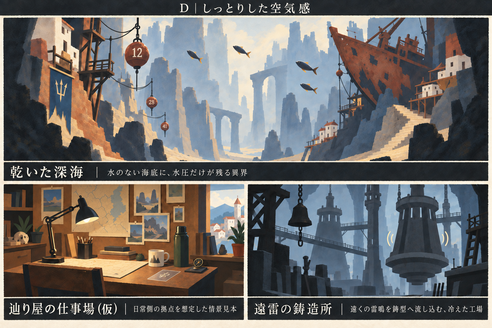

# しっとりした表現

版：0.3／2026-09-12。VD-001のユーザー所感を受けた調整案D。後続の指示で、今後は基本的にDを軸に描き方を揃える方針を受領。具体的な工程は[Dの制作手順](Dの制作手順.md)0.1へ整理した。道具見本⑥を最初の適用対象とするが、今回の段階は手順規定まで。以下の比較経緯を、Dを軸にする判断の未回答扱いに使わない。

上：**乾いた深海（WB-LOC-002）**。左下：**辿り屋の仕事場（仮）**。右下：**遠雷の鋳造所（WB-LOC-006）**。異界二点は世界観DB内の未採用の舞台案、仕事場は日常側の拠点を想定した情景見本。固有の事務所・店の正式設定ではない。

## ラベルと明るさの追加所感

ユーザーはB・Dを「いい感じ」と評価。「全体的にもうちょっと暗い方が良い？」としつつ、「情景や異界次第でそこは柔軟に、でもよい」と補足した。一律の暗化を採用したとは扱わず、B・Dを良好な比較基準に残す。

今回のラベル修正では明るさを変えていない。今後は各異界のテーマ・時刻・屋内外に合わせて明暗を設定し、しっとりした基調は輪郭・中間色・光の柔らかさで維持する。暗い場面でも文字や操作対象の読み取りを保つ。

ラベルは必ず日本語の設定名を使い、仮の情景には「仮」を付ける。見本中のどの領域か分かる位置に置き、必要な場合は短い説明を添える。DBの題材選択を舞台の採用と取り違えない。

## 受領した所感

> サンプル見てみたが、ちょっとくっきりはっきりし過ぎているかも
> 異界や情景次第である程度絵柄は変わってよいと思うが、全体的にはもう少しだけしっとりした感じにしてほしい

この時点では全体に通る落ち着いた感触を重視し、特定の画材・数値を固定していなかった。後続のユーザー指示によりDを主軸とする段階へ進んだ。場面ごとの明るさや題材差は維持し、共通の描写方法と許容幅を手順として明示する。

## 今回の解釈と変更

- **輪郭**：全ての縁を切り抜きのように閉じず、陰や遠景側は隣の色になじませる。意味を持つ物の特徴は残す。
- **明暗**：前景の黒を少し持ち上げ、強い明暗の境目に中間色を足す。場面全体を一律に暗くしない。
- **光**：面が突然切り替わる硬い照明から、木・石・鉄へ柔らかく回る光へ寄せる。
- **筆致**：細かい粒子を増やすより、大きな面の中に穏やかな色の移りを作る。全画面のぼかしや濃霧で代用しない。
- **場面差**：仕事場は温かな木と静かな午後、深海は乾いた白い岩と遠い灰青、鋳造所は冷たい鉄と音の重さ。色や描き込みは異なってよい。

「しっとり」は今回、感触・空気・光として解釈した。全異界を雨・湿地・濡れた表面に変える指定ではない。乾いた深海の水のない前提、鋳造所の冷えた炉を維持する。

## 共通にするもの／場面ごとに変えられるもの

| 共通の基調 | 場面ごとの幅 |
|---|---|
| 少し柔らかな明暗と、必要な所に絞った輪郭 | 線の量、筆触、色、素材感、遠景の溶け方 |
| 不思議を暮らしや景観の中に置く | 可笑しさ、怖さ、壮大さ、親密さの配分 |
| 選択・対象・札を追える特徴を残す | 建物・敵・道具の造形、背景の描写密度 |
| 通常の場面を過剰に光らせない | 異常や一閃の局所的な光・形・音 |

世界観設定1.6の「不思議で切ない」という基調と各異界のテーマを優先する方針に接続する。全場面の悲劇化、常時の暗さ、人物の誇張した泣き顔を追加する意味ではない。

## UIとの両立

背景の輪郭を柔らかくしても、文字・選択状態・属性識別まで同じようににじませる必要はない。札の図柄は薄い半透明の表象に乗せ、情報のラベルはUI側の可読性を保つ。選択は短い輪郭・記号で支え、発光の強さだけへ頼らない。

UIの正式参照版は1.0／UI-R-002 v0.15。16:9を実装基準とする画面全域の背景、相手・場・手札の絵、薄い予測線と窓の前後関係を維持する。今回の3:2比較ボードはゲームの画面比率を変更するものではない。

## 見本の評価と残る点

画像Dでは、Bより前景の黒が和らぎ、石・壁の色のつながりと遠景の空気が増えた。大きな形は比較のため残っている。このB・Dの両方へ良好な所感を受領した。全異界の明るさや最終的な画材までは固定しない。

机上の札は世界観設定1.6に合わせて薄い半透明へ改めた。カード表象の絵・図の最終様式、取り出す所作、主人公の完成像は今回決めていない。旧工具見本の不透明札・切欠きは現行採用候補から外す。

代表案件の背景「夜潮の排水路」は後続で制作済み。現在の優先作業はDの描写方法を手順化し、写実的な質感が強い道具見本⑥へ適用すること。背景や正式UIとの合成検討は、その手順と後続の評価を引き継ぐ。
