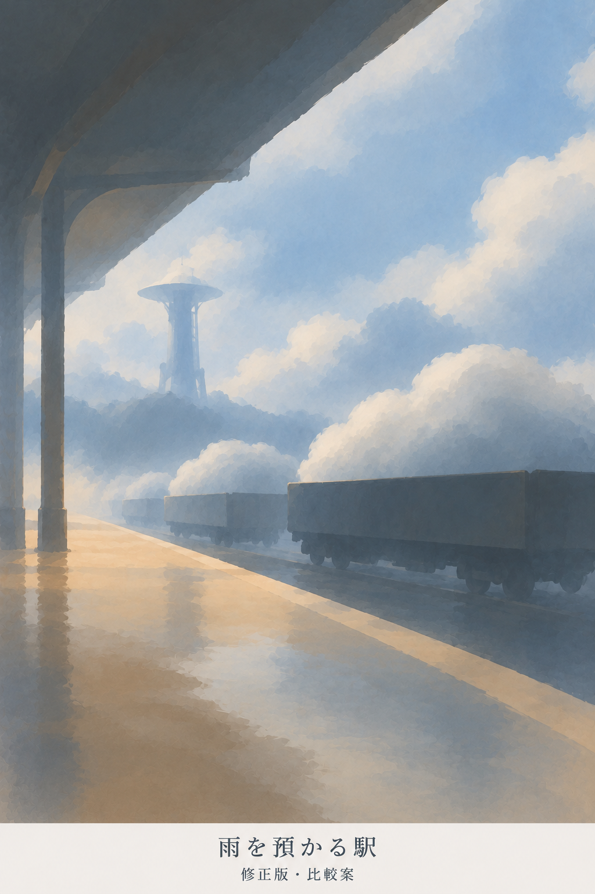
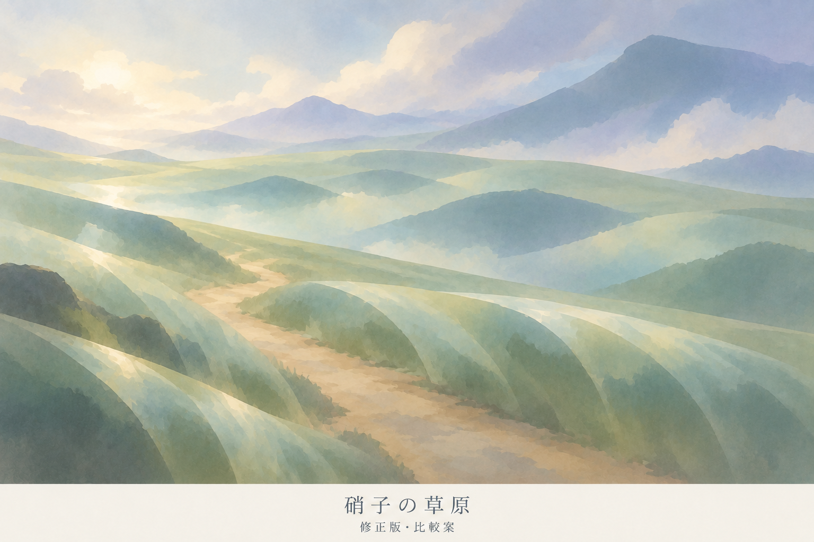
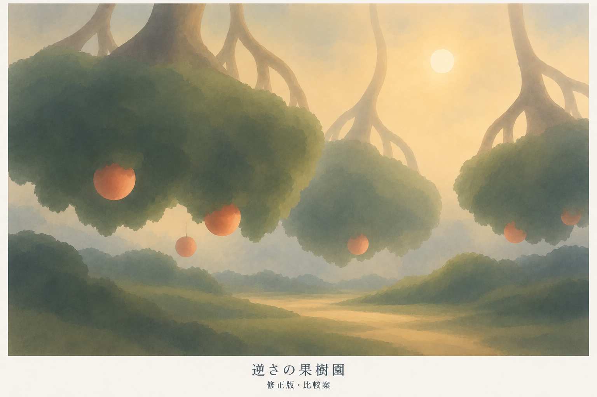
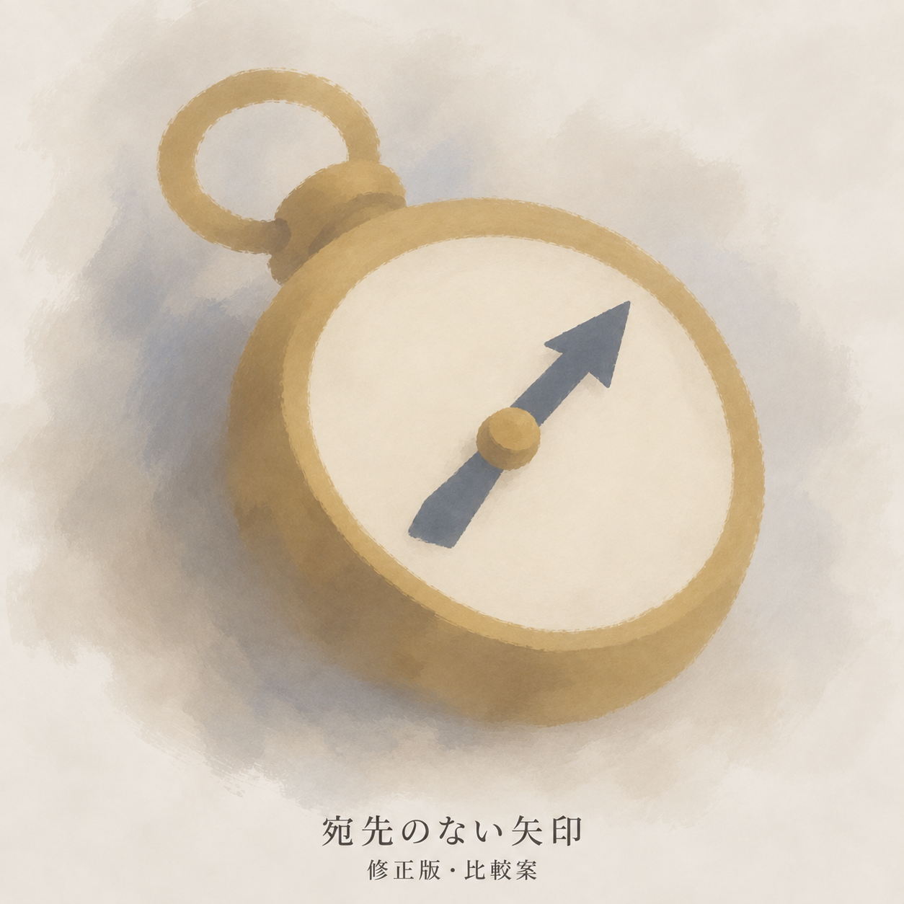
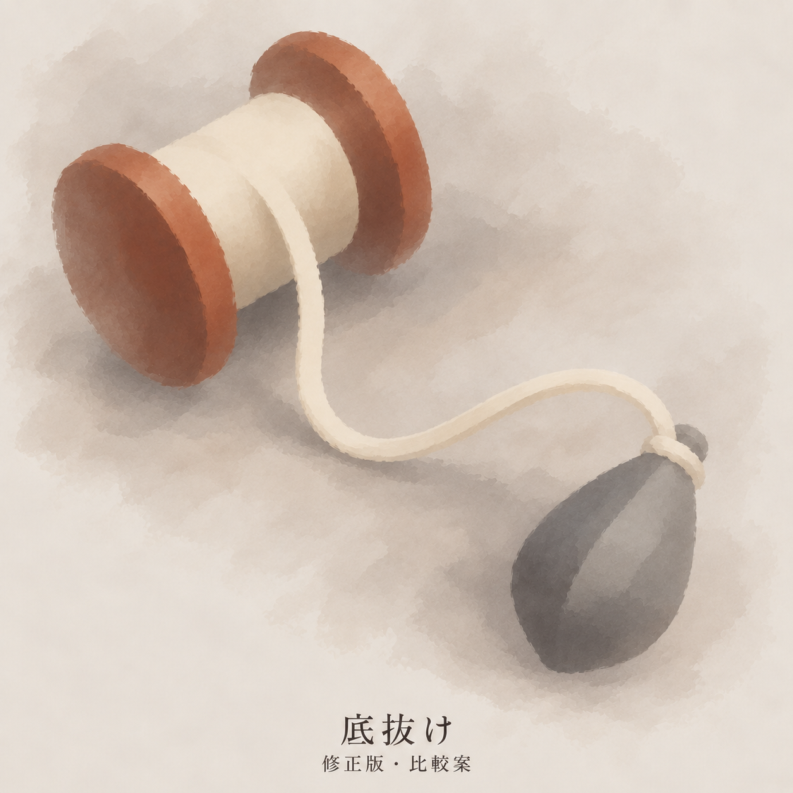
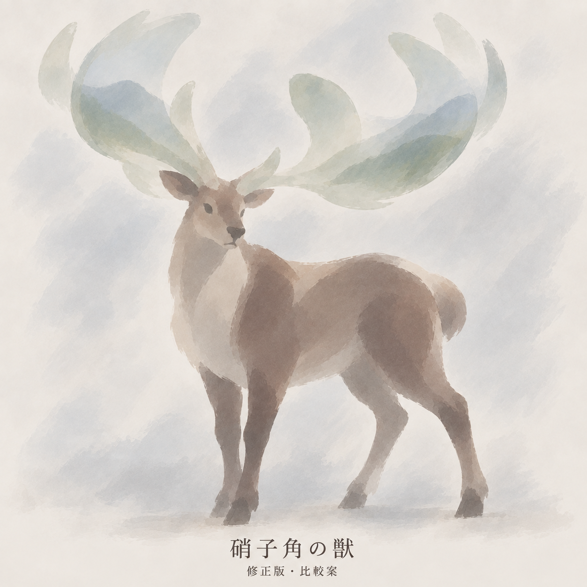

# 別題材6種の修正版

版：0.1／2026-09-13（日本時間）。Work：`20260912-visual-direction`。ユーザーの「課題点踏まえて修正版出して」に対応するR1。**背景3点・道具2点・敵／存在1点の修正版を制作・個別提示済み。R1へのユーザー所感と個別素材の正式採用は未確認。**

[前回6点](別題材6種の比較.md)の題材・構図・配色を編集参照にし、細かな筆触、方位磁針の立体感、草原の特徴の読みにくさを修正対象とした。基本②「少数の筆で拾う」・背景③「輪郭を途切れさせる」と[制作手順0.5](Dの制作手順.md)を継承。Dへの一致や一つの描き方への収束を目的にしない。

## 修正前後

左が保存済み原画像、右がR1。画像内の題材名と「修正版・比較案」で区別する。以下は原画像の参照表示であり、画像を結合・切り抜き・再加工していない。

| 題材・区分 | 原画像 | 修正版R1 |
|---|---|---|
| VD-BG-01／雨を預かる駅・背景③ |  |  |
| VD-BG-02／硝子の草原・背景③ |  |  |
| VD-BG-03／逆さの果樹園・背景③ |  |  |
| VD-OBJ-01／宛先のない矢印・道具② |  |  |
| VD-OBJ-02／底抜け・道具② |  |  |
| VD-OBJ-03／硝子角の獣・敵／存在② |  |  |

## 修正の効果と残る点

以下はAIの目視所見。ユーザーの評価や、制作手順への定量的な合格判定を代筆しない。

| 題材 | 指示した修正 | 出力で確認できる変化 | 残る点 |
|---|---|---|---|
| 雨を預かる駅 | 雲・貨車・床の描き込みを大きな塊へまとめる | 車体が暗い面へまとまり、屋根・空・ホームと雲の荷を読む構図が残る。塔と奥の貨車は空へなじむ | 雲の小さな明暗、床の斑、車輪が多く残る。背景3点では省略の変化が控えめ |
| 硝子の草原 | 大きな透過する草の面と、近くへずれた遠景の反射を使う | 道沿いに曲がった大きな草のような面が立ち、乾いた道と地面の区別が増えた | 草の面は厚い葉や地形にも見える。下の地面の透過と「遠景の反射が近くにある」という対応は依然弱い。異界の特徴の伝達は未解決 |
| 逆さの果樹園 | 葉・細根・果実を減らして樹冠をまとめる | 葉の個別形が減り、低い樹冠と太い上向きの分岐、下を通る道が大きな形として残る | 樹冠の縁に粒状の筆触と丸い塊の反復が残る。果実は吊られているようにも見え、熟すほど軽くなる性質や上昇方向は静止画では伝え切れない |
| 宛先のない矢印 | 金属の縁・厚み・光沢を省き、針の一方向を明確にする | 内側の金属縁と光沢が減り、空の文字盤・黄土色の本体・一方向の矢印が明確になった | 外周はまだほぼ一周追え、厚みと接地影も残る。金属細部の省略と、輪郭を途切れさせることは別で、後者は不十分 |
| 底抜け | 巻き糸の縞と材質描写を減らし、接続を残す | 巻き糸を広い一つの帯へまとめ、糸巻き→糸→錘の接続を維持。錘の明暗も大きな面へ整理 | 木の端面と錘の外周・体積感、全体の細かな塗りむらは残る。薄い糸の縮小時の識別は未確認 |
| 硝子角の獣 | 角の中の細景と体の小さな描写を減らす | 角内の木・雲のような細部を大きな青緑の反射色へまとめ、四足の姿勢と大きな角を維持 | 体の立体陰影と表面の筆触は残る。角は淡いため、背景との重なりで識別を保てるかは別確認 |

巻き糸・葉・角内景色など、意味のある細部をまとめる変化は出た。一方、全面に細かな筆触が残る傾向は解消していない。「基本②・背景③」が安定して再現できた、または6点すべての課題を解消したとは扱わない。駅の寒暖、草原の明色、果樹園の暖色は維持し、一律に暗くしていない。

次の所感では、まず**方位磁針の平面化の程度、底抜けの省略量、獣の角の反射のまとめ方**を原画像と比較する。草原をさらに修正する場合は、透明な草越しに同じ地面が続くことと、実際の遠景に対応する反射が手前にあることを、少数の形で示す必要がある。今回の大きな草の形自体を正式造形へ採用しない。

## 制作・保全条件

R1の公開固定成果は [`51cb505`](https://github.com/eckolo/crossweave/commit/51cb505348241e8edcadf1d6bd25eeccedeaab6c)。以下の修正版6画像・6指示・記録を同じ内容で取得できる。

- 編集元は公開成果 [`cd89b5a`](https://github.com/eckolo/crossweave/commit/cd89b5a68e5850090c549b997c86557a72d3dbfb) の原画像6点。全件を維持し、原照合JSONも改変していない。
- 世界観の固定参考は `169b6b71c1fdd9d9b603278017dec278a546e92a`／1.14。世界観IDは見本索引と照合JSONに対応。駅の指示はDBの「降り切らなかった雨」へ合わせた。世界観の名称・設定・造形の採用権限は世界観Workに維持する。
- 内蔵画像生成で、対応する原画像1点と個別の指示を渡す編集を6回実施。各回1点を生成し、題材名と「修正版・比較案」入りでその場で提示。画像生成後の加工なし。制作順は方位磁針・草原・駅・果樹園・底抜け・獣。
- 正確な指示は[制作元／修正版](../../作業資料/ビジュアル・演出/制作元/修正版/)。指示のローカル固定は `9f9ebb26c60a9980a6298123806a1eb97a94fa7d`、全6出力のローカル保全は `2ec51b6`。[修正版の照合JSON](../../作業資料/ビジュアル・演出/修正版6種の画像照合.json)に生成元・SHA-256・容量・寸法・指示を一対一で記録する。
- 駅は1024×1536px、他の背景2点は1536×1024px、背景以外3点は1254×1254px。比較のため原画像と同じ縦横比を維持した出力属性であり、実装寸法や完成アイコン仕様ではない。
- [VD-003](../../検証/ビジュアル・演出/VD-003/検証記録.md)はR1の確認記録。原画像の保全を扱うVD-002、旧演出のVD-001とは分ける。同一プロンプトの反復試験、正式UI合成、縮小識別、透過素材化、潜水服、逆流の動きは今回実施していない。

保存状態と次の再開点は[引継ぎ](../../作業資料/ビジュアル・演出/引継ぎ.md)。成果の統合は設計Work担当であり、本Workから設計集約へ逆方向統合しない。
