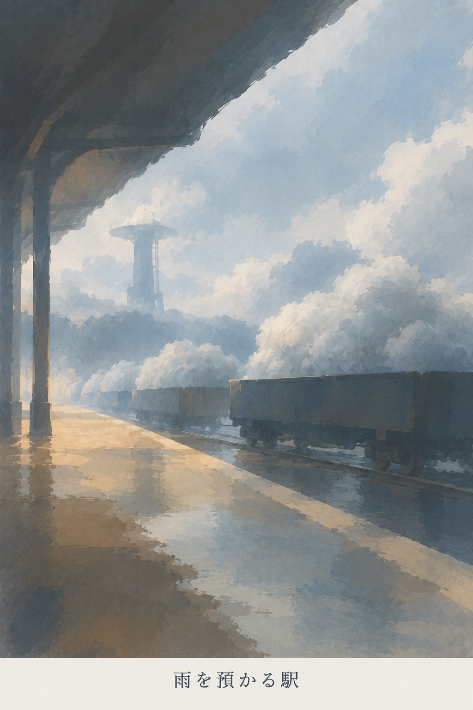
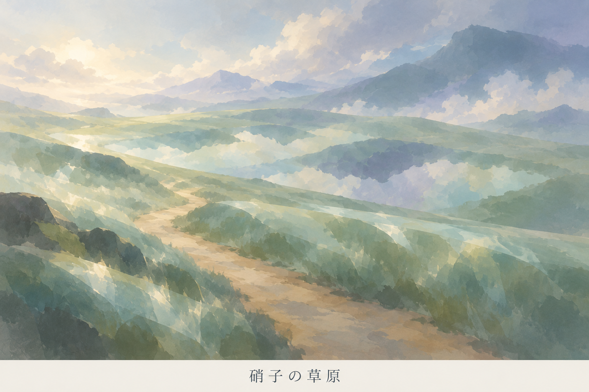
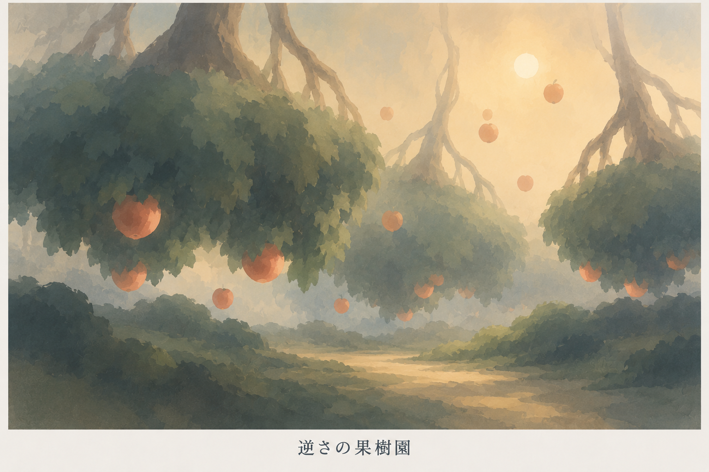
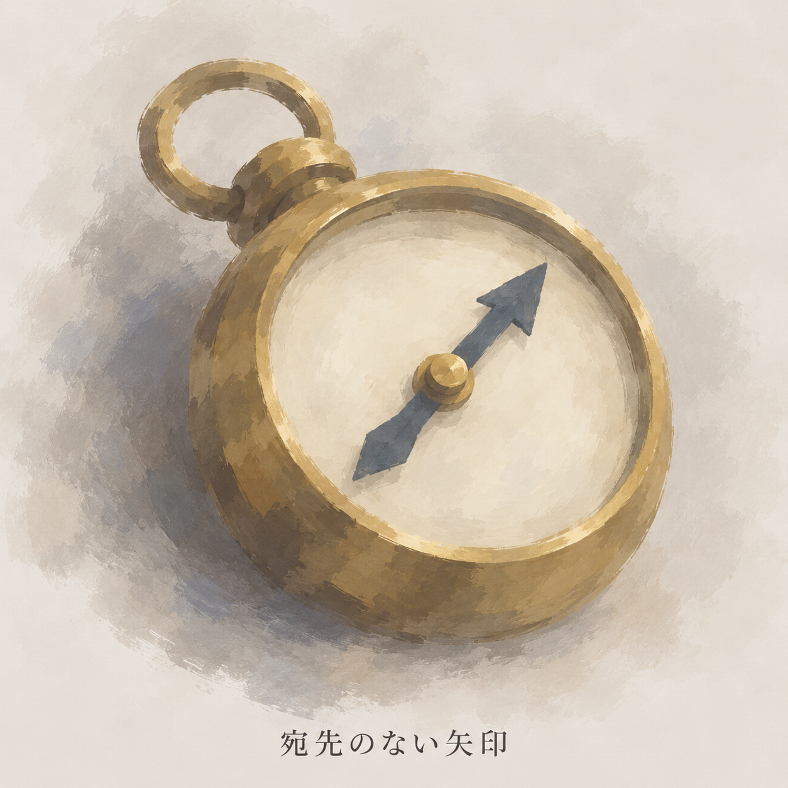
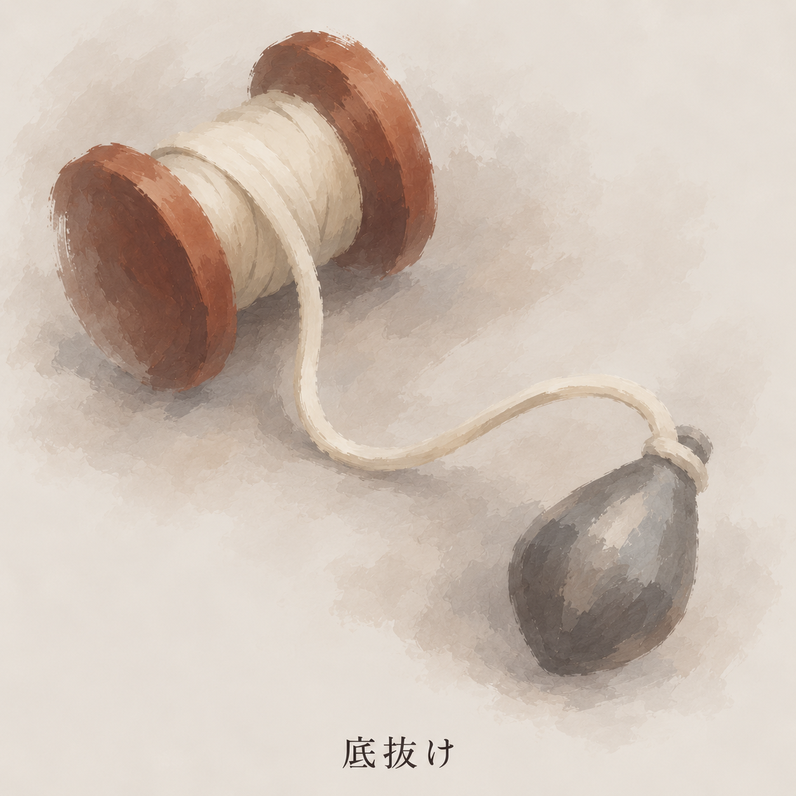
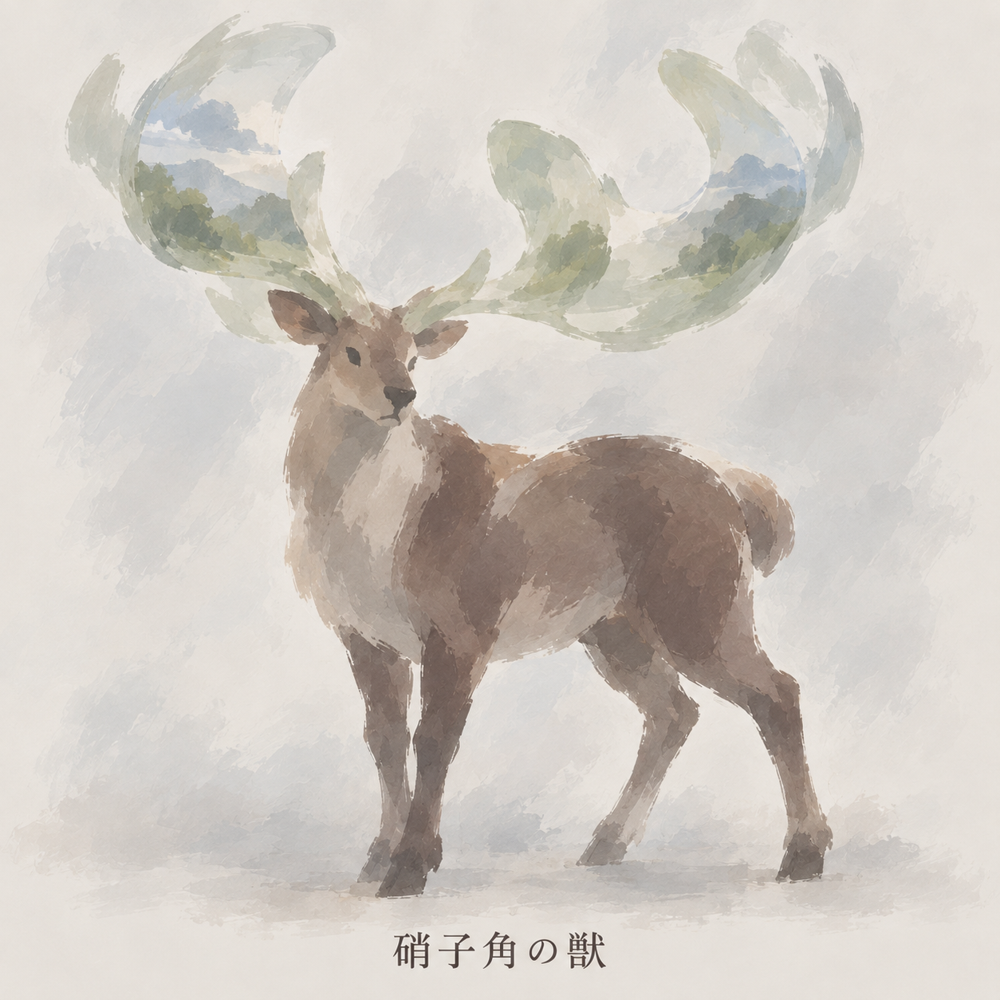

# 別題材6種：基本②・背景③の適用試作

版：0.1／2026-09-13（日本時間）。Work：`20260912-visual-direction`。**制作済み原画像6点の保全・実見・整理。個別素材は未採用、6点へのユーザー評価は未取得。** 今回の再開では生成・加工していない。

ユーザーの「この方針で別の背景と背景以外を3種づつぐらい描いてみて」に対応する、背景3点・道具2点・敵／存在1点。背景以外3点をすべて道具、または人物も制作済みとは数えない。[制作手順0.5](Dの制作手順.md)を使った適用例であり、旧⑥の全道具・半透明札の改稿や、実装検証の完了ではない。

## 固定した方針と参照

| 適用先 | 作画参照 | 今回残す手掛かり |
|---|---|---|
| 背景3点 | [夜潮の排水路の比較板](見本/night-tide-lost-edges.png)の下段③「輪郭を途切れさせる」 | 足場・道・貨車・樹形など、場所と空間を読む部分 |
| 道具・獣3点 | [封緘の比較板](見本/seal-lost-edges.png)の中央②「少数の筆で拾う」 | 種類・向き・部品の接続・姿勢 |

Dへの一致は必須にしない。旧②「丸いデフォルメ」と混同しない。基本②・背景③の選択は受領済みで、以下の所見により未選択へ戻さない。色・明るさ・比率・筆致の幅を維持し、一律の暗化や同じ描き方への収束を求めない。

世界観の制作時参照は `169b6b71c1fdd9d9b603278017dec278a546e92a`／世界観1.14。下の6項目は世界観DBでも「案」であり、名称の照合は正式採用を意味しない。世界観ブランチは参考読取りで、必須同期元へ追加せず、原本も更新しない。

## 画像と題材

| ID | 日本語ラベル・原画像 | 区分 | 世界観の参照項目 | 原画像の寸法 |
|---|---|---|---|---|
| VD-BG-01 | [雨を預かる駅](見本/rain-depot-study.png) | 背景③ | [WB-LOC-001](https://github.com/eckolo/crossweave/blob/169b6b71c1fdd9d9b603278017dec278a546e92a/docs/仕様案/世界観/データベース/異界/WB-LOC-001_雨を預かる駅.md) | 1024×1536px |
| VD-BG-02 | [硝子の草原](見本/glass-grassland-study.png) | 背景③ | [WB-LOC-004](https://github.com/eckolo/crossweave/blob/169b6b71c1fdd9d9b603278017dec278a546e92a/docs/仕様案/世界観/データベース/異界/WB-LOC-004_硝子の草原.md) | 1536×1024px |
| VD-BG-03 | [逆さの果樹園](見本/inverted-orchard-study.png) | 背景③ | [WB-LOC-010](https://github.com/eckolo/crossweave/blob/169b6b71c1fdd9d9b603278017dec278a546e92a/docs/仕様案/世界観/データベース/異界/WB-LOC-010_逆さの果樹園.md) | 1536×1024px |
| VD-OBJ-01 | [宛先のない矢印](見本/addressless-compass-study.png) | 道具② | [WB-CRD-013](https://github.com/eckolo/crossweave/blob/169b6b71c1fdd9d9b603278017dec278a546e92a/docs/仕様案/世界観/データベース/札/WB-CRD-013_宛先のない矢印.md) | 1254×1254px |
| VD-OBJ-02 | [底抜け](見本/depth-spool-study.png) | 道具② | [WB-CRD-003](https://github.com/eckolo/crossweave/blob/169b6b71c1fdd9d9b603278017dec278a546e92a/docs/仕様案/世界観/データベース/札/WB-CRD-003_底抜け.md) | 1254×1254px |
| VD-OBJ-03 | [硝子角の獣](見本/glass-antler-beast-study.png) | 敵・存在② | [WB-ENT-011](https://github.com/eckolo/crossweave/blob/169b6b71c1fdd9d9b603278017dec278a546e92a/docs/仕様案/世界観/データベース/敵・存在/WB-ENT-011_硝子角の獣.md) | 1254×1254px |

寸法は保全したファイルの属性。実装の縦横比・アイコン寸法・ラベル領域の仕様にはしない。制作指示は[VD-BG-01](../../作業資料/ビジュアル・演出/制作元/VD-BG-01.txt)・[02](../../作業資料/ビジュアル・演出/制作元/VD-BG-02.txt)・[03](../../作業資料/ビジュアル・演出/制作元/VD-BG-03.txt)、[VD-OBJ-01](../../作業資料/ビジュアル・演出/制作元/VD-OBJ-01.txt)・[02](../../作業資料/ビジュアル・演出/制作元/VD-OBJ-02.txt)・[03](../../作業資料/ビジュアル・演出/制作元/VD-OBJ-03.txt)。原照合JSONは[別題材6種の画像照合](../../作業資料/ビジュアル・演出/別題材6種の画像照合.json)、今回の確認条件は[VD-002](../../検証/ビジュアル・演出/VD-002/検証記録.md)。

## 背景3点

### VD-BG-01：雨を預かる駅

雲を詰めた貨車・空の集水塔・無人のホームを描いた造形案。屋根と空、黄土色の足場の大きな面で空間が分かり、遠い塔と貨車は周囲へなじむ。昼の淡い青と暖色の足場により、水路の暗青色以外へ幅を出している。

**AIの目視所見：** 駅と雲の荷を読む手掛かりは残る。一方、雲の中の細かな明暗、車輪や床の塗り分けが多く、「少数の大きな面」への省略はさらに進める余地がある。広い景観という制作指示に対し出力は縦長。今回は原本の属性として記録し、横長化のために切り取らない。

制作指示の英語には「まだ降っていない雨」という表現があるが、DB原文は「降り切らなかった雨」。造形指示では雲の貨車として共通するものの、雨の由来の設定を変更したとは扱わない。今後の制作指示ではDBの表現へ合わせる。

### VD-BG-02：硝子の草原

淡い緑・青紫の高原と、斜めに続く道。遠くの山に似た色面が手前にも重なる。道を残しつつ丘と草地の境界を弱め、背景3点では明るい側の試作になっている。

**AIの目視所見：** 空間と道は読み取れる。ただし手前の淡い重なりは、透明な草だけでなく霧や水面のようにも読める。「実体と反射像の距離が一致しない」特徴が絵だけで伝わるとは確認できない。細い草を増やす前に、道に接する少数の大きな透過面と反射像のずれで伝える案を残す。草の輪郭をすべて明瞭にする判断ではない。

### VD-BG-03：逆さの果樹園

低く垂れる樹冠、空へ伸びる根のような分岐、空中の果実、下に続く道を描く。緑と杏色・暖かい空の大きな色の違いで、駅や草原とは異なる情景を試している。

**AIの目視所見：** 上下が通常と異なる樹形と空中の果実は見える。奥の木は空へなじむが、手前の葉のような細かな筆触・果実・分岐は多い。横並びの3樹塊という指示に対し、前後の樹冠が奥行きを強調する構図となった。静止画の果実から上昇方向や熟すほど軽くなる因果までは確定できない。題材の根拠と、画像から読み取れる範囲を分ける。

## 背景以外3点

### VD-OBJ-01：宛先のない矢印

文字盤が空いた方位磁針。金属の輪・接続部・円形の本体と針が読み取れる。真鍮色や持ち輪の具体形は今回の造形案で、正式材質・形状として追加採用しない。

**AIの目視所見：** 種類・向き・部品の接続は明確。目盛りや方位文字はなく、ラベルも一致する。一方、本体の外周・厚み・内側の縁をほぼ一周追え、金属の陰影も強い。今回の対象3点では「輪郭を必要な部分だけ拾う」方向の弱さが目立つ。針は中央の軸を通る一本として見えるが、反対端も尖るため、単方向の矢印としての形の明瞭さには余地がある。針の本数や目的を新設定として解釈しない。

### VD-OBJ-02：底抜け

糸巻きから一本の糸が曲線を描き、錘へつながる。円筒・糸・錘が離れて見え、今回の大きさでは接続を追える。木の色や滴形の錘は造形案。

**AIの目視所見：** 大きな部品の対応を保ちながら、糸巻きの外縁と接地影の一部をなじませている。ただし巻き糸の帯、錘の陰影、細かな塗りむらが多く残る。画面を広く使う接続は試作として有効だが、縮小時に糸と部品の対応を読めるかは未検証。今回の1254pxを完成アイコンの寸法にしない。

### VD-OBJ-03：硝子角の獣

鹿に似た四足の体と、周囲の景色を映す大きな半透明の角。鹿型・体色・角の曲がり方は暫定の造形案。人を食べる習性がないというDB条件に対し、牙や捕食姿勢は描いていない。

**AIの目視所見：** 顔の向き・胴・4本の脚の位置は読め、角の大きさで比率のデフォルメも示せている。外縁の一部は筆跡として切れている。一方、角の中に山・雲・草木に見える細かな景色が描かれ、体の小さな筆触も残る。角は大きな色面の反射へさらにまとめる余地がある。背景から切り離した完成透過素材ではなく、姿勢差分・背景との重なりも未検証。

## 比較から残す論点

以下はAIの目視整理であり、ユーザーの所感・採否・定量的な合格判定ではない。

| 軸 | 今回読み取れること | 残る確認・次の比較候補 |
|---|---|---|
| 明るさ・色の幅 | 駅の寒暖、草原の淡い明色、果樹園の暖色が分かれる | 一律に暗くせず、情景ごとの感触への所感を得る |
| 背景③ | 遠景のなじみと、足場・道などの手掛かりが併存する | 草原の異界性のように、省略すると何が伝わりにくくなるかを見る |
| 基本② | 道具の接続、獣の姿勢と大きな角が読める | とくに方位磁針の外周と立体陰影を減らした幅を比較できる |
| 大きな面・しっとりした感触 | 暖冷のまとまりと部分的な縁の省略はある | 全6点に細かな筆触が多く残る。落ち着いた面を増やす比較の余地がある |
| 試作から実装 | 題材・ラベル・原画像・指示の対応を固定した | 完成寸法、縮小識別、透過化、正式UIとの合成、反復再現性は別作業 |

次に所感を求める際は、①6点の中で方向に近いもの、②さらに省きたい描き込みの例（方位磁針の立体感・果樹園の葉・獣の角内景色）、③草原の特徴の読め方、を具体物で示す。完成素材の正式採用と描き方への所感を一括で求めない。今回は保全・記録・保存を完了するための採用判断待ちは設けない。

独立した潜水服、逆流を伝える動き、完成アイコンの寸法・縮小識別、正式UI合成、反復生成の再現性は[引継ぎ](../../作業資料/ビジュアル・演出/引継ぎ.md)に維持する。今回の6点の整理で完了扱いにしない。共通設計・世界観DB・UIの原本へ直接反映していない。
