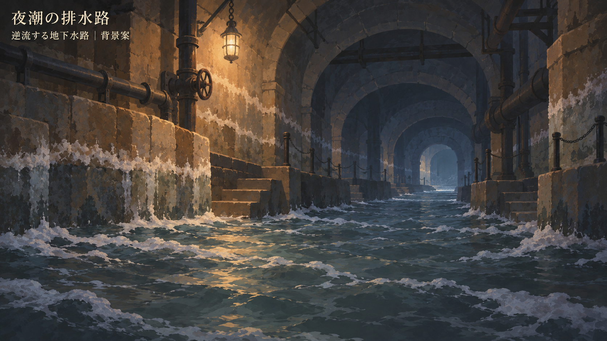

# 夜潮の排水路の背景

版：0.1／2026-09-12。担当：`20260912-visual-direction`。**背景・演出の検討案**。案件・具体素材の正式採用は未実施。

## 題材と比較の目的

シナリオWorkの[SCN-001草案0.1](https://github.com/eckolo/crossweave/blob/a93ab629f62cefb14f061be600bdbcb4112f877b/docs/仕様案/シナリオ・探索内容/SCN-001_夜潮の排水路/概要.md)から、S02「逆流する地下水路」／ART-BG02を具体化する。日常側の商店地下から、流れの元を調べに入る最初の水路。案件全体の真相を明かす場面ではない。

初回のB・Dへの好感触を引き継ぎ、一場面の暗さ・奥行き・質感を絞る。A〜Dの選択を改めて求める資料ではない。地下の暗さと手元の読み取り、先へ進みたい奥行きを両立できるかを次のUI合成で見る。

## 今回の表現

| 項目 | 背景案の扱い | 限界・残る確認 |
|---|---|---|
| 明暗 | 暗い奥行き、灰青の水、石の茶色、局所的な暖かい灯り | 異界全般の暗化基準にしない。下部の泡と反射は手札の背景として情報量が多い可能性 |
| しっとりした感触 | 光の回り込みと中間色、陰に溶ける輪郭。石積みの形は残す | B・Dより水面の細部が多い。良好な画風としてユーザー評価済みとはしない |
| 調べる手掛かり | 壁の塩、奥へ続く水路、段差、手前へ寄る泡 | 静止画だけで逆流・上り勾配を一意に読めるとはいえない |
| 背景と対象 | 水路だけを描き、潜水服と主人公を一枚絵へ焼き込まない | 独立した潜水服素材、作用位置、状態差分は未制作 |
| 情報の公開 | 港・頭上の海・水門・噛み込んだ鎖は見せない | S03・S04の手掛かりを先取りしない |
| ラベル | 「夜潮の排水路」「逆流する地下水路｜背景案」を画像内に表示 | 比較用のラベルで、作中の看板や正式UIの新見出しではない |

背景は内蔵画像生成で制作。Dは画風参照であり、同じ場所の改変ではない。[プロンプト](../../作業資料/ビジュアル・演出/制作元/夜潮の排水路.txt)に制作条件を保存する。画像は統合された一枚絵で、前・中・後景の分離ができた素材ではない。

## 動きで補う内容

以下は未実装の演出案。新しいルールや数値は追加しない。

- 逆流は、壁と保守用の段差を固定したまま、水面の薄い泡だけを奥から手前へ流す。全面の激しい波や点滅を使わず、出札中に必要以上の注意を奪わない。動きを抑える設定でも、S02の短文と塩の跡で状況を知れるようにする。
- 探査だけなら、今扱える足場・流れの切れ目を短く捉える。カメラを進めず、潜水服を怯ませない。
- 進展が生じたときだけ、進めた分を小さな視点移動や足場の差分で示す。道のりを実距離へ変換しない。T1残量0の結果を受けてS03へ切り替える。
- T1踏破時に生存している潜水服は、通り過ぎた側へ残して退場を示す。撃破して崩れる姿や報酬演出を出さない。潜水服を先に倒した場合は潜水服の層だけを変え、水路そのものを勝手に切り替えない。
- S03への場面転換で、手札・余力・保護の既存結果を維持する。休息、全回復、山札再セットのような演出を挟まない。

## 正式UIへの接続案

基準は[UI正式参照版1.0／UI-R-002 v0.15](https://github.com/eckolo/crossweave/blob/4b9034a6fe445fa2fce62fad7ac154de45f94e94/docs/検証/UI/readability/正式参照版.md)。本稿は原本の配置・操作コードを変更しない。

| 確認位置 | 次の合成で見ること | 必要な場合の修正範囲 |
|---|---|---|
| 相手・行動順 | 環境と潜水服の同一性を、対象と行動順の両方で追えるか | 独立素材・背景局所の明暗。主体ごとの選択と攻撃対象の役割は維持 |
| 可変の場枠 | 泡・石の輪郭が札枠や薄い予測線に見えないか | 背景の細部・局所的な落ち着かせ方。固定の中央空白や4枠固定へ変更しない |
| 手札と予測 | 半透明の札絵と、数字・ラベルが同時に読めるか | 表象と情報面を分ける。文字まで半透明にしない |
| 右下の履歴・窓 | 水面の反射で文字がちらつかないか | 背景の動き・局所コントラスト。履歴の正式位置を移さない |
| 画像内ラベル | 比較見本の説明とゲームの常設情報を重ねない | 合成では画像外に比較ラベルを置くか、ゲーム用の文字なし素材を別途制作 |

最初は「通常の場」「一致予測」「右下の履歴と詳細窓」の3状態を同じ背景で比較する。公開情報や札性能をSCN-001へ差し替えた動作試験と、画面素材を重ねただけの表示検討を区別する。今回、実合成・ブラウザーでの表示・操作確認は未実施。

## 次へ渡すこと

本Workでは、潜水服の独立素材と水路の流れの見本、正式UI上の3状態の比較を先行できる。顔・性別・衣装が必要な主人公素材の量産、最終画風・案件の正式採用はユーザー判断の範囲。シナリオ・UI・世界観の原本は各担当へ戻す。
