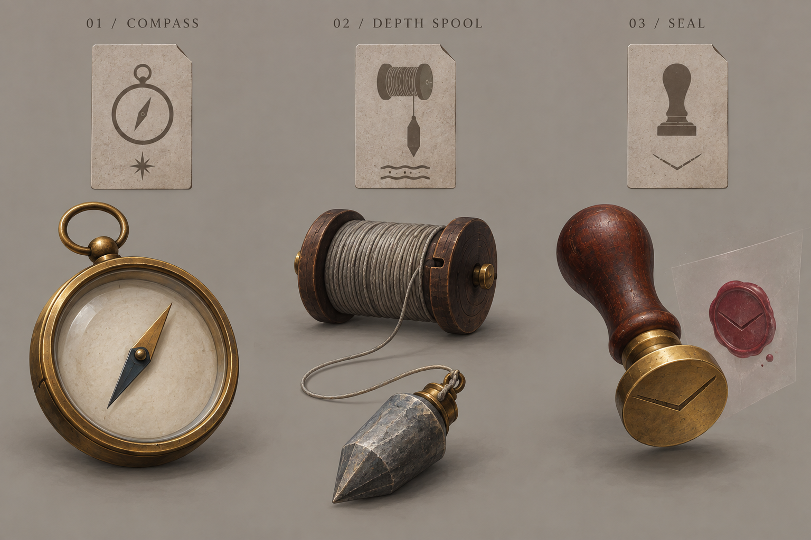

# 札と行動の演出

版：0.3／2026-09-12。未採用案。具体札の性能・追加行動を決めない。世界観設定1.6の札の基本形と主人公固有能力を優先する。

## 現行前提への対応

- 札は印象の表象を写した絵・図。材質不明、トランプサイズ、薄く半透明の長方形。道具は作用の具象。下の不透明な札は世界観1.5時点の比較見本で、現行の材質例から外す。
- 札化と展開は主人公だけが行う。どこからか札を取り出す方向を基準とし、鞄・箱からの恒久的な物品在庫を前提にしない。
- 他主体の表示は行動・作用の可視化として扱う接続案を参照し、敵や環境が実体の札を開くアニメーションへ共通化しない。共有の場・一致・補正のゲーム規則は維持する。
- 写すこと自体で元の存在を消さない。写し元の影響や主人公からの貸与の影響を失って霧散する背景と、現行の消滅条件を対応させる。独自の時間減衰や札の消費規則は加えない。
- 主人公は幼く、無口で表情が少ない方向。人物の具体年齢・性別・顔・衣装は未定。今回の道具と作用の見本には人物像を描き足さない。

以下の「折り開く／厚みを得る／印が移る」は旧形態案の比較を含む。今後は札の半透明性と印象→作用の関係に合わせて調整し、材質不明という現行前提を覆さない。

## 道具3点

| 既存DB案 | 不思議の由来・作用 | 具体物 | 見分ける要素 |
|---|---|---|---|
| WB-CRD-013 宛先のない矢印 | 届く方向を探し続ける働き。今ある手掛かりの続きを捉える | 文字盤の空いた方位磁針 | 輪と一本の針。未知の正解地点や報酬を示さない |
| WB-CRD-003 底抜け | 水のない深さが生む落ち込み。触れた足場の下へ重さが抜ける | 錘付きの糸巻き | 円筒・一本の糸・錘の連続。大きい進展寄りの候補 |
| WB-CRD-014 封緘 | 宛先まで中身を保つ働き。触れた範囲を押しとどめる | 封蝋印 | 握りと平らな底面、押された印。完全無効や消滅禁止は示さない |

各DB内容は未採用。画像の札材質は旧仮置きの「薄い艶消しの複合素材」であり、世界観1.6の現行札には適合しない。道具の具体形と対応を読むための過去見本として保持する。印の体系・切欠きは未採用。由来印は属性記号とは別。道具の名称を物体名に揃える必要はない。

## 携行から使用後まで

| 時点 | 共通する読み取り | 表現案 |
|---|---|---|
| 携行 | 札は道具を持ち運ぶ形 | 道具そのものの輪郭を札面へ持たせる。拡大時だけ由来の小さな跡を読める |
| 不一致の設置 | 場に残り、今は主効果が出ない | 札のまま落ち着く。道具の大展開・対象への作用線を出さない |
| 一致 | 今使った札と場札が関係して、主効果と場の補正が成立 | 二枚の該当属性表示が短く呼応。主効果を担う使用札から道具を表す。場札の道具まで同格に二つ発動させない |
| 作用 | 今回の対象と変化 | 方位磁針は針が定まる、糸巻きは錘が働く、封蝋印は短く押す。全札を飛翔弾・武器にしない |
| 使用後 | 通常は二枚が捨て場へ。消滅札は既存条件に従う | 道具表現を札へ収め、UIが持つ実際の移動先へ送る。手札へ自動帰還させない |

### 展開方法3案

| 案 | 携行→作用→使用後 | 長所 | 弱点 |
|---|---|---|---|
| 折り開く | 札が折れ、輪郭が立体の道具へ開く。畳んで捨て場へ | 行為を覚えやすい | 和紙や折り紙に意味が寄る。異形の道具ごとに折り方の制作が必要 |
| 厚みを得る（第一候補） | 平たい輪郭に厚みが戻り、同じ形の道具になる。厚みを失って札へ | 札と道具を同一物として追える。3道具に共通化しやすい | 浮き彫りやホログラムと区別する仕上げが必要 |
| 印が移る | 札面の形が対象側へ移って具体物となり、作用後に札へ収まる | 主人公の手を出さず、環境・敵にも適用しやすい | 転写元の札が残ると二重所有・複製に見える。元の輪郭を抜く必要 |

上記は主効果を使う際の旧演出比較。現行では札化・展開は主人公固有、道具だけ意思ある貸与が可能という前提へ更新された。場の共有利用を、敵も実体札を操作する演出へ直結させない。見本画像は同一物の形態比較のため並べており、二個を同時に所持する意味ではない。

通常の捨て場への移動は輪郭を保った移動。消滅は縁から形が欠け、移動先へ札の実体を残さない候補。敵の退場に伴う既存捨て場の由来札の消滅も同じ表示区別を使う。燃やす演出を全札の既定にせず、回収時まで消滅を遅らせない。

## 探査・突破・一閃の対象別場面

以下の各列は**異なる結果の比較**。探査→突破→一閃という必須の三手、専用の追加操作ではない。一致した一行動の結果を短く分解して見せる。

| 対象 | 探査が進むが進展0 | 突破が生じる | 一閃を伴う突破 |
|---|---|---|---|
| 道 | 今の足場へ輪郭が寄る。足場・視点は進まない | 捉えた一段を足元側へ送り、奥の道を見せる | 同じ箇所の輪郭が一度だけ結び合い、実際の結果に応じた進展を強調 |
| 岩 | 表面の継ぎ目だけ浮く。岩片は飛ばない | 継ぎ目が開き小片が落ちる。耐久が残れば岩本体も残す | 圧の線が一点へ集まり、同じ一回の割れを鋭く見せる。毎回全壊させない |
| 敵 | 次の足運び・輪郭のずれを捉える。怯みは描かない | 支えていた足場が崩れ、姿勢を立て直す | 作用点が揃う一瞬と短い反応。二撃目・追加ノックバックは作らない |

探査が通らない場合は対象の有効箇所を確定させない。隠蔽を削り切っても身構等で進展0なら、作用が押しとどめられたことを示し、道を動かす・岩を割る成功表現は使わない。解決後の隠蔽リセットでは、次の有効箇所へ焦点を移す。既に進んだ足場や記録を元に戻さない。

一閃は斬撃に限定しない。防御側の一閃は、押しとどめる面・留め点が一度そろう表現を候補とする。保持中の機転を勝手に消費する演出、追加ダメージの遅延発生、気絶・行動順遅延は追加しない。

## 反復と時間の仮条件

- 通常一致の見本：0〜100msで一致、100〜220msで形態変化、220〜420msで対象への作用、420〜600msで残った変化と使用後。これらは映像内の時刻で、ゲームのコストや予約時刻ではない。
- 一閃：通常の作用と同じ時間枠へ80ms程度の局所強調を重ねる。全画面白転・長い止め絵・カメラ揺れは初期候補に含めない。
- 不一致の設置は100〜160msで落ち着く候補。毎回道具を見せる演出は省く。
- 反復の下限案は200〜300ms、通常案は600ms。人の読み取り・疲労は未評価。600msを30回直列に待たせると18秒になるため、総待機を別に計測する。
- 入力受付と演出再生を別にする。ただし前の対象への演出を、交代後の新対象へ付け替えない。実際の処理順を入れ替えず、混雑時は結果を残して装飾の尾を短縮する案。
- 音：方位磁針は細い金属音、底抜けは低い木と糸の張り、封緘は短い押印音。一閃の強調は高音を一層重ねる程度。残響の遅れで効果が後から発生したように聞かせない。実音源は未制作。

## 初回見本の範囲

[VD-001](../../検証/ビジュアル・演出/VD-001/preview.html)は道・岩・敵／探査・突破・一閃を切替できる模式演出。約600msの流れと停止状態を観察するためのもので、効果量や計算の検証ではない。札・道具の完成アニメーション、音、共有循環はまだ接続していない。

## 再開後の模式見本の修正

VD-001の記号的な札を、切欠きのない半透明の長方形へ修正した。通常使用後は札の輪郭を残して「捨て場」の位置へ動かし、消滅と混同しにくい表示案にした。この捨て場ラベルは模式見本内の説明であり、正式UIに常設の捨て場を追加する提案ではない。

再生中の一致・作用・結果に説明が追随するよう修正。対象変更時の再生停止と、動きを抑える設定等を静的なイベント試験で確認した。完成画風の表現・札から道具への一貫した変形・実際の共有循環・実描画は未検証。世界観1.8における他主体の札表示との対応は採用済みとして扱う。
