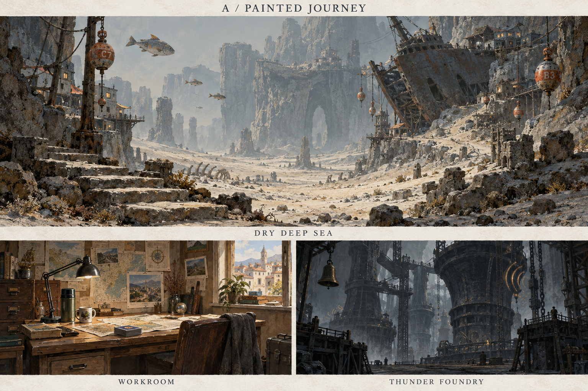
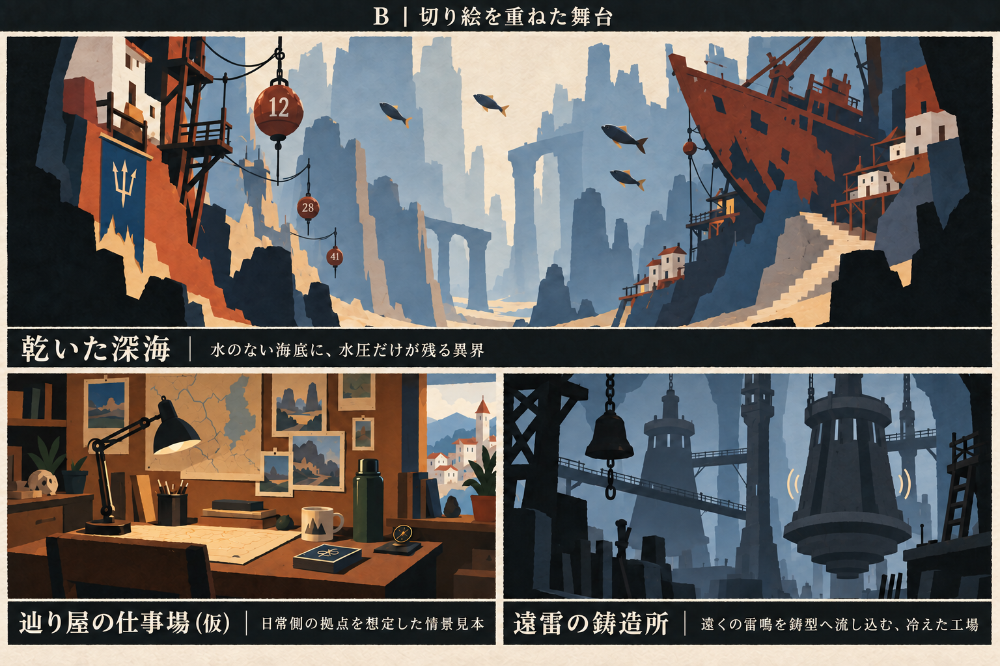
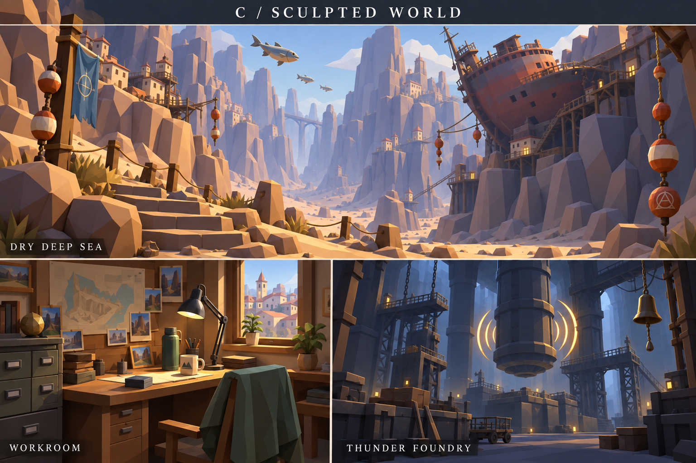

# 表現方向の比較

版：0.2／2026-09-12。VD-001。初回A〜Cの未採用比較と経緯。**後続のユーザー所感に対応した現行案は[しっとりした表現](しっとりした表現.md)**。本書のB推奨を現行の正式方針としない。

## 比較条件

同じ意味を持つ3地点を全案で使用。主画面は水のない深海、左下は日常の小さな仕事場、右下は遠雷の鋳造所。画風比較用であり、3地点の連続した探索・登場順は定めない。人物の名前・性別・年齢・衣装は固定しない。

- **仕事場**：現代に近い町の窓、地図、使い込まれた机、電気スタンド、水筒、札。固有の事務所設定は未採用。
- **乾いた深海／WB-LOC-002**：空気中の魚、乾いた海底、崖に刺さる沈船、住居と高さを示す浮標。水中風景と混同させず、海だった場所に生活が続く気配を描く。
- **遠雷の鋳造所／WB-LOC-006**：冷えた炉と大きな鋳型、作業鐘、道具と往来の跡。熱や溶湯の工場と区別し、重い音の伝わりで不思議を示す。

カメラ構図・魚や建物の数まで同一の対照試験ではない。生成画像の局所差と画風差を区別する。縮小時・操作時の読み取りは別途確認する。

## A：絵筆で辿る旅

- 絵：描き込みの密な前景から、筆触が薄れる遠景へ。線を常時閉じず、明暗で形をつなぐ。
- 材質：石の粉、鉄の錆、木の傷。全域へ均等に細部を載せず、場所の主役に集中させる。
- 光と色：仕事場は黄土と昼光、深海は白い粉塵と灰青、鋳造所は青黒い鉄。世界ごとに光を変える。
- 空間：空気遠近によって奥へ続く距離を感じさせる。調べたい物だけ輪郭を少し強める。
- 主人公：探索中は視点と必要時の手元、拠点は物を置く所作が第一案。人物設定が決まれば背姿を追加可能。
- 不思議：魚だけが空を泳ぐ、影の向きが少し違うなど、普通の景観内に局所的な違和感を置く。
- 魅力：旅先の空気、触った跡、生活の来歴を描きやすい。
- 弱点：明暗の細かさが小さな対象・札と競合する。一枚絵の一部変更で筆致や照明を揃え直す必要がある。
- 制作：基本背景＋別描き対象＋少数の作用。差分を前提に背景の空き領域を設計する。元画像からの切り出しだけでは隠れていた背景を補えない。

## B：重ねた切り絵の舞台

- 絵：少ない色面、閉じた不揃いの輪郭、前・中・後景の重なり。表現技法としての紙の手触り。
- 材質：背景の粒子は控えめ。重要な道具だけ金属・木・布の違いを面で残す。全物体を紙素材にする設定ではない。
- 光と色：明るい中央と暗い両端。影を少数の段階に揃え、色が違う異界でも同じ読み取り構造を保つ。
- 空間：まず前景・対象・遠景の3層。移動時だけ差を付けて動かし、操作待ち中の常時揺れは控える。
- 主人公：通常は視点に留め、必要時に手元か短い影。長い全身動作を出札ごとに要求しない。
- 不思議：輪郭の内側と外側がずれる、層の間から道が見える、像が本体に遅れるなどの局所差。
- 魅力：対象の輪郭と変化が読みやすく、分離した絵を動かす方式と整合する。異界ごとの画材差も取り込みやすい。
- 弱点：奥行きを狭い舞台として感じる、紙世界と受け取る可能性。黒い前景が中央の可用面積を圧迫しやすい。
- 制作：一地点を背景3層・対象1素材・対象状態差分・作用素材へ分ける候補。素材数の試行単位であり工数の実測ではない。透明画像の輪郭と隠れ面の描き足しが必要。

## C：立体の手触りを持つ世界

- 絵：大きな多角形の面、厚みのある輪郭、簡潔な質感。細かい表面汚れより形と照明を主にする。
- 材質：石・木・鉄を反射と形状で区別。深海は乾いた岩、鋳造所は冷たい金属として扱う。
- 光と色：色面は明快だが、光源による物体内の陰影を持つ。明暗が背景と対象で一致するよう統一。
- 空間：透視投影の連続した立体。見本は画像であり、3Dモデルや動かせる場面ではない。
- 主人公：将来固定アバターを置きやすいが、初回は視点だけで比較。アバター追加は骨格・衣装・動作の継続負担が生じる。
- 不思議：力の向きと物体の形が噛み合わない、宙にある浮標と魚など、明快な実体の矛盾で示す。
- 魅力：物体を動かしたときの厚みと照明を維持できる制作方式に向く。色や状態の差分をモデルへ持たせやすい。
- 弱点：3Dとして制作する場合、モデリング・照明・カメラ・書き出しの初期整備が増える。生成画像だけを増やす場合は立体の整合性が保証されない。
- 制作：本物の3Dを用意し2D素材へ書き出す方式と、リアルタイム3Dを区別する。現在のUIへは前者の方が接続しやすい可能性があるが、技術採用はしていない。

## 比較と推奨

| 観点 | A | B | C |
|---|---|---|---|
| 強く感じさせるもの | 遠くへ来た気配、土地の来歴 | 見つけた輪郭、場面の変化 | 物の重み、そこにある空間 |
| 対象と背景の分離 | 輪郭・明暗の調整が必要 | 色面と独立層で揃えやすい | 照明・背景値・位置の整合が必要 |
| 継続追加の主な負担 | 筆致と明暗の維持、部分修正 | 層分け、輪郭、隠れ面の補完 | 立体・材質・動作の整備 |
| 初期の制作単位 | 背景一景＋分離対象 | 背景3層＋分離対象 | 一場面または一モデルと書出し |
| 心配な受け取られ方 | 暗く重い作品に寄る | 紙の世界、箱庭に寄る | 玩具らしく、軽い危険に見える |

**第一候補はB。** 多世界の場所感と、操作対象の読み取りを両立させる制作上の仮説に最も合う。Aの密度をそのまま足し戻さず、道具の近接画や訪問時の見せ場だけ質感を補う案を推す。好みの評価は未取得であり、Bの採用は未決定。

一地点の量産見積りは、選択後に背景3層・対象1・札3を実際に作り、初回と2地点目の修正回数を記録してから行う。生成に要した時間だけでゲーム用素材の制作工数を見積もらない。

## 画像の限界

- Aは指定より写実的で、細部が密。柔らかい絵筆表現を選ぶ場合は追加調整が必要。
- 初稿B・CはAに近かったため、Bは色面、Cは低ポリゴン形状を強めた調整稿を比較の代表にした。
- 画面内の番号・模様は仮の装飾。世界共通の文字・規格・住所制度へ採用しない。
- 鋳造所の黄色い窓や照明は熱源の意味ではない。音と冷えた炉の区別を、後続の演出・描写でも保持する。
