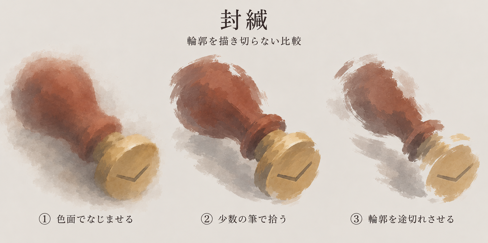
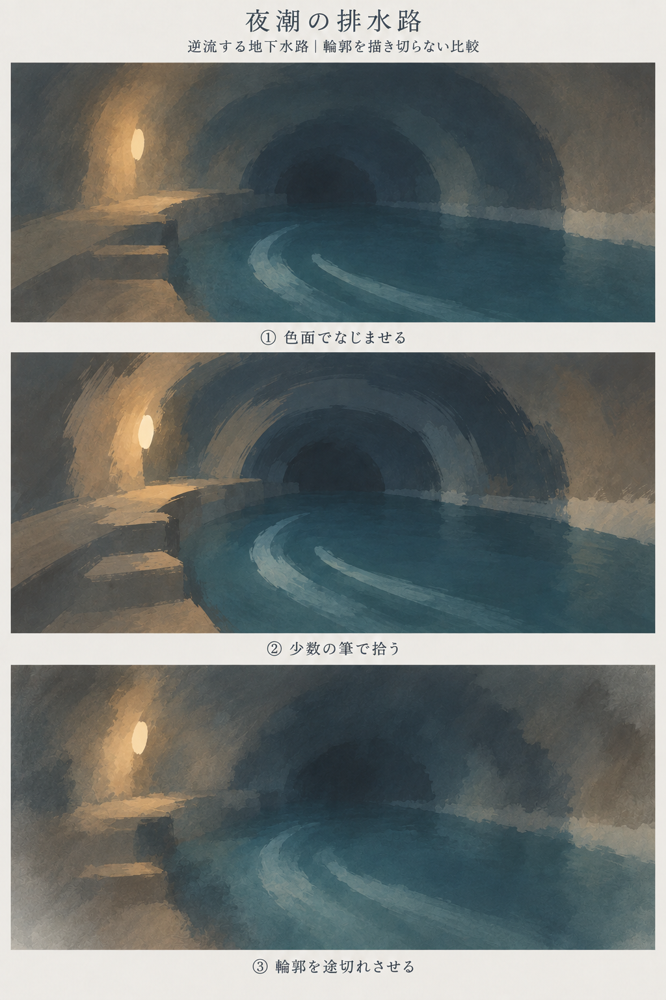

# 輪郭を省く比較

版：0.2／2026-09-13（日本時間）。Work `20260912-visual-direction`。封緘と夜潮の排水路、各3案。**方向の比較用の試作で、個別素材・実装寸法・量産画風の正式採用ではない。**

## 最新のユーザー判断

**「基本は2、背景のみ3」**を受領。②「少数の筆で拾う」を基本とし、背景は③「輪郭を途切れさせる」。[制作手順0.5](Dの制作手順.md)へ反映した。新比較の評価は取得済みであり、再選択待ちに戻さない。個別の完成素材・実装寸法の採用とは分ける。

## 受領した方向と今回の違い

ユーザーは、旧封緘③「筆で省く」・旧水路③「にじむ色の塊」のように、輪郭を輪郭としてはっきり描かない方向が良いと評価した。支持を未回答へ戻さず、大きな色面とにじみを土台に、必要な箇所を少数の筆跡で拾う組合せを試す。全周の縁を明確に残したままぼかすことだけを目標にしない。

| 案 | 共通して試すこと | 封緘での目視所見 | 水路での目視所見 |
|---|---|---|---|
| ① 色面でなじませる | 接する色を混ぜ、物と背景・壁と水の境界を弱める | 柄の左側と影が背景へなじむ。印面は比較的まとまった円形として残る | 壁とアーチが大きな色へなじむ。手前の足場は識別できる |
| ② 少数の筆で拾う | 色面の上へ大きな筆跡を少数置き、形の手掛かりを示す | 柄・接続・印面を筆跡で表す。印面の明るい縁と細かな筆触は残る | アーチに沿う大きな筆運びが見える。①③より乾いた筆触と境界が強い |
| ③ 輪郭を途切れさせる | 色と明暗を近づけ、縁の一部自体をなくす | 柄の外周と印面の縁が欠け、接続の省略が進む。部品が離れて見える可能性は残る | 奥のアーチと側壁の一部が周囲へ溶ける。灯り・足場・水のまとまりで空間を感じさせる |

3案の色・題材・視点を概ね共有し、輪郭の省略方法を変えた。これは意図と出力の比較であり、筆数・色数を正確に実現したという計測ではない。全案に細かな塗りむらは残っており、大きな形・面だけへ整理し切ったとはしない。制作時には②の乾いた印象と封緘③の接続の読みやすさを観察点とした。その後ユーザーが基本②・背景③を選択。②の筆運びを活かし、細かなかすれを増やさずしっとりした感触を保つ手順へ整理した。

## 封緘

柄・短い接続・丸い印面・簡素な封の折れ線を共通にした。道具単体の比較で札は描いていない。①②③は別々の道具設定ではなく、同じ封緘の描き方の違い。画像1774×887pxは比較板の属性で、実装アイコンの寸法やラベル配置には転用しない。

- 正確な制作指示：[封緘_輪郭省略.txt](../../作業資料/ビジュアル・演出/制作元/封緘_輪郭省略.txt)。
- 参照画像：旧[封緘比較](見本/seal-style-explorations.png)の右端を題材と筆で省く方向、旧[水路比較](見本/night-tide-style-explorations.png)の下段を色面のなじみとして渡した。

## 夜潮の排水路：逆流する地下水路

左の灯り・保守用の足場・奥のアーチ・水の帯を共有した。SCN-001-S02の背景比較。人物・潜水服・水門・港・頭上の海は描かず、事件の先の情報を追加していない。逆流の方向が静止画だけで読めるかは未検証。画像1024×1536pxは比較板であり、実装用の3背景や分離レイヤーの完成ではない。

- 正確な制作指示：[水路_輪郭省略.txt](../../作業資料/ビジュアル・演出/制作元/水路_輪郭省略.txt)。
- 参照画像：旧水路比較の下段を場面と色面、旧封緘比較の右端を筆跡の省略として渡した。封緘を場面内に追加する指示ではない。

## 保全と確認範囲

内蔵画像生成を各1回、比較板各1枚、計2画像・6作例。生成原本を変更せず同一内容で自Workへコピーした。再生成・トリミング・縮小・後加工はなし。[画像照合JSON](../../作業資料/ビジュアル・演出/輪郭省略の画像照合.json)に原本名・寸法・サイズ・SHA-256・Git blobを保存。画像内の日本語ラベル、各題材の部品、比較の差を目視確認した。

今回は画面表示された比較画像の確認で、ゲームUI合成・縮小アイコンの識別・動作・反復生成の再現性の検証ではない。旧比較は経緯として保全。各画像は生成時に本返答へ表示し、手順・所見を保存する。ユーザーが選んだ基本②・背景③を出発点に、題材に応じた描き方の幅を残す。
