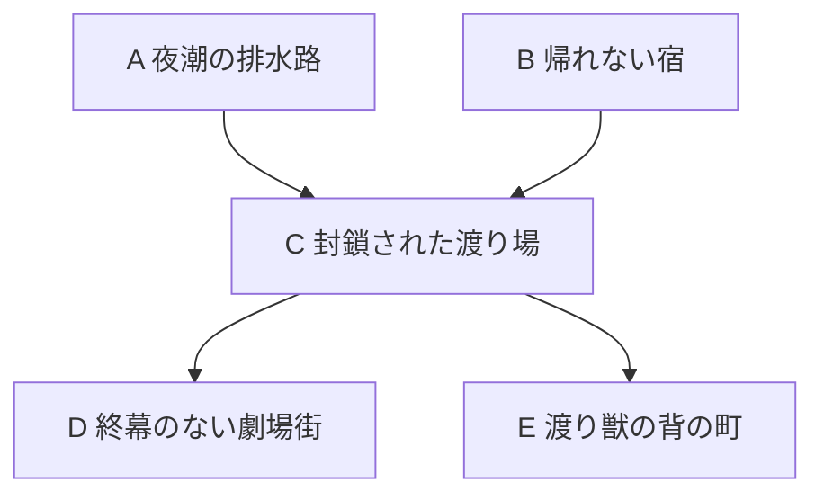

# crossweave — 世界観候補

版：0.9／2026-09-10（大枠採用後の案内更新）。
状態：**0.8の概ねの世界観はユーザーが決定稿として採用。大枠の正本は[世界観設定](../../確定仕様/世界観/世界観設定.md)へ集約した。以下は0.8までの具体化の経緯と内容案を保持する。過去の「未決定」を、大枠が未選択という意味に戻して扱わない。**

追加の検討：[背景断片](背景断片.md)／[用語検討](用語検討.md)。探索名・個別の事件・人物・具体機能等の詳細は引き続き案。新しい名称の推奨と大枠の採用を区別する。

担当：`20260910-worldbuilding`／`design/worldbuilding-20260910`。
0.8本文の参照時点：基本設計0.46・D46、同期元 `41b1a029e973cd99f6e5e59bf5079864285b111a`。今回の用語検討では `6d28d67996c21040aae61a4017a2da3b5758760e` まで取込み、基本設計0.47・D47と未採用の体勢案も確認した。探索数・個別解放条件・一回の内容構成は引き続き具体案として扱う。
入口：[Work設定](../../作業資料/Work/20260910-worldbuilding.md)／[反応の原記録](../../作業資料/世界観/検討記録.md)。

## 1. 今回の方向：異変調査を主な仕事、踏査・取材・回収を副目的にする

ユーザーは、ゲームの目的に「踏破」を置く場合、K02の取材等だけでは危険を冒して奥へ進む必要性が弱いと指摘した。そのうえでK04を高く評価し、K01・K02・K03を副目的として含める方向を提案した。今回はこの組合せを具体化の基盤にする。

**日常や旅先で起きる異変について、現地に入り、原因と対処の見通しを確かめ、必要な対応を引き受ける探索者。** その道中で未知の道を調べ、世界の記録を集め、価値あるものを持ち帰る。

「必要な対応まで引き受ける」は今回の補強案。調査報告だけで完了する案件もあり得るが、主な探索案件には、深部で確認・達成する必要のある目標を置く。全案件を退治や世界救済へ統一せず、原因の確定、現地での処置、対象の回収等から選ぶ。

道具化能力は未知に対処し、旅で使える手段を増やす能力として維持する。仕事を必ず道具制作へ結び付けず、特定の不思議の所在を事前に知る必要も置かない。必要な道具の調達は、発見後の個別目的や再訪理由として使える。

旧5案からの再選択には戻さない。K05の連絡屋は今回の主・副目的の組合せへ自動追加せず、以前の候補として保持する。名称、主人公の職業上の身分、組織、個々の案件は未決定。

## 2. 継承する世界とプレイヤー

骨格はS01「日常の裏側に広がる世界」＋S03「世界の継ぎ目を巡る旅」。不思議が一見見えない日常に帰る場所があり、その裏側の道から数多の世界へ出かける。

現代に近い町、商店街、古い駅、住まいの作業机等は引き続き仮の具体像。帰る場所の第一案は、小さな調査の窓口と、地図や記録・旅道具を広げられる部屋。自営か所属組織の一室かは未決定。道具店の経営は既定にしない。

旅先には境界の市場、物語に覆われた旧市街、内部に空がある巨大遺構、巨獣の背と内側、忘れものの漂着地、不思議を使う文明等を置ける。住人の暮らしや歴史を持つ世界として、それぞれの成り立ちを保つ。

主人公の強みには「境界を越え、普通なら踏み込めない場所で探索を続けられること」も含められる。その理由を、体質、経験、知識、道具化を含む複数の技術のどれに置くかは未決定。唯一の越境者や、必ず無事に帰れる能力とは定めない。

不思議を取り込み具体的な道具にする方向は継承する。怪異・夢・物語・魔法・文明遺構等を広く対象にできる。探索中に初めて知った働きが、自分の手段になることを重視し、出発前からその道具の完成形を知る必要はない。

## 3. 出発時に何を知っていればよいか

探索へ出る理由と、何が見つかるかの確定を分ける。

| 時点・情報 | 仮例 | 扱い |
|---|---|---|
| 出発する手掛かり | 未記録の分岐、知らない地名の手紙、町で起きた異変、由来不明の漂着物 | 調べる場所や問いの足場になる |
| 事前に見込める範囲 | 水の多い場所らしい、古い設備がある、往来の記録が途絶えている | 根拠のある概略情報として準備に使える |
| 現地で初めて分かること | 向こうの世界の暮らし、現象の原因、どんな不思議が働くか、別の道の行き先 | 探索の発見と判断の中心 |
| 帰って仕事へつながること | 実地の記録、危険や通行条件、確認した事実、回収物、相手からの返事 | 依頼者や取引相手に価値がある成果 |
| 後の探索に使うこと | 発見した現象の所在、住人との接点、未調査区域、準備できるようになった道具 | 再訪・追加調査・個別の調達目的へつながる |

出発時に「何を知りたいか」はあってよい。「どの不思議を獲得して、どの道具にするか」は未知のまま仕事が成立するようにする。

既存のD40では初訪問でも攻略傾向の概略を示す。世界設定の未知と、遊ぶための見通しは両立させる。手掛かりの不確かさを使って、提示済みの攻略情報が理由なく裏切られることを前提にしない。

## 4. 主な仕事と副目的の役割

| 位置付け | 探索する理由 | 成果の仮例 | 全体との関係 |
|---|---|---|---|
| **主軸：K04 異変調査** | 依頼された問題を明らかにし、対応を判断・実行できるところまで進む | 原因地点での確認、深部設備への処置、問題に関わる対象の回収 | 深部の目標へ向かう理由と、案件の区切りを作る |
| 副目的：K01 踏査 | 未知の経路、土地の性質、通行条件を調べる | 分岐の記録、安全な生活圏、別の世界へ通じる道の情報 | 進路や再訪の見通しを増やす |
| 副目的：K02 取材・記録 | 出会った世界・人・出来事を知り、記録する | 住人の証言、土地の来歴、旅の記録 | 世界への関心を深め、異変の解釈や後の案件にもつながる |
| 副目的：K03 回収 | 現地で見つけた品の価値を見極め、持ち帰る | 遺物、資料、漂着物、使い道を検討できる品 | 寄り道や進退に、追加の成果を狙う理由が生まれる |

この三つを毎回すべて達成する必須課題にはしない。一回の探索で自然に得た記録だけのことも、主目的の途中で価値ある品を見つけて寄り道を考えることもある。

調査の依頼者は、異変に困った日常の住人や店だけでなく、訪れた世界の共同体、裏道を利用する人々にも広げられる。仕事を通じて知った土地から別の相談が届き、旅先が次の出発点になる。日常の町で事件が発生し続けることだけに旅を依存させない。

主人公自身が、過去の調査で残った疑問や異なる場所に共通する兆候を追い、追加調査を提案することもできる。自営なら仕事ごとの調査料、所属するなら組織の仕事として活動費を得る等、生計の支え方は別途選べる。固定費・納期・評判値等をゲーム機能として新設する意味ではない。

## 5. なぜ奥へ進む必要があるのか

### 5.1 入口で分かることと、深部でしか確かめられないこと

主な案件では、出発時に「困っている現象」を提示し、探索によってその奥にある原因・関係・必要な対応を絞り込む。

入口付近で「異界につながっている」と分かっても、それだけでは、異変が続くのか、誰が影響を受けているのか、どう対処すべきかを決められない。手掛かりが深部の具体的な場所や対象を指し、そこへ到達して確認・処置することが仕事の区切りにつながる。

深部へ向かう必要は、証言、水の流れ、記録、現象の変化等で現地から分かるようにする。単に「答えはいつも最奥にある」という説明だけには頼らない。

| 深部の目標の型 | 奥へ行く理由 | その探索を終える具体的な達成の仮例 |
|---|---|---|
| 原因を確定する | 発生地点での観測や記録がなければ、複数の可能性を区別できない | 夢が繰り返し始まる場所へ到達し、発生の仕組みを確かめる |
| 現地で処置する | 異変を生む設備・流れ・現象が、その場所でしか扱えない | 深部の水路設備へ到達し、逆流を起こす切替を復旧する |
| 対象を取り戻す | 問題に関わる物や取り残された対象が、奥に留まっている | 現実から消えた記録の原本を保管庫から回収する |

具体達成の内容は提案。敵との戦闘、環境の踏破、経路の突破等が、核心へ到達するまでの課題になる。対話・操作・回収を全て新しいミニゲームにする前提は置かず、既存のイベントと終了条件へ接続する内容案として扱う。

### 5.2 途中帰還と、踏破を目指す意味

案件を完了したい理由と、今回の探索を続けるかの判断を分ける。

- 途中で原因の一部や次に必要な準備が分かれば、帰って再挑戦する意味がある。
- 踏査・記録・回収の副目的は、道中で得た成果にも価値を持たせる。
- 深部には、まだ確認できていない事実や未完了の処置等、案件を区切るための具体目標が残る。

これにより、「今回の成果を持って帰る」と「この先まで進めば仕事を一段進められる」を両立させる。進退判断を成立させるため、全案件を即時の人命危機・時間制限にすることは基本にしない。相談者が当面しのげる、影響区域を避けられる等、準備と複数回の探索を物語上も許容できる案件を含める。

一件の案件は、複数の探索を通して解決してもよい。ある探索で発生地点を確定し、次の探索で必要な対応を行う構成も可能。ただし、それぞれの探索に独立した目標と区切りを持たせ、単に長い道を細分化して途中再開にする扱いとは分ける。

### 5.3 解決後にも世界との関係を残す

異変の解決後も、訪問先の世界、住人、調べていない土地は残せる。解決した水路の先に別の遺構があり、知り合った住人が次の依頼者になる、といった継続を作る。

同じ事件が帰還のたびに何の説明もなく再発する設定にはしない。案件の進行や解決の物語上の扱いと、同じ探索内容へ再挑戦する仕組みの対応は別途詰める。全ての事件解決を恒久的な世界改変機能へ拡張することも、今回の前提にはしない。

## 6. 単独案件としての具体例（0.7）

この章は一件の因果関係を見る例。0.8の進行配置は10章を参照し、以下の全事象を一つの探索へ必ず詰め込む扱いにはしない。

### 6.1 主例：雨の降らない夜に、地下街が海水で浸かる

**依頼と出発。** 日常の町の商店から相談が来る。夜に地下へ海水が流れ込み、品物が傷む。依頼者が知るのは起きている被害だけで、どこへ行けば何が見つかるかは分からない。主人公は流入箇所と時間帯を調べ、古い地下通路にある境目へ入る。

**探索で世界を知る。** 通路の先には、空にも海が広がる港がある。港の住人も水位の乱れに困っている。現地の流れと古い水路図をたどると、異変が港の奥の設備につながっていると分かる。

**深部へ向かう理由。** 港を見つけただけでは、なぜ日常へ水が流れるか、どうすれば双方の暮らしを守れるかが確定しない。奥の水路設備を直接確かめる必要がある。危険な桟橋や通路を突破して進み、深部で、古い切替機構が壊れて満潮の水を日常側へ逃がしていると分かる。

**その探索の区切り。** 原因を確認したうえで、設備へ必要な処置を行うことを、この仮例の終点にする。設備への到達・処置をどのイベント結果で表すかは設計側へ渡す。原因の発見だけ、または副目的の品を一つ得ただけで、今回の全体クリアになったとはしない。

**同じ道中の副目的。**

| 副目的 | この案件での具体例 | 主目的との関係 |
|---|---|---|
| 踏査 | 水路の分岐と別の港へ続く通路を記録する | 今回の進路や、後の旅先の手掛かりになる |
| 取材・記録 | 住人から空の海の潮と、かつての水路の使われ方を聞く | 原因を考える手掛かりであり、旅の記録にもなる |
| 回収 | 脇の区画で古い観測資料や漂着物を見つける | 持ち帰るために寄り道するかを考えられる。毎回必須にはしない |

**道具化の位置。** 探索中に出会った夢や設備の不思議を、自分の手段として扱う余地がある。出発時に「落下の錘を得る」と決める必要はなく、特定の新規道具一つだけを必須の解決手段にも固定しない。

**帰還と次の旅。** 帰った主人公は、持ち帰れた成果と確認した事実を整理する。案件が解決した後も港の住人との関係は残り、未調査の通路や別の異変が次の旅へつながる。危険を感じて途中帰還した場合は、既存の精算に従った成果と、保持される知識を基に準備し直す。

### 6.2 同じ主軸で扱える別の案件

| 日常や旅先で起きること | 調査で入る世界 | 深部へ進む理由の仮例 |
|---|---|---|
| 何人もの住人が、眠るたび同じ廊下へ迷い込む | 複数の夢が重なった古い宿 | 廊下を歩いただけでは繰返しの理由が分からず、始まりの部屋で何が起きているか確かめる必要がある |
| 町の出来事が、古い芝居の筋書きに沿って起き始める | 物語と街路が重なる劇場の世界 | 現実への干渉が成立する終幕の場所を突き止め、そこで上演に対処する必要がある |
| 旅先の集落で、地下から脈動とともに建物が沈む | 巨獣の内部に残る文明遺構 | 生体の動きと設備の異常の関係を知り、奥の接点で原因を確かめる必要がある |

全例は未採用。解決方法や真相をプレイヤーへ事前に全部提示するものではなく、内容を設計する側が用意する因果関係の例。物語の結末改変、設備修理、巨獣の状態変化等の汎用機能を一括追加する意図はない。

## 7. 仕事の成果とゲーム上の報酬を区別する

生業として説明できることと、具体的なゲーム機能を採用することは別に扱う。

- 仕事上の依頼、プレイヤーが今回狙う成果、環境踏破、一回の探索全体クリア、次の探索先の解放は別に扱う。途中で関心や目的を変える余地を持たせ、依頼の完了だけで全体クリアや行先解放が成立する設定にはしない。全体進行の基本構造はD46採用済み。[一回の探索構成](../カード探索ゲーム_探索全体の設計.md#expedition-composition)や具体的な解放条件は案として参照する。
- 探索の結果を誰が必要とするかを示したが、報告ごとの料金、前金・成功報酬、雇用形態、依頼選択画面、評判値、納期、生活費等は未決定。
- 調査で否定的な結果が分かることにも物語上の価値を持たせられる。探索失敗や死亡でも毎回満額の報酬を得る、同じ既知の報告を繰り返し換金できる等の規則は追加しない。
- D41の保持される知識と、D43の今回探索で得る成長報酬は区別する。知識が残ることを理由に、今回失った報酬を報告で無条件に取り戻す形へは変更しない。具体的な調査記録・回収品と報酬の対応は設計担当へ渡す。
- 共有札は敵・環境・プレイヤーの間で循環し、同じ札の通常性能は使用者だけで変わらない。道具化を主人公だけの共有札利用権とはしない。
- 現地で一時的に使う札と、帰還後に初期構築へ準備できる手段の解放を区別する。任意の不思議の確定吸収・自動恒久取得は採用しない。
- 属性一致、場への設置、主効果と場作用、出現元退場時の由来札の消滅は既存設計を維持する。
- 帰還後の成長、HP全回復と探索入口からの再出発、保護済み成果のみを持ち帰る任意撤退、探索全体クリアでの全成果持帰り、死亡時の今回成果喪失を維持する。
- D44の探索先の攻略傾向・成果系統の一貫性と、D45の成長への難度非追随を維持する。未知探索を、既知の土地まで毎回根本から変わる根拠にはしない。

## 8. 今回の到達点

- K04の異変調査を主軸に、K01踏査・K02取材・K03回収を副目的とするユーザー提案を、今回の具体化の基盤として記録した。
- K02単独では危険な深部へ進む理由が弱いという指摘を、全体の目的構成へ反映。情報を得るだけで満足できる副目的と、核心での確認・対応が残る主目的を組み合わせた。
- 深部へ進む理由を現地の証拠や関係から示す案、途中帰還、複数探索での案件進行、解決後の世界との付き合いを具体化した。
- 道具化は探索で出会った不思議を手段へ変える能力として継承し、必須の調達目標には据えない。
- 0.8では、日常側の窓口と、案件の区切り・一回の探索・全体進行の対応を10〜11章へ具体化した。職業を再び横並びで選び直す段階には戻さない。

## 9. 以前の比較への参照

以前の案は固定コミットで保持する。前案の推薦や仮設定は当時の提案であり、今回のユーザー修正を優先する。

- [0.1：初回8案](https://github.com/eckolo/crossweave/blob/b83c63e7fc4570198742818d3d4baecc2da65f86/docs/仕様案/世界観/世界観候補.md)
- [0.2：主体6案](https://github.com/eckolo/crossweave/blob/1ae9f448f5491c01e49f64ce884a2cb0f976ae38/docs/仕様案/世界観/世界観候補.md)
- [0.3：舞台8案](https://github.com/eckolo/crossweave/blob/c6d520d59bb150796f22c385d90ecbb56cd4eed8/docs/仕様案/世界観/世界観候補.md)
- [0.4：日常と旅](https://github.com/eckolo/crossweave/blob/fc7293fbf27f887c3821bede77023b24115b5e73/docs/仕様案/世界観/世界観候補.md)
- [0.5：道具化と生業の比較](https://github.com/eckolo/crossweave/blob/b3dc010d3f753d39f52c0f6dc9395faff01c98a6/docs/仕様案/世界観/世界観候補.md)
- [0.6：未知探索が仕事になる生業5案](https://github.com/eckolo/crossweave/blob/2926003ec219befa0ca8596f2f9448bbe619a80c/docs/仕様案/世界観/世界観候補.md)

- [0.7：異変調査を主軸とした踏破目的と副目的](https://github.com/eckolo/crossweave/blob/7b713d6ec936d9ccdd38dc392226ba3e0a0197d3/docs/仕様案/世界観/世界観候補.md)

## 10. 現在の進行チャートへ、調査案件を配置する（0.8）

### 10.1 参照した構造と、今回具体化する範囲

[探索全体の設計12章](../カード探索ゲーム_探索全体の設計.md#progression-structure)の「AかBの一方をクリアするとCを選べ、CをクリアするとD・Eが開く」進行例と、[13章](../カード探索ゲーム_探索全体の設計.md#expedition-composition)の内容構成に沿って考える。

D46で採用されたのは、異なる探索先を選び、要所の攻略によって次の範囲を開く基本構造。以下の一方クリアという閾値や渡り場による接続は、その具体化案である。[14章](../カード探索ゲーム_探索全体の設計.md#unknown-exploration)の世界・探索先・一回の探索を分ける考え方も維持する。一つの世界に複数の探索先を置け、一回の探索が世界の境目をまたいでもよい。境目を越えるだけで自動帰還や回復は起こさない。

A〜Eは比較用の枠で、ゲーム全体が五つの探索だけで終わる決定ではない。以下は、最初のまとまりで日常の近くから異界の広がりを知る具体案。採用されているルールと、探索数・個別解放条件・事件等の仮案を区別する。

図は帰還後に選べる探索先の関係。**AまたはBの片方をクリアすればCへ進める。** 各探索の後には日常側へ帰って成果を整理し、準備してから次へ出る。同じ一回の探索中にAからEまで連続する図ではない。

日常に近い二つの案件から、世界間の小さな中継地へ到達し、その先で異界の住人が抱える案件を選ぶ。舞台の規模が広がっても、主人公が行うのは「異変を調べ、核心へ進み、必要な対応をする」仕事のまま。

### 10.2 A〜Eに置く案件と深部目標

| 枠・探索先 | 出発時の相談・手掛かり | 深部へ進んで達成すること | 成果や未知の題材・次との接続 |
|---|---|---|---|
| **A 夜潮の排水路** | 商店街の地下へ、雨の降らない夜にも海水が流れ込む | 逆流する水路を突破し、奥の水門で流入の原因を確かめ、局所の流れを復旧する | 水の流れ・圧力の不思議、漂着資料。水門の管理用連絡路から旧い渡り場への経路が分かる |
| **B 帰れない宿** | 古い宿の階段を上ると同じ踊り場へ戻り、奥の部屋へたどり着けない | 夢と重なった廊下に入り、帰路を塞ぐ影を退け、宿の往来を回復する | 夢・影・霧の働き、宿泊客の記録。宿がかつて越境者の休泊所で、裏の廊下が渡り場へ通じると分かる |
| **C 封鎖された渡り場** | かつて世界間の往来に使われた中継地が閉じ、通行者を拒む状態になっている | 閉ざされた通行区画を突破し、奥の門守の暴走を止める | 古い境界設備と迷い霧、世界間の交通の記録。通行が回復してD・E方面へ出発できる |
| **D 終幕のない劇場街** | 芝居の出来事が住人の暮らしへ入り込み、終わるはずの上演が続いている | 上演が現実へ干渉する終幕の場所を突き止め、そこで異変へ対処する | 物語の役割・反復・場面の働き、街の来歴。D固有の次の調査や関係が生まれる |
| **E 渡り獣の背の町** | 巨獣の脈動に合わせて、背の町の一部が沈み始める | 内部へ入り、生体と呑み込まれた設備の接点で原因を確かめ、必要な処置を行う | 生体の働き・古代設備・巨獣の夢。E固有の未調査区画や住人との関係が残る |

A/Bの相談は症状から始まり、奥にある設備や存在は探索で分かる。D/Eでも依頼者が知るのは被害や兆候で、解決方法・得られる道具までは確定していない。表の深部目標は内容を設計する側の案であり、真相を最初から全公開するものではない。

Aの局所的な流入を直すこと、Bの宿の往来を戻すことは、それぞれ独立して依頼者の役に立つ完了点。Cを出すためだけの前座にはしない。いずれを終えても渡り場へたどり着く十分な経路情報が得られる。A/B両方の手掛かりや固有札を揃えなければCへ進めない構成にはしない。

### 10.3 探索の遊び方の違いも、元の内容案へ合わせる

| 元の役割 | 世界観を付けた対応 | 維持する攻略上の違い |
|---|---|---|
| A：環境T1→T2、任意の敵Eα | T1＝逆流する地下水路、T2＝奥の水門、Eα＝水路を徘徊する漂着した潜水服 | 水路と水門の突破が進行の軸。潜水服を攻略して由来の札αの解放候補を狙うか、先へ進むかを選べる |
| B：目的敵Eβ＋支援環境S、S踏破でLへ | Eβ＝帰路を塞ぐ影、S＝迷い霧、L＝霧の薄れた廊下 | 影の攻略が終点。霧を残して作用を利用するか、先に薄めて状況を変えるかを考える |
| C：進行環境T＋Sから、終盤のEγ＋S/Lへ | T＝閉ざされた通行区画、S＝迷い霧、Eγ＝暴走した門守、L＝霧の薄れた渡り場 | 前半に残した霧が門守との戦闘にも続く。前半の判断と消耗を終盤へ持ち越す |

「潜水服」「影」「霧」「門守」は表現案であり、札性能・属性・HP・行動方式の採用ではない。B/Cの霧には共通する働きを持たせられるが、具体的な同一札・数値まで固定しない。

Cでは、霧に姿を紛らせる恩恵が主人公にも門守にもある、といった表現が考えられる。Sの作用は共通ルールに従い各主体へ及ぶものとして設計し、物語の都合だけで主人公専用の支援にはしない。霧を先に薄めると、前半の負担と終盤の状況が変わる。途中で薄めても、継続する敵や主人公の状態はリセットしない。

T突破で奥の門守との対峙が始まっても、同じ渡り場の霧は残っている、と描けば環境の継続が自然に見える。前半で霧由来の札を借りられた場合も、その後の所持・使用を保証せず、出現元の退場と札の消滅を既存規則で扱う。

D/Eは元のチャートでは新しい攻略先の枠だけがある。今回、Dは上演を支える環境と演者への対処、Eは生体の危険と設備を渡る複数区間を題材にする。具体的なイベント数、終点の敵・環境種別、性能は設計担当との次の接続事項とする。

### 10.4 どちらから始めても、未攻略の方が仕事として残る

- **A→Cの順で進む場合：** 水路から渡り場へ通じる経路を知ってCへ挑める。Bの宿の相談と夢・影の手段への関心は残り、必要ならBで別の経験や準備を得られる。
- **B→Cの順で進む場合：** 宿の古い往来から渡り場へ進める。Aは環境突破を中心とする別の仕事として残る。
- **A/B両方を先に行う場合：** 別の対処を試し、手段や知識を増やしてからCへ向かえる。ただし両方の固有札がCの唯一の解法になる構成にはしない。
- **A/Bの途中で帰還する場合：** 保護済みの成果や得た知識を次の準備へ使える。一部の情報を得ただけでその探索のクリア実績・Cの解放に読み替えない。
- **Cを途中で帰還する場合：** 新しい探索はCの入口から始める。前回の霧の状態や、途中の門守の消耗を持ち越す方式へはしない。
- **Cの後：** D/Eから次の案件を選べる。日常の窓口も残り、報告・準備を挟みながら遠くの世界との仕事が増える。

未着手の案件が残っても自然なよう、Aは影響区域を避けられる浸水、Bは使用を止めている宿の一部という程度から始められる。初期の全案件に短い救助期限を付け、先に選ばなかった方を放置できなくする前提にはしない。

### 10.5 収穫・再訪・大きな進行の関係

成長ポイントと用途限定の成果、札の解放候補は現行の方針を維持する。Aは水路の現象や漂着物、Bは夢や影、Cは境界の設備という異なる由来を持たせる。共通用途の成果を後続の探索でも得る設計と両立させ、毎回Aへ戻る必要がある世界設定にはしない。

踏査・取材・回収は各案件の道中に置ける。例えばCでは、使われなくなった出口の記録、元の利用者の話、倉庫に残った品が、主目的以外に先を見たくなる題材になる。道具化も遭遇して初めて分かる働きを手段にする形で残す。

初訪問のAでは、浸水の相談と「障害を越えて奥へ進む」という見通しを頼りに出発する。現地で潜水服や水路の働きを知れば、再訪には「前に見つけた手段を持ち帰りたい」という目的も加わる。死亡後も確認した知識は残るが、失った札の解放まで得た扱いにはしない。既知の成果を狙えることと、次も同じ相手・成果に必ず出会うことは分ける。こうして調達は、探索から生まれる個別目的として置ける。

初回の案件完了と、その後の探索は描写を分ける案が必要。直した同じ水門の同じ故障を、理由なく毎回再発させる方式は基盤にしない。水路全体に残る不思議や別の調査、同系統の危険がある区域を再訪の題材にできる。D44の攻略傾向を維持した反復に、どの範囲まで物語の変化を付けるかは今後の具体化事項。

この最初のまとまりで示す進行の手触りは、「身近な異変の調査」から「世界間の往来を回復する仕事」、さらに「異界の住人から直接持ち込まれる案件」への広がり。Cは最初の地域的な節目であり、全ての世界や不思議の起源を解く最終目的にはしない。

## 11. 世界観側を少し掘り下げる（0.8の仮案）

### 11.1 日常側には、小さな調査の窓口がある

第一案は、主人公が日常の町に小さな調査事務所を持つ形。住まいと仕事場が近く、地図・記録・旅道具を広げる部屋がある。困った人が直接訪ねるほか、顔なじみの古書店、修理屋、建物の管理人等から相談を紹介される。

主人公は開始時点で近場の異変へ対処した経験があるが、閉じた渡り場の先はまだ知らない。この程度の出発点なら、仕事を請け負える専門性と、新しい世界に驚く余地を両立できる。年齢・種族・名前・能力の来歴、事務所が自営か所属先の窓口かは未確定。

対価は調査と対応という仕事に対して得る。異界側でも、現地の案内、資料、物品、協力等が関係を支える候補になる。共通通貨や細かな契約・経営をここで制定せず、生業が世界の人々に必要とされる理由を先に置く。

### 11.2 不思議についての知識は、人と場所に偏っている

普通の暮らしでは、裏道の入口に気付かなかったり、知っていても入る必要がなかったりする。町の人は、奇妙な出来事を設備の不調、古い噂、見間違い等として扱っている場合もある。

一方、特定の入口を知る店主、身近な異変に対処してきた住人、日常へ働きに来る異界の人も点在する。知る人同士の紹介を通じて、主人公の仕事と行き先が広がる。

人によって知る範囲が違い、入口を知っていることと、危険な深部を探索できることも違う。主人公の専門性は越境だけでなく、現地を調べ、危険に対応し、判断できる成果を持ち帰るところにある。不思議の目撃を常に消す万能の隠蔽機構は、この案の前提に置かない。

### 11.3 自然につながった境目に、人が往来を作ってきた

世界同士には、川沿いの道、夢を見やすい場所、古い建物の奥等を介した境目がある、と仮置きする。入口の成立条件を一つの式へ統一せず、場所の性質や来歴から手掛かりを持たせる。

その一部を使った人々が、道標、宿、渡り場、倉庫を整備してきた。Cの渡り場はその地域の小さな中継地であり、世界を生んだ施設ではない。夢や物語や文明遺構は別々の由来を保ったまま、往来によって接している。

この町の周辺に複数の入口が残るのは、昔の往来の拠点が近くにあったため、という背景にできる。ゲームの進行で回復するのはこの地域の道であり、全宇宙の出入口を主人公一人が管理する構図には広げない。

### 11.4 異変は、異なる世界の働きが接する場所でも起きる

不思議は、それぞれの世界の暮らしの一部でもある。向こうの正常な潮の動きが日常の地下へ入れば被害になり、夢の宿にとって自然な廊下が普通の客を迷わせることもある。ほかに、古い設備の故障、制御を離れた存在、意図を持った行為等も案件の原因にできる。

主人公の仕事は、何が起き、誰にどう影響しているかを知り、対応を選ぶこと。こうして異界の住人も、調査対象の世界で暮らす人として登場できる。全ての異変を同一の黒幕や、一つの失われた文明に由来させる必要はない。

道具化は、違う由来の働きを主人公が手に取れる形で扱う能力。未知の正体を全て理解していなくても、今使える道具の働きは明確に示す。能力の起源や、誰もが同じ力を持つかは今回の掘下げで決め切らない。

## 12. 今回の到達点と設計側へ渡す内容（0.8）

- 現行のA/B→C→D/Eの例を、身近な二案件、地域の渡り場、異界側の二案件へ対応させた。A/Bの片方でCへ進め、未攻略の方にも独立した目的が残る。
- Aの環境突破、Bの敵攻略と環境選択、Cの前半から終盤への環境継続を具体的な姿へ対応させた。元の探索内の状態継承を変えずに説明できる。
- 日常での仕事の窓口、局所的に知られる不思議、境目に人が整備した往来、異変が起きる理由を仮案として追加した。世界全体の起源、主人公の固有設定、大組織、数値経済まで拡張していない。
- 設計側への受渡しは、本書10章の案件配置・内容対応・未攻略先の意味と、11章の表現前提。採用仕様、具体的な札・数値、地名・人物・進行条件の仮案を区別する。
- 今後の大きな接続事項は、初回の案件完了と再訪時の内容、D/Eで異なる攻略を求める具体構成、持帰り報酬の世界観上の表現。今回は具体化と文書整合の確認であり、面白さの人評価やゲーム実装を完了したものではない。
