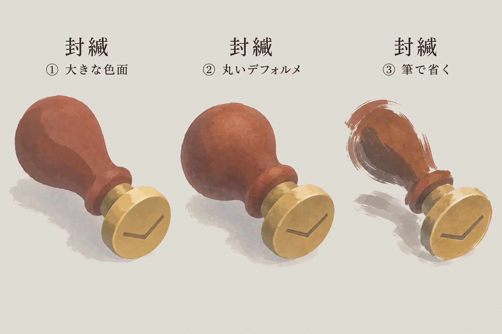

# 画像の保全と提示

版：0.1／2026-09-13（日本時間）。Work `20260912-visual-direction`。

## 今回の照合範囲

ユーザーの最後の描画指示は「大きな形・面を優先」「写実性が強過ぎる」「水路も細かく描き過ぎ」「一つへ収束させず様々な描き方を試す」「道具はアイコンに近い用途だが試作解像度は実装寸法ではない」。この指示以降から旧Work中断までに作成された画像を対象にした。

旧Workの生成元 `/workspace/scratch/173bf3b36c83/generated_images` にある全3画像、保全先の見本一覧、制作元の正確な指示、検討記録を照合。対象は封緘の比較板1点・作例3個で、3つの独立ファイルではない。時刻だけでは会話の順序を確定せず、指示・記録との対応を使った。元画像と保存コピーはバイト単位で一致した。[機械照合の結果](画像保全照合.json)にサイズ・SHA-256・Git blobを保持する。

| 制作順 | 画像 | 今回の対象との関係 | 状態 |
|---|---|---|---|
| 旧Work・1 | [夜潮の排水路の旧背景](../../仕様案/ビジュアル・演出/見本/night-tide-channel.png) | 最後の指示より前 | 既存保存を保持。生成元と一致 |
| 旧Work・2 | [封緘の単品試作](../../仕様案/ビジュアル・演出/見本/seal-soft-study.png) | 最後の指示より前。写実性が強いとの評価対象 | GitHub保存済み。生成元と一致 |
| 旧Work・3 | [封緘の描き方比較](../../仕様案/ビジュアル・演出/見本/seal-style-explorations.png) | **最後の指示以降から旧Work中断までの全1画像** | GitHub保存済み・本返答で再提示。①大きな色面、②丸いデフォルメ、③筆で省く |
| 再開後・1 | [水路の描き方比較](../../仕様案/ビジュアル・演出/見本/night-tide-style-explorations.png) | 本チャットで新規制作 | 前の返答で表示済み。旧Work成果とは分けて保持 |

この照合範囲で、最後の指示後の未保全画像や別の完成出力は見つからなかった。失敗した生成を完成画像として数えず、生成されていない素材を補完しない。

## 封緘の比較板：旧Workの最終出力

1536×1024px。正確な[生成指示](制作元/封緘の描き方比較.txt)を保持。再生成・切り分け・画像加工は行っていない。提示は個別作例の採用や実装寸法の決定とは別。

## 今後の手順

1. 画像を作成したら、題材の日本語名・作例ラベル・正確な生成指示を対応させ、生成原本を保全する。比較板と独立素材の枚数を区別する。
2. 見本一覧へ追加し、既存画像の上書きで制作経緯を消さない。旧稿・現行試作・採用済みの区分を明示する。
3. まとまった作業単位で自Workブランチへ保存し、GitHub上のファイルと内容を照合する。画像の表示と保存完了を取り違えない。
4. ユーザーへ画像自体を日本語の題材ラベル付きで提示する。ファイルへのリンクや「作成した」という報告だけで提示完了にしない。比較板は作例ラベルも説明する。
5. 会話引継ぎでは、直近のユーザー指示・それ以降の全生成画像・保存状態・提示状態・未取得の所感を一覧で残し、画像の提示漏れを先に解消する。

## 公開許可の扱い

2026-09-13のユーザーは、今回の画像3点と更新資料の公開を許可し、既に許可した `eckolo/crossweave` はブランチを問わず公開許可済みとして扱う意向を明示した。通常のプロジェクト成果の公開はリポジトリ単位で許可済みとして引き継ぐ。公開許可と他Workの編集担当・成果統合の権限は別に管理し、このWorkでは既存の作業ブランチへ保存する。

直前の自動審査は、過去の許可を記載した取得文書・履歴を現在の公開許可の根拠として認めず拒否した。画像特有の基準や原因は確認できない。今回の直接の許可後には同じ通常Pushが審査を通過し、その後にローカルGitの認証不足で失敗した。接続済みGitHubの正規の書込み機能で同じ許可対象を保存する。認証失敗と審査拒否を混同しない。設定文への記録だけで自動審査の将来の挙動を保証しない。

### 保存完了の確認（今回の最新状態）

公開成果コミットは `347e97d7c1fff326b785ad968244f10a1ba8f153`、全内容のツリーは `bfce4776d785bcdf3b32edd90a01fbb002585967`。GitHubのブランチHEAD・コミット・画像保全照合JSONを再取得し、ローカル全内容との一致を確認した。新しい画像3点（旧Workの封緘単品・封緘比較、再開後の水路比較）と更新資料を含め、既存の画像も保全。公開済み自Work `ac85768` と同期元 `84badb4` の履歴を維持した通常更新。保存・許可待ちは解消し、過去の拒否記録を現在の停止理由として再使用しない。

最後の旧Work指示以降の画像は封緘比較板1点・3作例。原本と同じ画像を本返答で再提示する。日本語ラベル・制作元指示・旧稿の区分・保全と提示の手順は[画像の保全と提示](画像の保全と提示.md)にある。各作例の採否判断や実装寸法の確定は行っていない。

## 追加比較2画像の保全確認（2026-09-13・今回の最新状態）

[輪郭を省く比較](../../仕様案/ビジュアル・演出/輪郭を省く比較.md)の封緘・水路の計2画像・6作例を成果 `245f77d256ba79ef673677536c04c1223c2d03ec` へ保存。生成原本とのSHA-256・Git blob一致を再照合し、公開後の全内容ツリーもローカルと一致した。

| 画像 | 対応する原本 | 提示・判断 |
|---|---|---|
| `seal-lost-edges.png` | `exec-874536e9-e093-4467-b7e5-508bb1af041f.png` | 直前の生成時に提示済み。基本②「少数の筆で拾う」を選択 |
| `night-tide-lost-edges.png` | `exec-e1e3f297-cfa5-4029-b205-0d47f3782ac2.png` | 直前の生成時に提示済み。背景③「輪郭を途切れさせる」を選択 |

同じ生成フォルダの `exec-0e20c0af-63e6-4886-9a7a-a3005b520f87.png` は旧 `night-tide-style-explorations.png` とバイト一致（SHA-256 `a4a32cb52450e23ccb60a328db834fd396bf68644df967522e09b23211282ff6`）。未記録の別試作ではない。今回の手順整理では新画像を生成していない。
