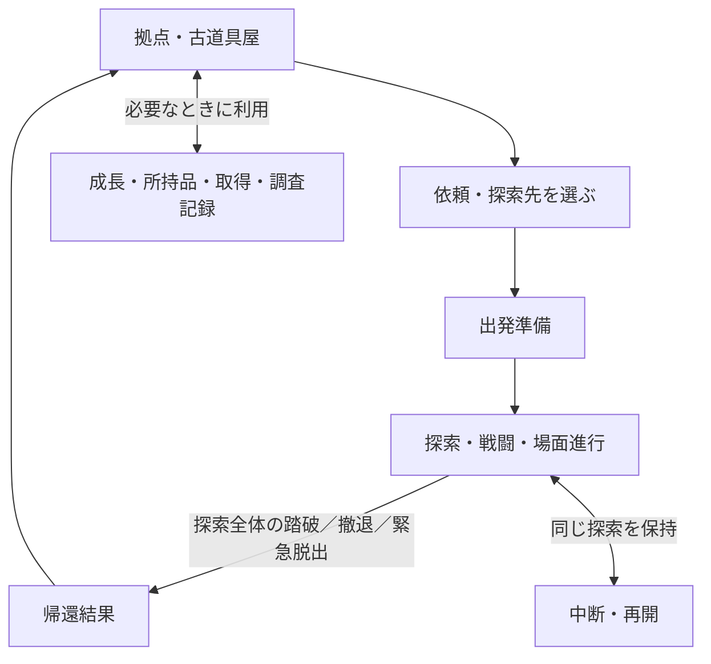

# UI検討 — ゲーム進行と全画面一覧

版：1.1／2026-09-16（日本時間）

親タスク：**UI-PLAN-001「全画面のUIを決める」**

担当：UI Work `20260910-ui-readability`／`ui/readability-20260910`

状態：**全30項目＋条件待ち4候補の構成と26行動経路を整理し、帰還・札組／心得・探索先・探索をつなぐ操作試作0.5を作成。文字の大きな囲いを外し、帰還・探索先・場面文を背景へ重ねる配置に修正。16:9の了承と主画面のスクロール禁止を受領し、固定操作帯・枠内ページ一覧・本文の小窓を反映。心得一覧の密度、記録の札詳細と親子窓、探索の収まり・能力アイコン・対象指定と参照の分離を修正。実Campaign＋一時メモリーで主経路を接続。全機能実装・実セーブ・実表示・操作量実測・ユーザー受入とCO-U02全体完了は未了。**

ユーザーの「現状のゲーム進行フローを整理し『画面』の種類を全て出す」「一覧を記録し、『UI検討』のタスクとして全ての画面のUIを決めていく」という依頼を登録する。本書を全画面の一覧・進捗の正本とする。

現状の進行と操作から、**30のUI検討単位と、仕様条件待ちの4候補**を洗い出した。「画面」には主画面、詳細窓、場面表示、操作結果・エラーの状態を含む。30枚の独立したページを作る決定ではない。統合・タブ化・重ねる窓・一時表示・画面不要の判断も、各タスクの成果として記録する。プレイヤーに出す正式な画面名も、この管理用の名称だけで確定しない。

ユーザーから一覧の方針への了承と継続指示を受領。[UI-F-001 拠点・準備・帰還の構成案](flow/README.md)と[操作試作](flow/preview.html)を追加した。今回の配置案の正式採用は未了。

探索画面の基準は[正式参照版1.0／UI-R-002 v0.15](正式参照版.md)。今回の一覧化はその採用を引き継ぐ。探索外の画面まで設計済みとせず、新しい条件への対応は個別タスクで管理する。

**今回の検討入口：[全画面構成0.6](全画面構成.md)・[画面機能要件0.5](画面機能要件.md)・[一巡の操作試作0.5](co-u02/journey/README.md)（2026-09-16）。** 構成資料は全IDと26経路、機能要件は情報・更新境界を保持する。設計を先に見直した後、ユーザーの「この方向で改めてUI設計」を受けて主経路を具体化した。既存一覧・履歴を維持し、機能IDごとに独立画面を作らない。

## 1. 確認した正本と現在の実装範囲

| 記号 | 資料・確認版 | この一覧への反映 |
|---|---|---|
| D | [基本設計0.53／D53](https://github.com/eckolo/crossweave/blob/002804daa8942c3faedb7b85d70152015f220c11/docs/確定仕様/カード探索ゲーム_基本設計.md) | 探索先選択、準備、探索終了と精算、成長・取得・変換、公開情報、中断と再開。2.11〜2.27、6章、9章を中心に確認 |
| A | [探索全体の設計](https://github.com/eckolo/crossweave/blob/002804daa8942c3faedb7b85d70152015f220c11/docs/仕様案/カード探索ゲーム_探索全体の設計.md)・[習得点の用途](https://github.com/eckolo/crossweave/blob/002804daa8942c3faedb7b85d70152015f220c11/docs/仕様案/カード探索ゲーム_習得点の用途.md) | 探索先と準備・再訪の接続、撤退の任意予告、習得返却と取得の比較。試験価格・候補数・編成値は採用値にしない |
| W | [世界観設定1.13](https://github.com/eckolo/crossweave/blob/19ed4bc74590bc14447ab055f1d174c06e93e20b/docs/確定仕様/世界観/世界観設定.md)・[正式用語集1.3](https://github.com/eckolo/crossweave/blob/19ed4bc74590bc14447ab055f1d174c06e93e20b/docs/確定仕様/世界観/正式用語集.md) | 古道具屋を拠点にする。心得・余力・緊急脱出などの表現。着想は習得点の仮称候補として扱う |
| S | [SCN-001概要](https://github.com/eckolo/crossweave/blob/a93ab629f62cefb14f061be600bdbcb4112f877b/docs/仕様案/シナリオ・探索内容/SCN-001_夜潮の排水路/概要.md)・[場面と進行](https://github.com/eckolo/crossweave/blob/a93ab629f62cefb14f061be600bdbcb4112f877b/docs/仕様案/シナリオ・探索内容/SCN-001_夜潮の排水路/場面と進行.md)・[接続と素材](https://github.com/eckolo/crossweave/blob/a93ab629f62cefb14f061be600bdbcb4112f877b/docs/仕様案/シナリオ・探索内容/SCN-001_夜潮の排水路/接続と素材.md)（0.1） | 依頼、到着、見晴らし、踏破後の変化、帰還、次の準備という具体的な接続例。製品全体の確定シナリオではない |
| T | [PT-NT-001案内](https://github.com/eckolo/crossweave/blob/54d701026ffeaf82b81a4a379b88ce036532d230/docs/検証/試遊/night-tide/README.md) | 依頼・初期編成→排水路→港の見晴らし→水門→帰還を一巡できる試遊。準備、場面、帰還、保存・復元の専用案を再利用検討の材料にする |
| R | [正式参照版](正式参照版.md)・[固定画面コード](https://github.com/eckolo/crossweave/tree/e8a1bae4eff18f4a1287e1e25bc7b8940f71fef1/docs/検証/UI/readability/interaction) | UI-R-002 v0.15の探索画面・詳細窓・操作・表示密度を継承。登録判断は2026-09-12 |

D・Aの確認元は必須同期元 `dev_design_tmp_assembly`。W・S・Tは各Workの参考ブランチから取得した。開始時の実取込コミットと成果反映前の確認は[自Work設定](../../../作業資料/Work/20260910-ui-readability.md)へ記録する。

**「存在する試遊」と「正式UI」を区別する。** PT-NT-001の準備・場面・帰還画面は既存の材料だが、共通の正式画面として採用されたものではない。同試遊の一巡コードは `169686cd77d5d35e4d4b2dd2f6723851fff4491c`。周回を積み重ねる成長・取得・変換・再訪の全体実装は含まれない。試遊の新規開始による初期化を、製品の帰還後の再出発として流用しない。

## 2. 現状のゲーム進行

### 2.1 基本の一巡

起動時は新規開始または保存データの再開へ進む。保存地点が拠点なら拠点、探索中なら同じ探索へ戻る。タイトルを挟むか、保存枠を何個持つか、初回導入をどこへ重ねるかはUI・保存方式の検討事項。

依頼・探索先を選ぶ際は、行ける場所、現在の目的、初見でも分かる傾向、既に調べた内容を確認する。出発前には札の編成と装備を整える。習得・取得・変換・調査記録は必要に応じて利用し、毎回順番に開く必須工程にはしない。

探索中は同じ基本画面で敵・環境・物体を扱い、終了条件に応じて対象の退場、環境の交代、後続イベント、短い場面描写へつなぐ。敵を一体倒すたび、環境を一つ突破するたびに、独立した勝利画面を必ず挟む仕様ではない。探索中の道順選択や地図はまだ採用されていない。

### 2.2 帰還・中断・途中進行の違い

| 発生したこと | 戻り先と表示 | 成果・状態の扱い |
|---|---|---|
| 対象の撃破・除去 | 探索画面で結果を示し、条件に応じて次の局面へ | 個別の成果を取得。生きたまま離れた対象を撃破扱いにしない |
| 環境の踏破 | 探索継続または探索全体の終了へ | その時点までの取得報酬を撤退に対して保護。場面文を読むだけで回復・補給・追加保護を発生させない |
| 探索全体の踏破 | 帰還結果→拠点 | 今回の取得報酬を全て持ち帰る |
| 任意撤退 | 帰還結果→拠点 | 保護済みを持ち帰り、未保護分は失う。任意の予告は用意するが、撤退ボタンは直接実行する現行方針を継承 |
| 余力0・緊急脱出 | 帰還結果の緊急脱出版→拠点 | 今回の取得報酬は保護済みを含めて失う。以前の恒久的な成果と、既に得た知識は保持する |
| 中断・保存→再開 | 同じ探索・局面へ | 帰還や新規探索ではない。状態を保持し、中断を理由に回復・精算・初期化しない |
| 戦闘離脱による探索継続 | 採用された離脱条件に応じて探索内の次局面へ | 探索全体からの撤退と区別する。具体的な離脱操作・配置は条件が定まった時にS15へ接続する |

帰還後は余力が回復し、持ち帰った成果を成長や次回の準備へ利用できる。新しい探索は選んだ探索先の入口から始まり、直前の手札・場・借用した札をそのまま次回へ引き継がない。札の解放など恒久的な変化も、探索中の循環へ即座に自動追加する意味ではない。根拠：D 2.11〜2.19、6.4、9章、W。

### 2.3 現在の具体例との対応

SCN-001／PT-NT-001は「依頼と準備→夜潮の排水路（潜水服は任意の相手）→港の見晴らし→水門→帰還」という接続の材料を持つ。見晴らしは同じ探索内の場面であり、原因を解決した後の変化と、実際に持ち帰れた獲得物は別に表示する。

シナリオ案には帰還後の準備・再訪・別探索先への接続もあるが、最新試遊は一巡が対象。依頼を解決した後の再訪では目的・場面が変わり得るため、解決済みの原因を毎回未解決へ戻す画面にはしない。解放条件や再訪内容の実装判断は設計・シナリオへ残す。

## 3. 画面一覧＝個別UI検討タスク

以下の各行を親タスクUI-PLAN-001の子タスクとして登録する。全行のUI担当は本Work、ゲーム規則の判断・成果統合は設計Work。根拠が「UI整理」の部分は必要な導線・状態を洗い出した提案であり、新しいゲーム機能を採用するものではない。

状態は次の区分で管理する。

- **未着手**：一覧登録まで完了。配置・操作・画面の分け方はこれから決める。
- **試遊案あり**：専用試遊に材料がある。共通画面への設計・採用は未着手。
- **基準あり**：正式参照版に該当UIがある。継承し、未対応条件と他画面への接続を検討する。
- **構成試作あり**：配置・画面の行き来を操作できる案を作成。正式採用・実機確認は未了。
- **操作試作あり**：公開契約の模擬応答で選択・比較・確定・拒否を操作できる。実API・永続保存・実描画・正式採用は別。
- **条件待ち**：仕組みの採否・条件がまだ決まらない。候補として追跡し、他のタスクは進める。

### 3.1 起動・拠点・出発

| ID | 画面・UI | 役割と出入り | UIで決めること | 状態・根拠 |
|---|---|---|---|---|
| UI-S01 | 起動・タイトル | 新規開始、続きから、設定への入口 | タイトルの要否、初回と通常起動の違い、開始までの操作数 | 未着手／UI整理、D 2.11 |
| UI-S02 | データ選択・続きから | 保存データを選び、拠点または中断した探索へ戻る | 保存地点の要約、複数枠の要否、新規開始との区別。保存方式・枠数は未確定 | 未着手／D 2.11、6.5、UI整理 |
| UI-S03 | 拠点 | 古道具屋から依頼・準備・成長・記録へ進む。帰還後の戻り先 | 場所の見せ方、各機能の入口と近さ、今回できることの示し方 | 構成試作あり／[UI-F-001](flow/README.md)。正式採用は未了 |
| UI-S04 | 依頼・探索先一覧 | 行ける探索先を比較して詳細・準備へ | 初回・未解決・解決済み・再訪・未解放の区別、候補増加への対応。地理的な地図は前提にしない | 構成試作あり／[UI-F-001](flow/README.md)。複数依頼は未実装 |
| UI-S05 | 依頼・探索先詳細 | 目的、場所の傾向、既知の情報を確認し、準備へ | 初見で見える情報と調査後の情報、解決後の変化。一律の受注・報告操作を追加しない | 構成試作あり／[UI-F-001](flow/README.md)。正式採用は未了 |
| UI-S06 | 出発準備 | 選んだ探索先と今回の編成・装備を確認して出発する | 概要と編集画面の接続、不足・制限違反の示し方。出発前に別の必須確認窓を重ねるかは未決 | 操作試作あり／[CO-U01・UI-G-001](co-u01/README.md)。帰還から準備、下書き・比較・確定。実出発は境界のみ |

### 3.2 編成・成長・所持品

| ID | 画面・UI | 役割と出入り | UIで決めること | 状態・根拠 |
|---|---|---|---|---|
| UI-S07 | 札の編成 | 利用可能な札から今回の初期山札を組み、準備へ戻る | 選択元と編成中の札、枚数・制限、追加・除去・詳細比較。現在の探索中の山札とは分ける | 操作試作あり／[CO-U01・UI-G-001](co-u01/README.md)。初期札／所持／購入予定の札組。全画面決定は継続 |
| UI-S08 | 心得の習得・組み直し | 帰還後に基礎心得を習得し、必要なら無料で取り直す | 未使用の着想と習得へ配分中の量、返却後の装備への影響、確定前の比較。返却と所持品の変換は別操作 | 操作試作あり／[CO-U01・UI-G-001](co-u01/README.md)。明示取消・実払返還・別基礎習得。模擬適用 |
| UI-S09 | 心得の装備 | 習得・所持した心得から今回使うものを選ぶ | 習得済み／所持／装備中を区別し、組合せと制限を示す。枠数や容量方式は決め打ちしない | 操作試作あり／[CO-U01・UI-G-001](co-u01/README.md)。基礎要件・個体・容量・装備を分離。模擬適用 |
| UI-S10 | 所持品一覧 | 札・心得の個体差や重複、素材を確認し、詳細・編成・変換へ | 絵による一覧、絞込み、数量と付加特性の比較。解放済みの種類と所有個体を混同しない | 操作試作あり／[CO-U01・UI-G-001](co-u01/README.md)。所持個体・修飾・変換保護。素材の用途は未接続 |
| UI-S11 | 取得候補 | 帰還後に内容の見える候補を比較し、着想で取得するか見送る | 候補数の増減、価格と未使用資源、現在使えるかと将来用か、習得の取り直しとの比較。比較だけでは購入・候補更新・習得解除を起こさない | 操作試作あり／[CO-U01・UI-G-001](co-u01/README.md)。購入予定・見送り・空／保持／購入済み・不足を区別 |
| UI-S12 | 変換 | 所持する取得物を選び、少量の成長資源へ変換する | 対象・数量・失う個体と得る量を明示し、実行前後を区別。最後の一つ、装備中、取消しの扱いは仕様確認 | 操作試作あり／[CO-U01・UI-G-001](co-u01/README.md)。見積0.5・使用中／保護中拒否。修飾個体の価格入力待ち |
| UI-S13 | 調査記録 | 既に知った探索先・相手・札などを拠点や必要な箇所で読み返す | 知識と所持品の区別、項目間の移動、未確認情報の扱い。設定資料の全文公開や未出現内容の先読みにはしない | 未着手／D 6.4、A、S |

「着想」は世界観側で提案された仮称（従来の習得点）。習得済みの心得を返す操作、所持品の変換、候補の購入は異なる状態を動かす。候補の比較で自動的に心得を解除して費用を補わない。返却後なら購入できる場合でも、購入後に元の構成を再習得できるとは限らないため、その差を見せる。試験の価格・容量・候補数は製品値に固定しない。BB・BCの続報も照合し、候補を見られること、買えること、装備できること、初巡から本人が使うことを一つにまとめない。未公開の次札や未来の成績を購入前に保証しない。

**2026-09-16の追加要件**：S08・S09とS10〜S12の心得分を、プレイヤー視点で一つの心得画面にまとめる。S07札組との直接切替と下書き・対象・位置の保持を要件とし、S06〜S12を共通の編成領域へまとめる案を[画面機能要件4.1〜4.2](画面機能要件.md)へ記録。札の所持・候補・変換は札組側へ、心得の同機能は心得側へ内包する案とし、独立した所持品・買い物・装備画面の巡回を必須にしない。上表の機能IDは検討・検証の対応用に維持し、既存試作を今回更新済みとは扱わない。

### 3.3 場面・探索・帰還

| ID | 画面・UI | 役割と出入り | UIで決めること | 状態・根拠 |
|---|---|---|---|---|
| UI-S14 | 会話・場面表示 | 依頼、到着、途中の見晴らし、解決後、帰還時の描写を進行へ重ねる | 短い主表示と任意の詳細、初回と再訪、探索画面との接続。読むことを行動時間・必須進行キーにしない | 試遊案あり／S、T、W |
| UI-S15 | 探索・戦闘 | 場を挟む構図で対象を選び、札を置き、結果を把握して次局面へ | 正式参照版を継承。可変数の場・対象、支援対象の除去／残置、途中の獲得・保護、離脱・後続イベントとの接続を補う | 基準あり／R、D 9章、A |
| UI-S16 | 帰還結果 | 踏破・撤退・緊急脱出の結果を確認し、拠点や次の準備へ | 同じ画面の3状態として持帰り／喪失、知識、解放、帰還後に使えるものを整理。終了時の余力と帰還による回復を混同しない | 操作試作あり／[CO-U01・UI-G-001](co-u01/README.md)。精算済み帰還→取消比較→ack後の準備。旧UI-Fの3状態は維持 |
| UI-S17 | 進行・解放のお知らせ | 依頼の解決、新しい探索先・札・心得等への導線を示す | 帰還結果内か一時表示か、読み返し先、複数同時発生の要約。解決・踏破・取得・解放を区別する | 未着手／D 2.14、2.22、S、UI整理 |

### 3.4 詳細窓・探索中の参照

| ID | 画面・UI | 役割と出入り | UIで決めること | 状態・根拠 |
|---|---|---|---|---|
| UI-S18 | 札・道具・心得詳細 | 手札・場札・編成・所持品・取得候補から個別情報を見る | 既存の札詳細を継承し、個体差・比較・用途を補う。情報量に合う窓、対象に近い位置、再クリック・窓外で閉じる操作 | 操作試作あり／[CO-U01・UI-G-001](co-u01/README.md)。一時表示／ピン・トグル・外クリック。性能詳細の公開入力待ち |
| UI-S19 | 対象・状況詳細 | 相手・環境・自分の現在の状況を参照し、元の画面へ戻る | 対象ごとの意味、性格・既知の情報、現在の効果、保護状態。対象選択と詳細表示を混同しない | 基準あり／R、D 6.1〜6.5、A |
| UI-S20 | 山札・捨て場 | 現在の札循環を絵の一覧と個別詳細で確認する | 未ドロー・手札・捨て場・初期編成の関係、件数増加。公開されていない他者の現在手札や将来のドロー順は見せない | 基準あり／R、D 3章、6.3〜6.4、7章 |
| UI-S21 | 行動順詳細 | アイコンを選び、その主体を軸に予定を確認する | 主体ごとの基準・時差、予定更新、公開済みの確定情報の範囲。現行の次回1回表示とD 6.7の将来対応を区別 | 基準あり／R、D 6.7 |
| UI-S22 | 目的・突破条件 | 今の目的と条件ごとの結果を確認する | 対象別の達成条件、別結果となる分岐の区別、短い要約。未出現の相手を「次」として開示しない | 基準あり／R、D 9章、S |
| UI-S23 | 履歴 | 起きた変化を一行ずつ新しい順に読み返す | 右下帯直上の一時表示と固定窓を継承。探索外の永続的な調査記録と分け、持ち込み・補給を常設ログへ戻さない | 基準あり／R、D 6.5 |
| UI-S24 | 撤退時の持帰り予告 | 必要なときだけ、今撤退した場合に残るものと失うものを見る | 状況窓または撤退ボタンのホバー等への組込み。毎回通る撤退確認画面を新設しない | 未着手／D 2.12〜2.13、A、R |

S18〜S24は独立ページを前提にせず、場面に応じた窓・一時表示として扱う。探索画面に常時文章を追加して全てを表示する方針にはしない。帰還で残る調査知識と、現在の探索の実際の札・相手の状態は分ける。

### 3.5 中断・再開・設定・共通状態

| ID | 画面・UI | 役割と出入り | UIで決めること | 状態・根拠 |
|---|---|---|---|---|
| UI-S25 | ポーズ・中断 | 探索状態を保存して終了、設定へ移動、またはそのまま続行する | 入口と操作数、保存済みの確認、中断できる処理境界。「ポーズ」による進行停止の詳細は仕様確認 | 未着手／D 2.11、T、UI整理 |
| UI-S26 | 再開時の状況確認 | 中断した目的・局面・直近の変化を思い出し、プレイへ戻る | S19・S22・S23の再利用、必要時だけ開く要約。再開のたびに必須の大窓を通すとは限らない | 未着手／D 6.5 |
| UI-S27 | 設定 | 表示・音・入力・補助などを調整して元の場所へ戻る | 既存の操作設定を継承。調整できる項目、変更の即時反映、初期値復帰、入力手段間の対応 | 基準あり／R、UI整理 |
| UI-S28 | 遊び方・初回案内 | 初回に場と対象・出札を学び、後から必要な説明を読み返す | 文脈に沿う短い案内と任意の詳説、再表示、手段別の操作案内。慣れた後も操作文章を常設しない | 未着手／Rの方針、UI整理 |
| UI-S29 | 保存・読込の状態表示 | 保存／読込の進行・完了・失敗を伝え、再試行や復帰へ導く | 保存不能、破損・非対応データ、中断処理中の表示。試遊のファイル入出力を製品の保存方式と決めつけない | 試遊案あり／D 2.11、T、UI整理 |
| UI-S30 | 重要操作の確認・実行不可表示 | 購入・変換・編成変更・データ操作等の必要な箇所で結果と問題を示す | 実行するものと戻れる範囲、無効理由、確定前後。既存の確認操作を点検し、全操作に確認窓を増やさない | 操作試作あり／[CO-U01・UI-G-001](co-u01/README.md)。資金／容量／札不足・失効・保存失敗と修正。永続保存は未接続 |

ゲームオーバー専用画面の必要情報はS16の緊急脱出版で扱う。終了・上書きの確認はS30、読込待ち・失敗はS29、データの選択はS02に含める。アカウント、オンライン対戦、課金、ログインボーナスなど現在の仕様にない機能は追加しない。

## 4. 仕様が決まった時に要否を判断する候補

次の4件もUI検討の子タスクとして追跡する。必要だと決まった時に具体化し、不要なら理由を残して閉じる。採否判断そのものは設計・該当Workが担当する。

| ID | 候補画面 | 今は決めない理由・着手条件 | 状態 |
|---|---|---|---|
| UI-C01 | 探索中の地図・進路選択 | D 2.20の探索内経路・マップ方式は未採用。経路を選ぶ操作が採用されたらS15との接続を設計。探索先一覧S04は先に進める | 条件待ち |
| UI-C02 | 素材の利用・加工 | 素材はあり得るが、加工・製作・特性の付け直しを行う仕様は未採用。用途が定まったら専用画面か既存画面への追加かを決める | 条件待ち |
| UI-C03 | 同行・救出の管理 | Wの救出は相手を連れて帰ることを含むが、同行状態や救出の具体操作は未確定。同行枠・料金・護衛システムをUIだけで新設しない | 条件待ち |
| UI-C04 | 終幕・スタッフロール・クリア後案内 | ゲーム全体の終点とクリア後の扱いが未確定。個別依頼の解決・探索踏破はS16・S17で扱い、全体の終幕が決まった時に具体化 | 条件待ち |

世界観に学校や古道具屋があることから、学校生活・日付管理・店舗経営画面を自動的に追加しない。取得候補S11も一般的な店舗売買・全商品カタログの採用を意味しない。主人公の名付け、外見編集、難易度選択などを別画面にする判断も現状の確定事項ではない。

## 5. 「UI検討」の進め方と完了条件

### 5.1 親タスクの進捗

| 工程 | 状態 | 対象・成果 |
|---|---|---|
| 現状のフロー・画面の洗い出し | 完了 | 本書の30単位＋4候補。現在の仕様で必要な導線と未確定事項を分離 |
| 操作・出来事・変化から機能要件を整理 | 整理案を提出／配置・演出は未決定 | [画面機能要件0.1](画面機能要件.md)。30項目と4条件待ち候補を、判断・更新・変化の表示・移動先で整理。2026-09-16のユーザー指示を受領 |
| プレイヤーの目的から統合構成・操作量を整理 | 心得1画面と直接往復の要件を受領／経路は設計案 | [画面機能要件0.2](画面機能要件.md)。所持対象の明確化、札組・心得への機能集約、13の行動経路と移動・決定の目標。未実装・未実測 |
| 全画面の操作経路を見直す | 設計案を提出／実装・実測・具体画面受入は未了 | [全画面構成0.1](全画面構成.md)。30項目の配置・主操作・省く往復・保持情報と26行動経路。条件待ち4候補も同観点で追跡 |
| 全体構成・画面の分け方 | 構成試作あり・採用未了 | [UI-F-001](flow/README.md)。拠点・依頼窓・広い準備・帰還結果を操作できる形で提示。探索の演算は未接続 |
| 各画面の配置・操作を決める | 具体化中／一部に既存基準 | 各Sタスクの案・比較・採用判断をここへ紐付ける。既存探索UIの了承を再質問しない |
| 操作可能な画面と試遊への接続 | 一部に既存材料 | 固定探索版とPT-NT-001の準備・場面・帰還を参照し、別の試験ID・版・差分で必要な試作を追加 |
| 全画面の決定・統合確認 | 未完了 | 全Sタスクが決定／既存画面へ統合／不要判断のいずれかになり、条件待ちの扱いと設計側の統合結果を記録 |

進める順は、まず**拠点から出発・帰還までの全体構成**、次に**札の編成と心得・取得・所持品の関係**、続いて**場面進行と探索・帰還の接続**、**起動・中断再開・設定の仕上げ**を基本とする。共通の窓・入力・戻り方・状態表示は各段階で併せて揃える。未決のゲーム数値があっても、可変値を前提に情報配置と操作案は進められる。

### 5.2 各画面で必ず決めること

1. **目的と出入り**：何を判断・実行する場所か、どこから開きどこへ戻るか。必須経路か任意の参照か。
2. **情報と公開時点**：常時表示、一時表示、詳細へ送る情報を一通り分類。未知の内容、所持と知識、予測と確定結果を分ける。
3. **配置と操作**：主画面・タブ・窓への統合、横長の画面比、可変件数とスクロールの誘導、選択・比較・実行・戻る操作を決める。
4. **状態の違い**：初回／再訪、空／多数、選択前後、利用可能／不可、確定前後、保存・復元、踏破／撤退／緊急脱出を必要な範囲で扱う。
5. **描画・入力の確認**：反復操作を重くせず、マウス・タッチ・キーボードで届くこと、窓の重なり、狭い表示、長い名称を確認する。必要な試作は実際に操作できる形で保存する。
6. **決定と引渡し**：画面案・判断日・参照版・未決事項・試験ID・開始手順・対象コミットを記録し、設計へ渡す。ゲーム条件を変えた試験を既存比較へ上書きしない。
7. **行動経路全体の操作量**：プレイヤーの目的・開始地点・完了状態を固定し、移動、タブ切替、窓の開閉、内容選択、再検索、スクロール、確定、待ちを評価する。画面別の操作数だけで効率を判断せず、反復頻度の高い再出発・札組と心得の往復・出札を優先する。

2026-09-16以降は、上記に**「何をきっかけに、どの対象がどう変わり、発生時と変化後に何を見せるか」**を必ず含める。状態を説明する文章や用語の常設を増やす前に、対象の移動・増減・置換・短い強調と、見逃しても読める結果を検討する。選択中の予告と成功後の変化を分ける。詳しくは[全画面の共通要件](画面機能要件.md)を参照。

各S/C行を更新するときは、状態とともに成果資料・判断記録のリンクを追加する。複数行を同じ画面へまとめてもIDを消さず、どの画面で満たしたかを残す。画面不要の判断も理由を記録する。現段階では「一覧へ登録した」ことと「UIが決まった」ことを分ける。

## 6. 他Workとの接続・用語の追従

UIに関係する検討では[正式参照版](正式参照版.md)と本書の対応IDを確認し、影響を受ける画面、表示する情報、公開時点、入力・出力、仮の値と未決事項を成果に添える。複数画面へ影響する変更は関係するIDを全て挙げる。

| 担当 | 今回の一覧から接続すること |
|---|---|
| 設計Work `20260909-design-assembly` | 進行・精算・保存の処理境界、取得と習得の状態、装備制限、候補更新、返却・変換の結果を指定。UI成果の確認・統合と中心文書への反映 |
| 世界観Work | 名称と意味、主体の表記、古道具屋や道具の見せ方。変更語がどの画面・操作に影響するかをUIへ接続 |
| シナリオ・探索内容Work | 依頼・場面・現在目的・解決後・再訪の分岐と公開時点。S04〜S05・S14〜S17・S22への短文と素材 |
| ビジュアル・演出Work | 拠点・対象・札・画面遷移の素材、背景と窓の重なり、反復して見る表示・演出。全画面を常時文章で埋めない |
| 試遊Work | 既存の試遊版・原記録を維持。新しいUI試作の画面・開始手順・比較条件を取得し、操作と所感を記録 |

**今回の用語確認**：世界観設定1.12／正式用語集1.3を照合した。`interaction/check-terms.cjs`はR02・R06・R12・R25に差分を検出（終了値2）。いずれも成長資源「習得点」から仮称候補「着想」への関連更新として確認した。新しい検討では着想を仮称と明記し、S08・S11・S12・S16等の資源表示、S09の装備条件、S13の説明への影響を追跡する。

世界観設定1.12は、関わりが深まった体験の専用描写を全道具に必須としない。札ごとの使用回数条件・習得イベント画面・毎回の帰路や護衛操作を追加せず、必要な物語表現はS14へ組み込む。

この一覧化で固定UI-R-002 v0.15の対応表やコードを自動置換しない。次の表示変更では最新用語を再取得し、意味・公開情報・字幅を確認して専用差分と使用版へ記録する。「心得容量」「負荷」など未採用の制限方式・語も、正式仕様として画面へ固定しない。世界観側の緊急脱出表現を使い、古い資料の「死亡」を死と復活の新しい仕組みへ広げない。

UI-F-001の反映前には世界観設定1.13・連携事項0.8まで追従した（参考HEAD `19ed4bc74590bc14447ab055f1d174c06e93e20b`）。受付・渡航・通常帰路は背景として省略でき、日常・再訪の追加案は専用画面を必須としない。既存のS03・S05・S14へ必要な表現を接続する方針を維持し、画面数を追加しない。

## 7. 保存・引渡し

成果の保存先は本UIブランチ。本書・資料入口・自Work設定を成果とし、集約のWork分担には自Workの索引行から本書へ案内する。設計集約へのUI成果の直接Push・逆方向マージは行わない。対象コミット付きの統合依頼と反映前の同期確認は[自Work設定](../../../作業資料/Work/20260910-ui-readability.md)末尾へ記録する。

今回は文書によるフロー整理とタスク登録。UIコード・ゲーム条件・既存試遊を変更せず、新しい画面の実機操作を確認済みとはしない。全体構成はUI-F-001 v0.1で操作案を提示した。次の具体化は札編成と心得の習得・装備、取得・所持・変換の関係。全画面のUI決定は継続中。

## CO-U01提出分（2026-09-14）

計画0.3の指定に従い、[UI-G-001 v0.1](co-u01/README.md)へS06〜S12・S16・S18・S30をまとめた。札組・心得・所持・取得を準備の切替領域とし、毎回巡回する独立画面にはしない。現在／下書き／比較／確定後を分け、失敗で下書きを失わない。26項目のmock・DOM・仮時計確認を保存した。

UI-F-001 v0.1の「解放札を無料準備へ足す」固定例は保全するが、継続本体の取得経路には採らない。UI-G-001では初期無料札／解放／候補／購入した所持／今回の編成を分ける。BCの既存帰還例を夜潮の実績へ書き換えず、夜潮の未実行契約抜粋へ完全な所持・準備を補完しない。

設計CO-D01接続条件0.1、シナリオCO-S01 0.2、世界観1.14・正式用語1.3を確認。実APIへの対応と不足U-G01〜06、CO-V01向け素材要求を専用READMEへ保存。CO-U02、残る全画面、正式採用の判断は今回の完了に含めない。次の割当へ自動続行しない。

### CO-U01 表示修正（2026-09-15）

UI-G-001 v0.1.1へ表示枠・詳細窓の寸法、内容スクロールと確定操作の分離を反映。S-IDと採用状態は維持。設計CO-01A 0.1を受領し、準備plan不変・本文の表示記録追加を照合した。28項目のmock／DOM確認済み、実描画でのはみ出し解消は確認待ち。今回の修正提出で区切る。

## 2026-09-15：用語と操作対象の見直し

ユーザーから、取り消し・購入・習得・取得といった用語の列、修正する／次の準備への作用が分からないとの指摘を受領。用語を統一することと反復表示することを分け、言葉を極力減らす。対象名・個数・価格・現在と変更後を優先し、帰還の全取消ショートカットを個別選択へ変更した。UI-G-001 v0.2としてco-u02の同じ実接続描画・会話内模擬版に反映。検討版であり受入・正式採用は未了。

今回の変更に対する24項目（BC模擬応答、実Campaign＋設計MemoryStore、JSDOM）が合格。実表示・4幅・resize・IndexedDB・ユーザー理解度は未確認。詳細は[操作と言葉の見直し](co-u02/操作と言葉の見直し.md)。旧原本と検査記録を保持する。設計20260909-design-assemblyへ対象差分の統合を依頼し、逆統合・受領済み扱いは行わない。今回の単位を終了して枠を解放する。

## 2026-09-16：全画面の機能要件を先行整理

前回の帰還結果の説明に対し、丁寧な状態説明より「何がどうなったか」を即座に伝えることが重要であり、全画面へ適用するとの指示を受領。短いテロップの例を具体的な画風・文言の承認とは扱わない。画面を提示する前に必要機能を洗い出す今回の依頼に従い、[画面機能要件0.1](画面機能要件.md)へS01〜S30とC01〜C04を整理した。

帰還結果の閲覧と次の構成編集を分ける案は、今回の整理案として記録する。拠点への主導線や取消比較の移動先まで承認済みとはしない。CO-U02の帰還phaseにおける基礎取消比較・ack後の下書き再検証は既存実装のまま保全。画面・ゲームコードや固定原本を変更せず、配置・演出・実操作は今回未検証。設計への統合依頼は自Work記録へ保存し、この文書単位で区切る。

## 2026-09-16：心得の統合と行動経路の操作量

ユーザーから「所持品」の具体的な想定の確認、心得関連の1画面化、札組との円滑な行き来、全般の行動チャートに対する操作量削減を指示された。所持は取得した札・心得の個体が中心で、素材の用途は未決定。所持確認を独立画面にする必然性を前提とせず、札組・心得それぞれに選択・比較・取得候補・変換をまとめる案へ更新した。

心得1画面と円滑な往復は明示された要件として受領。具体的なタブ等の方式、帰還から直接出発する経路、複合操作のボタンはまだ設計案。13の行動経路で余分な移動・対象の再検索・確認を点検し、移動回数だけを総操作数と呼ばない。確定と出発など本体の複数処理をまとめて指示する案では、順次成功確認・途中失敗の実状態表示を維持する。今回は文書のみで、画面・runtime・経済・固定原本の変更はない。

## 2026-09-16：操作量から全画面の構成を見直し

全画面を同じ観点で見直す指示を受領し、[全画面構成0.1](全画面構成.md)へS01〜S30の配置・主操作・省く操作・保持情報・行動経路を対応づけた。主な場面を拠点・探索先、編成、探索、帰還結果に整理し、起動の入口と文脈を保つ共通窓を接続。通知と保存完了を必須の承認画面にせず、記録は対象から直通、設定・案内・中断は元の場面へ戻れる構成案とした。

既存ACT-01〜13に起動・依頼比較・記録・本文・行動順・通知・山札・目的・履歴・撤退・中断・設定・案内のACT-14〜26を追加。C01〜C04は仕様待ちを維持。正式UIの出札・窓・任意撤退予告など既に短い経路は継承し、旧原本を変更しない。文書の全ID・全経路・参照先を確認し、実装済みや操作数削減達成とは記録しない。具体画面を出す前の設計単位として提出する。

## 2026-09-16：リザルトの表示と参照窓を修正

外枠が開いた窓に応じて伸びる点を修正する指示、心得の枠表記・詳細構造、踏破後の再挑戦、記録の役割への疑問を受領。[操作試作0.2](co-u02/journey/README.md)で16:9の外枠内に窓を重ね、心得の発動条件・効果を分けた。「枠消費」「使用枠」は暫定。未解決の離脱では再挑戦、踏破後は拠点へを主操作とする。調査記録は判明した基本構成・観測札・札性能を攻略へ使うための参照として具体化。根拠・境界は[リザルト再検討](co-u02/journey/result-review.md)。新変更28項目はJSDOMで確認、実描画・IndexedDB・受入は未確認。正式用語・共通仕様・固定原本は変更しない。

## 2026-09-16：一覧密度・参照窓・探索操作の指摘を反映

ユーザーの心得枠縮小、遊び方の充実、記録の無反応と押せる表現、多重窓の重なり、探索の上下切れ、能力アイコン、敵の対象指定を妨げる窓への指摘を受領。[操作試作0.3](co-u02/journey/README.md)へ反映した。ゲーム規則と固定原本を変更せず、実公開データのUI接続と配置を修正する。原因・検査・継続事項は[操作再検討](co-u02/journey/interaction-review.md)。遊び方の具体例を含む本格構成と最終的な操作部品の識別性はS28等の仕上げ要件として維持。35件のJSDOM検査は実描画・人の受入を代替しない。

### 2026-09-16：主画面のスクロール禁止

ユーザーは16:9を了承し、主画面は枠内に収め、小窓内のみ縦スクロール可と指定。[操作試作0.4](co-u02/journey/README.md)へ、一覧のページ送り、固定操作帯、比較・内訳・本文の小窓を反映した。新変更32件は実Campaign＋設計MemoryStore／JSDOMで確認。実描画・実タッチ・IndexedDB・ユーザー受入は未確認。[配置・検証の詳細](co-u02/journey/fixed-screen.md)。

### 2026-09-16：背景と文字の重ね方

文字枠のためだけに面積を使わず、背景へ重ね、枠を縮める・部分的に消す指示を受領。[操作試作0.5](co-u02/journey/README.md)で帰還の背景を戻し、結果の大きな囲いと本文窓の固定高を除去。探索先・場面文にも反映。16:9・主画面のスクロール禁止・既存の操作と公開APIは維持する。既存32検査の回帰確認済み、実描画・実タッチ・IndexedDB・配置受入は未確認。[詳細](co-u02/journey/backdrop.md)。
