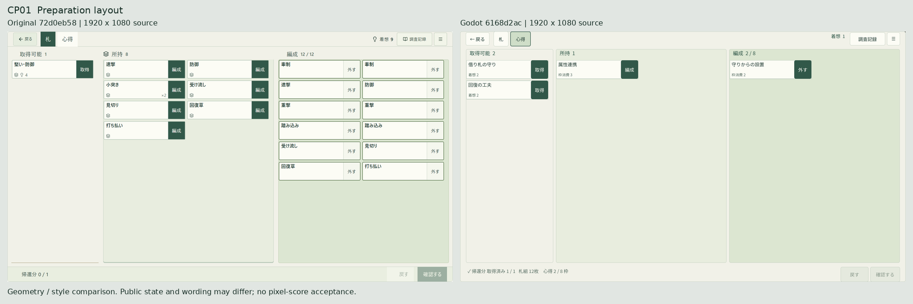
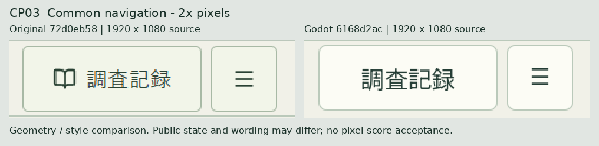
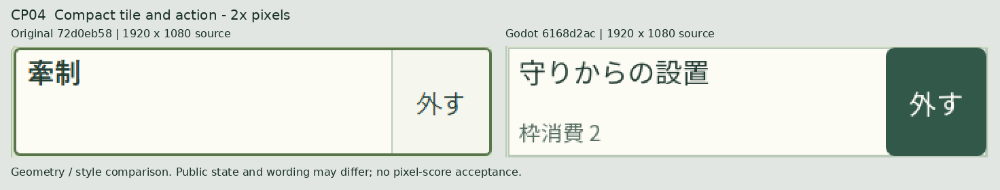
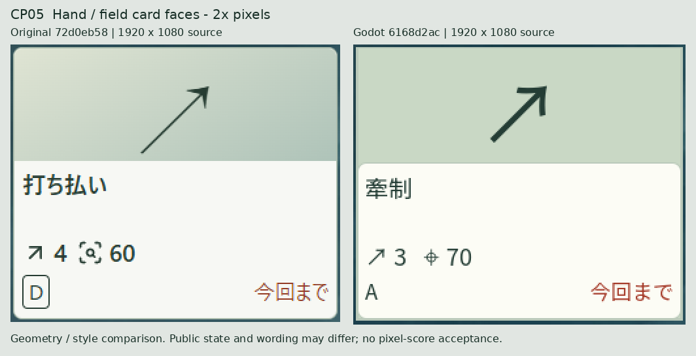
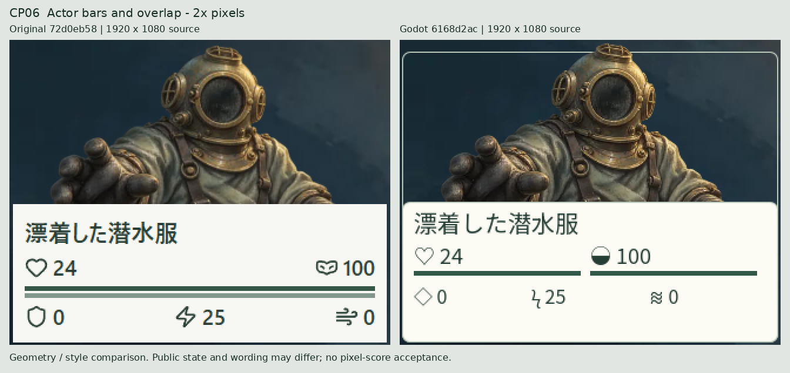
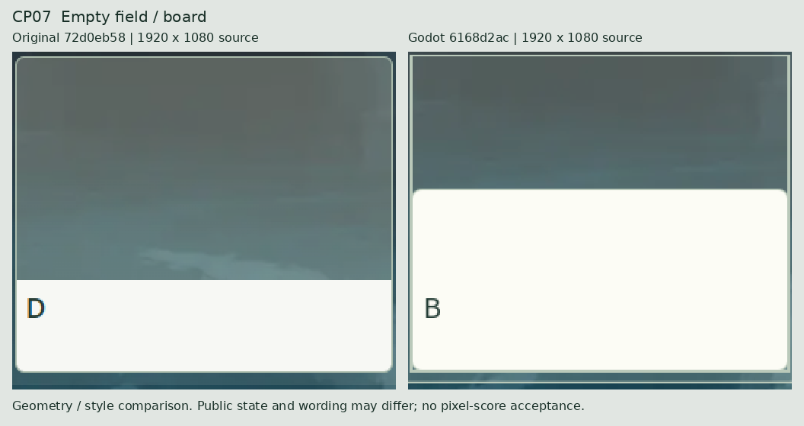
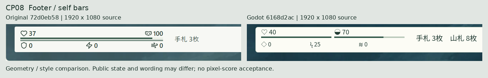

# 比較証拠

版：2026-10-04.1／2026-10-04（UTC）。原本 `72d0eb58c7e3d04759f1ab56a939d1dff20a46b2`、本編実装・証拠 `6168d2ac7ad66d8e707c51f2f3d7bf14fa123531`、提出 `0a4142cae97c0d6e3a56a943ad2e3cbe76ac5dc6`。

新しいサンプルやデザインを描いていない。原本2枚＋Godot53枚をGit blobのまま保存し、以下は閲覧用の並置／切出し。PNGは各1920×1080。左は原本、右は固定Godot。取得対象・名称・値が異なるため、同状態のピクセル差分試験とはしない。

## CP01 Preparation layout

倍率：0.5。対象差異：V-C03 V-P01 V-P02 V-P03 V-P12。

| 側 | 原寸PNG | crop x1,y1,x2,y2 | 元blob |
|---|---|---|---|
| 原本 | [preparation.png](evidence/reference/preparation.png) | [0, 0, 1920, 1080] | a830824ea1beeb6ff0746cd26413f85db7127f40 |
| Godot | [review-preparation-R02-mixed-committed.png](evidence/implementation/final-caption/review-preparation-R02-mixed-committed.png) | [0, 0, 1920, 1080] | 7c938edbe64877b78caec6596d020058faf38d0e |

## CP02 Exploration layout

倍率：0.5。対象差異：V-E01 V-E02 V-E03 V-E07 V-E12。

| 側 | 原寸PNG | crop x1,y1,x2,y2 | 元blob |
|---|---|---|---|
| 原本 | [exploration.png](evidence/reference/exploration.png) | [0, 0, 1920, 1080] | 3e4ed5b5c9c89b2a551b53bed0b241ba76500af5 |
| Godot | [natural-exploration.png](evidence/implementation/targeted-third/natural-exploration.png) | [0, 0, 1920, 1080] | f656079b8532cd8f267504df797d78a43bc2d005 |

## CP03 Common navigation - 2x pixels

倍率：2。対象差異：V-C01 V-C03。

| 側 | 原寸PNG | crop x1,y1,x2,y2 | 元blob |
|---|---|---|---|
| 原本 | [preparation.png](evidence/reference/preparation.png) | [1668, 0, 1910, 66] | a830824ea1beeb6ff0746cd26413f85db7127f40 |
| Godot | [review-preparation-R02-mixed-committed.png](evidence/implementation/final-caption/review-preparation-R02-mixed-committed.png) | [1668, 0, 1910, 66] | 7c938edbe64877b78caec6596d020058faf38d0e |

## CP04 Compact tile and action - 2x pixels

倍率：2。対象差異：V-P04 V-P05 V-P06 V-P07。

| 側 | 原寸PNG | crop x1,y1,x2,y2 | 元blob |
|---|---|---|---|
| 原本 | [preparation.png](evidence/reference/preparation.png) | [1168, 122, 1522, 204] | a830824ea1beeb6ff0746cd26413f85db7127f40 |
| Godot | [review-preparation-R02-mixed-committed.png](evidence/implementation/final-caption/review-preparation-R02-mixed-committed.png) | [1160, 123, 1516, 205] | 7c938edbe64877b78caec6596d020058faf38d0e |

## CP05 Hand / field card faces - 2x pixels

倍率：2。対象差異：V-E01 V-E04 V-E05 V-E06。

| 側 | 原寸PNG | crop x1,y1,x2,y2 | 元blob |
|---|---|---|---|
| 原本 | [exploration.png](evidence/reference/exploration.png) | [570, 686, 822, 898] | 3e4ed5b5c9c89b2a551b53bed0b241ba76500af5 |
| Godot | [natural-exploration.png](evidence/implementation/targeted-third/natural-exploration.png) | [569, 674, 823, 888] | f656079b8532cd8f267504df797d78a43bc2d005 |

## CP06 Actor bars and overlap - 2x pixels

倍率：2。対象差異：V-E05 V-E10 V-E11。

| 側 | 原寸PNG | crop x1,y1,x2,y2 | 元blob |
|---|---|---|---|
| 原本 | [exploration.png](evidence/reference/exploration.png) | [970, 86, 1294, 346] | 3e4ed5b5c9c89b2a551b53bed0b241ba76500af5 |
| Godot | [natural-exploration.png](evidence/implementation/targeted-third/natural-exploration.png) | [970, 86, 1294, 346] | f656079b8532cd8f267504df797d78a43bc2d005 |

## CP07 Empty field / board

倍率：2。対象差異：V-E03 V-E07。

| 側 | 原寸PNG | crop x1,y1,x2,y2 | 元blob |
|---|---|---|---|
| 原本 | [exploration.png](evidence/reference/exploration.png) | [966, 410, 1218, 632] | 3e4ed5b5c9c89b2a551b53bed0b241ba76500af5 |
| Godot | [natural-exploration.png](evidence/implementation/targeted-third/natural-exploration.png) | [966, 410, 1218, 632] | f656079b8532cd8f267504df797d78a43bc2d005 |

## CP08 Footer / self bars

倍率：1。対象差異：V-E10 V-E12。

| 側 | 原寸PNG | crop x1,y1,x2,y2 | 元blob |
|---|---|---|---|
| 原本 | [exploration.png](evidence/reference/exploration.png) | [0, 976, 660, 1080] | 3e4ed5b5c9c89b2a551b53bed0b241ba76500af5 |
| Godot | [natural-exploration.png](evidence/implementation/targeted-third/natural-exploration.png) | [0, 976, 660, 1080] | f656079b8532cd8f267504df797d78a43bc2d005 |

## 実画像の寸法と画素

| 部品 | 原本 | Godot | 根拠 |
|---|---|---|---|
| 取得可能1枚目の外形 | [19, 123, 352, 80] | [27, 124, 352, 80] | 原寸PNGの面・枠境界と固定コードの352×80を照合。角のAA領域は矩形外接で扱う |
| 編成1枚目 | [1170, 123, 352, 80] | [1162, 124, 352, 80] | 同じ名札ではないが同一種の352×80コンポーネント。CP04 |
| 手札1枚目 | [572, 688, 248, 208] | [572, 676, 248, 208] | 原寸上下境界＋MakeTile論理矩形。Godot枠strokeは左571へ1pxはみ出す。CP05 |
| 場1枚目上端 | 413 | 412 | 原寸PNGと枠境界。CP07 |
| 本人帯上端 | 983 | 984 | 原寸PNGの面境界。CP08 |
| 共通ナビ | [1680, 4, 152, 56] | [1680, 4, 152, 56] | 仕様座標と既存座標assert。図記号／文字／色は不一致。CP03 |

色の点採取RGBと座標、元blob、切出し倍率、全比較図hashは[comparison-evidence.json](comparison-evidence.json)。相対位置や枠線は画像とソースを併用。全画面の差率を0と断定する集計は行っていない。

## 証拠環境と不足

原本はEdge154.0.4258.37、viewport1920×1250、DPR1からゲーム要素1920×1080を撮影。OS・実解決font・窓外形は未記録。GodotはWindows11 build26200、4.7.2 mono、.NET SDK10.0.401/runtime10.0.12、論理／実窓1920×1080、NotoSansJP wght400、viewport-local合成InputEvent。

画像／ソース／実行manifestの対応と途中検査ソース差は[source-audit.json](source-audit.json)。final-recordsは取得した14ソース全一致。final-caption・final-detailsは検査クラス差、targetedの製品差は可否ラベル背景だけで、[差分実体](evidence/reviewfixes-source-delta.diff)を保存。全20modeが最終treeで再実行されたという記録にはしていない。

大きい原画home/story/returnは内容取得不能のままU-B01〜03。未描画の状態は[必要未確認](必要未確認.md)へ。拒否済みlocalhostやGit transportを再試行していない。
