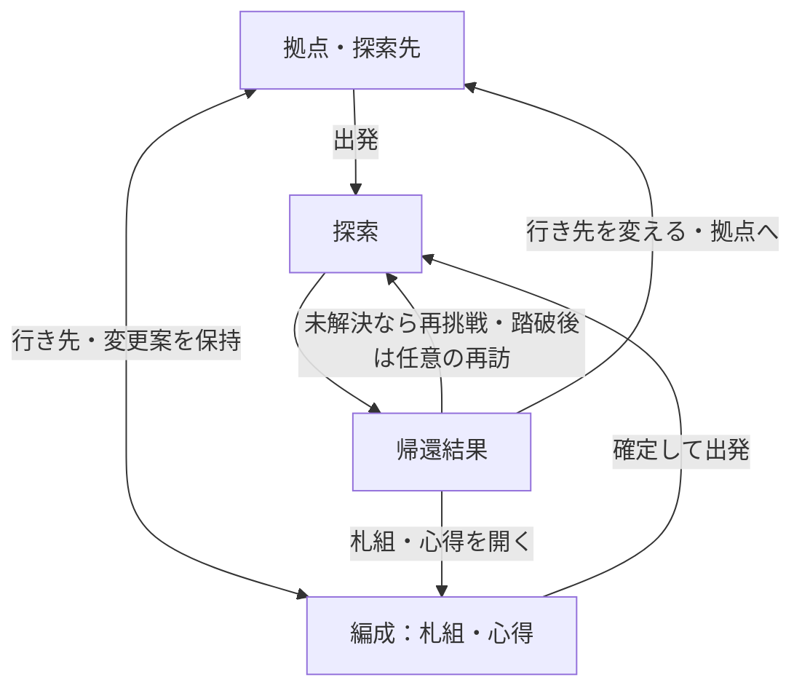

# 全画面構成 — 目的を済ませるまでの操作量

版：0.3／2026-09-16。UI-PLAN-001、Work `20260910-ui-readability`、枝 `ui/readability-20260910`。

状態：**全30項目＋条件待ち4候補の構成案。心得1画面・札組との円滑な往復・全体の操作量削減は受領済み要件。主経路を[操作試作0.2](co-u02/journey/README.md)へ具体化し、外枠固定・帰還後の主操作・調査記録を修正。全機能実装・物理操作量実測・画面受入・正式採用は未了。**

## 1. 見直しの基準

ユーザーの「同じ操作量の観点で全画面の設計を見直す」という依頼を受領。[画面機能要件](画面機能要件.md)の意味・公開範囲・更新境界を維持し、全項目について配置先、主操作、往復、確認、保持する文脈を見直す。機能IDは管理単位であり、独立ページの数ではない。

評価するのは、プレイヤーが目的を済ませるまでの一連の操作である。画面・タブへの移動、窓の開閉、対象選択、決定、探し直し、スクロール、処理待ちを分けて記録する。画面を減らした結果、巨大な一覧の探索や長いスクロールが増える案は再検討する。現在の試作の全操作を計測した記録はないため、削減率や「旧版より何回減った」という実測結果は示さない。

優先する経路は、①毎手の出札・対象指定、②繰り返す出発・帰還、③札組と心得の調整、④必要時の参照、⑤起動・設定・データ操作。これは使用頻度を想定した設計順であり、利用統計ではない。既に短い正式UIの操作は継承する。

## 2. 主な場面と共通の窓

| まとまり | 含める機能 | 基本の扱い |
|---|---|---|
| 拠点・探索先 | S03〜S05 | 拠点で行き先を選び、選択した依頼の要点を同じ場面で読む。そのまま出発、または選んだ行き先を保って編成へ |
| 編成 | S06〜S12 | 札組と心得を直接切替。所持・候補・比較・変換を対象別に内包。行き先・残高・変更案を共有し、途中の確定を挟まない |
| 探索 | S15、必要時のS14 | 正式UIの出札・予測・対象指定を維持。場面文と局面の変化を同じ探索の流れに置く |
| 帰還結果 | S16・S17 | 今回の変化を示す。未解決での離脱後は再挑戦、踏破後は拠点へを主操作にする。編成へ直接つなぐ。新しい通知の件数だけ確認ボタンを押させない |
| 起動の入口 | S01・S02・S26 | 通常は「続きから」の一つの選択で保存地点へ。新規開始・データ読込みは必要な時だけ開く |
| 共通の窓・状態 | S13・S18〜S25・S27〜S30 | 対象または短いメニューから開き、元の文脈へ戻る。参照・案内・保存完了を毎回必須の通過画面にしない |

主な行き来は次の案とする。名称と矢印は構成説明用で、画面の正式ラベルではない。

出発には本体の条件が必要で、未確定案や制限違反があれば該当箇所へ導く。場面文の停止や帰還確認など本体の進行を省略する図ではない。帰還から直接編集や出発へ進む場合も、既存APIの成功順に沿って処理する。

2026-09-16追加指示：窓を開閉しても外枠の縦横比を変えない。操作試作0.2は正式探索画面に合わせ16:9とし、長い本文だけ内部でスクロールする。同じ場所へ行く頻度は未決定であり、再挑戦を短くすることと踏破後に再訪を強調することを分ける。詳しくは[リザルト再検討](co-u02/journey/result-review.md)。

## 3. 全30項目の見直し

「省く操作」は今後の設計で避ける経路であり、現試作で必ず発生しているという測定結果ではない。経路IDのACT-01〜13は[機能要件9.1](画面機能要件.md)、ACT-14〜26は本書5節で定義する。

| ID・機能 | 配置・主操作の見直し | 省く操作 | 保持する判断材料・文脈 | 経路 |
|---|---|---|---|---|
| UI-S01 起動 | S02と一つの入口。通常の続行を直接選べる | タイトルからデータ画面を必ず経由する操作 | 新規と続行の区別、保存地点 | ACT-11・14 |
| UI-S02 データ選択 | 複数の選択が必要な時と読込・書出し時だけ展開 | 保存先が決まっている時の再選択、成功後の追加確認 | どの状態を開くか、読込結果、元データ | ACT-11・15 |
| UI-S03 拠点 | 行き先と編成・記録への入口をまとめる。既知の目的には直通経路 | 全操作のたびに拠点へ戻る往復 | 場所感、選んだ行き先、現在の資源 | ACT-01〜03・16 |
| UI-S04 探索先一覧 | 拠点内で選び、S05の要点を同時に更新する | 候補ごとの詳細ページ往復 | 選択・絞込み・位置、既知の攻略傾向 | ACT-02・16 |
| UI-S05 探索先詳細 | 選択中の依頼の要点を同じ場面に置く。長文・関連記録だけ任意の窓 | 毎回の受注・報告、必須の独立詳細画面 | 目的、解決状態、再訪時の変化、行き先 | ACT-02・16・17 |
| UI-S06 出発前の確認 | 編成の共通要約と出発操作に統合。違反があれば該当編集箇所へ | 編成後に同じ内容を確認する専用ページ、画面ごとの確定 | 実際に使う構成、変更案、行き先、差分と費用 | ACT-01・03・05 |
| UI-S07 札組 | 対象の近くで追加・除去・枚数変更。詳細は必要時に開く | 一枚ごとの詳細開閉、所持品画面との往復 | 札の識別、編成数、制限、変更案、一覧位置 | ACT-03・05・06・08 |
| UI-S08 心得の習得 | S09と同じ心得画面。対象を選んだまま習得・組み直し・使用を検討 | 習得後に装備画面で同じ心得を探す操作 | 対象の効果、支出・返還、外れる装備、下書き | ACT-04・05・07 |
| UI-S09 心得の装備 | 心得画面の装備欄と同じ対象一覧を使う | 別画面での再選択、入替ごとの確認窓 | 現装備、案、個体差、利用条件・制限 | ACT-04〜07 |
| UI-S10 所持品確認 | 札は札組、心得は心得画面へ内包 | 独立した所持品一覧を経由する操作 | 個体・数量・修飾・使用状態。無料札や知識との区別 | ACT-06・08・10 |
| UI-S11 取得候補 | 札組・心得内で現在のものと比較し、使用の意図まで指定 | 買い物・所持品・編成の巡回、取得後の探し直し | 同一の候補集合、価格、条件、本人の選択 | ACT-06・07 |
| UI-S12 変換 | 対象から数量・見積・実行を開く小さな確認 | 変換用の別一覧で対象を選び直す操作 | 失う個体と数、戻る額、利用中等の制約 | ACT-08 |
| UI-S13 調査記録 | 判明した相手・環境の基本構成、観測札、札性能を次の攻略に使う。対象からは該当項目を直接開く共通窓 | 記録のトップから分類と対象を辿り直す操作 | 初期構成と観測事実の区別、未知情報、関連項目、呼出元・位置 | ACT-13・17 |
| UI-S14 会話・場面 | 主本文を元の場面に重ね、任意詳細だけその場で開く | 本文ごとの別画面、読了確認と続行の二重指示 | 本文の意味、初回／再訪、実際に表示した範囲 | ACT-18 |
| UI-S15 探索 | 正式UIの出札・予測・対象選択を継承。最頻操作を対象付近に保つ | 毎手のメニュー巡回・確認窓、同じ対象の再指定 | 場・手札・対象・公開予測・次の判断に必要な状態 | ACT-09・19 |
| UI-S16 帰還結果 | 成果を見ながら次の目的へ直接進む。編集は編成側で行う | 受取済み報酬を一件ずつ承認する操作、必須の拠点経由 | 今回の成果・喪失・増減・進展。精算済みであること | ACT-01〜03・13 |
| UI-S17 進行通知 | 短い通知と該当一覧の更新。必要なら対象から詳細・使用先へ | 解放件数分の確認窓、通知を閉じてからの再検索 | 何が変わったか、見逃しても読める結果 | ACT-13・20 |
| UI-S18 札等の詳細 | 非固定窓は対象選択で内容を切替。比較と対象操作を近くに置く | 別対象を見るたびの「閉じる・開く」 | 対象との対応、比較基準、ピン状態、呼出元 | ACT-10・13 |
| UI-S19 対象・状況詳細 | 対象付近から開く。参照と攻撃対象の指定を区別 | 全体メニューから相手を探す操作 | 調べている対象、指定中の対象、公開状態 | ACT-10・19 |
| UI-S20 山札・回収山 | 一つの参照窓で公開された領域を切替 | 領域ごとの窓の開閉、探索画面からの離脱 | 領域・対象札・位置、公開範囲、編成との違い | ACT-21 |
| UI-S21 行動順 | 主体アイコンから直接参照。別主体への基準切替は同じ窓で | 行動順メニューを経由する操作、切替前の閉じる操作 | 公開順序と予測の限界、基準主体 | ACT-19 |
| UI-S22 目的・条件 | 必要な時に探索の短い入口から開く。達成は対象付近で通知 | 条件達成の承認窓、毎回の依頼本文の読み直し | 現在の条件・達成状況・分岐、未知情報の非公開 | ACT-22 |
| UI-S23 履歴 | 短い発生表示を維持し、帯から直接一覧を開く | 読むための探索離脱、共通メニューの深い階層 | 対象・作用・結果と順序、閲覧位置 | ACT-22 |
| UI-S24 撤退予告 | 撤退付近から任意に開く。実行は既存の明示操作 | 毎回必須の予告通過、追加の撤退確認 | 持帰り／喪失の対象、探索全体から撤退する意味 | ACT-23 |
| UI-S25 中断 | メニューから中断を指示し、保存成功を待って入口へ | 保存完了後の「了解」や終了確認の重複 | 同じ探索、保存結果、失敗時の状態と継続手段 | ACT-24 |
| UI-S26 再開要約 | 再開した元の場面に必要な要約を出し、詳細は任意参照 | 再開のたびの必須確認画面 | 場所・目的・状態。過去の成果を再獲得と見せない | ACT-11 |
| UI-S27 設定 | 元の場面に重なる窓。変更効果を試し、閉じて戻る | 調整ごとの別適用画面、拠点への強制帰還 | 変更値、元の選択・下書き・窓、反映状態 | ACT-25 |
| UI-S28 遊び方 | 文脈に合う短い案内と、必要箇所から開く任意の詳説 | 操作のたびの説明、ヘルプの最初からの辿り直し | 対象と操作結果の対応、元の作業 | ACT-26 |
| UI-S29 保存・読込状態 | 操作箇所で待ち・成功・失敗を示す共通部品 | 成功通知を閉じる操作、再試行前の入力し直し | 保存済みの範囲、元データ、下書き、未完了の操作 | ACT-12・15・24 |
| UI-S30 比較・実行不可 | 差分は編成内、不可理由は該当対象、個体喪失等はその場の確認 | 汎用エラー窓からの戻り、比較を閉じて同じ対象を探す操作 | 費用・失うもの・制限、確定境界、本人の選択 | ACT-03・04・06・08・12 |

S15・S18〜S24は正式UIの有効な操作を基準として維持し、共通接続と未対応範囲を補う。ピン止めした窓は別対象の参照で置き換えず、非固定窓だけを再利用する。窓を閉じる入力が背後の実行操作へ抜けないようにする。

## 4. 戻る・切り替える・決める

| 操作の区切り | 共通の振る舞い |
|---|---|
| 札組と心得を切替 | 片道1操作を目標とし、切替の確定は0回。共通下書きと各一覧の対象・絞込み・位置を保持 |
| 詳細や記録を閉じる | 呼出元へ一度で戻る。参照中に関連項目を辿っても、元の一覧を探し直さない。参照内の戻ると窓を閉じるは役割を分ける |
| 場面の主本文を続ける | 本文を見た後の明示続行を1回とし、別の読了確認を重ねない。任意詳細を開かなかったことは進行を妨げない範囲を既存仕様に従う |
| 案を編集する | 表示中の案へ反映し、費用と影響を公開プレビューで示す。タブ変更や窓を閉じることで確定・破棄しない |
| 確定して出発する | 指示の結果と費用が読める共通要約から実行。確定・出発の本体処理は順次成功を確認。単独の確定・編成後に出発しない使い方も残す |
| 個体を手放す | その対象・数量・見積に対する明示実行を残す。画面の往復は減らし、対象喪失の判断を省かない |
| 失敗から戻る | 入力と下書きを保持し、原因のある箇所へ直接移れる。再試行は既存の同一要求・古い応答排除を継承 |

画面内の移動に対する保持と、終了を越える保存は区別する。終了時に保持できる下書きは公開APIの保存成功範囲に従う。表示設定等も既存の対応項目から扱い、未採用のゲーム機能・保存枠・上書き操作を追加しない。

## 5. 全画面を補う行動経路

ACT-01〜13（再出発、編成、取得、出札、詳細、再開、失敗復帰、成果からの移動）を維持し、次の13経路を追加する。表の操作数は**設計上の目標**で、内容選択や一覧探索を除いた数字を総操作数として扱わない。

| 行動ID・目的／開始点 | 完了までの経路案 | 移動・確認の目標と条件 |
|---|---|---|
| ACT-14 初めて始める／起動 | 新規開始を選び、作成後の最初の場面へ | 安全に新規作成できる場合は開始指示1回。成功の了解0回。既存データを初期化しない |
| ACT-15 保存データを読み込む・書き出す／起動またはメニュー | データ操作を開き、対象を指定して明示実行。成功した保存地点または元の場面へ | 入口1回と必要な入力・実行。成功確認の追加操作0回。破損・非対応では元データを保つ。既存枠の上書きを新設しない |
| ACT-16 行き先を比べる／拠点 | 同じ一覧で候補を選び、要点を見て選び直す。決めたら出発または編成へ | 候補を変えるたびの詳細ページ往復0回。選択1回で要点を更新。複数候補は公開データがある場合に限る |
| ACT-17 関連する記録を読む／依頼・札・相手の詳細 | 対象の該当記録を開き、必要なら関連項目を辿って閉じる | 該当記録までの分類選択0回。開く1回・閉じる1回を目標。元の対象・案・一覧位置を復元 |
| ACT-18 場面を読んで進む／本文表示 | 主本文を読み、必要なら任意詳細を開き、続行する | 主本文後の続行1回。読了確認0回。任意詳細の開閉は必要時に数える。未表示本文の一括既読なし |
| ACT-19 相手・行動順を確認し、必要なら対象を変える／探索 | 対象や主体アイコンから参照し、攻撃先を変える時は明示指定して出札へ | 今の対象を使う時の再指定0回。変更時は指定1操作を目標。参照だけで攻撃先を変えない |
| ACT-20 複数の解放・進展を見る／出来事発生 | 変化を短く示し、任意に対象を開く。関連一覧にも結果を残す | 一件ごとの了解0回。見逃しても確認可能。通知を押さないと進めない待ちを作らない |
| ACT-21 山札と回収山を見比べる／探索 | 帯から参照窓を開き、公開された領域を切替、閉じる | 開く1回・領域切替ごと1回・閉じる1回を目標。切替ごとの窓開閉0回。公開されない内訳を補完しない |
| ACT-22 目的や直前の出来事を確かめる／探索 | 帯から目的または履歴を直接開き、確認して閉じる | 各入口から開く1回・閉じる1回。全体メニュー経由0回。元の対象・札選択へ戻る |
| ACT-23 撤退するか決める／探索 | 必要なら持帰り予告を見て、撤退を指示する | 撤退指示1回。予告は任意、必須の追加確認0回という現方針を継承。結果までの本文は別の場面操作 |
| ACT-24 中断する／探索・拠点 | メニューを開き、中断を選び、保存成功後に起動入口へ | メニュー1回・中断指示1回を目標。保存完了の了解0回。失敗時は元の場面で復帰・再試行 |
| ACT-25 設定を調整して戻る／任意の場面 | 共通の窓を開き、対応項目を変更して効果を確認し、閉じる | 窓を開く1回・閉じる1回と調整入力。項目ごとの別確認0回。元の場面と編集内容を保持 |
| ACT-26 操作方法を確かめる／操作対象またはメニュー | 文脈に対応する説明を開き、対象と作用を確認して元の作業へ | 関連説明へ直接開く1回・閉じる1回を目標。毎回の最初からの案内・必須再受講0回 |

出札のタップとドラッグ、詳細窓の閉じ方等は[正式UI](正式参照版.md)を継承する。目標回数のためだけに長押し・複数指ジェスチャ・小さな対象を増やさない。マウス・タッチ・キーボードで完了する経路を別々に確認する。

## 6. 条件待ち4候補の扱い

| ID・候補 | 操作量からの構成方針 | 前提 |
|---|---|---|
| UI-C01 地図・進路選択 | 現在地と選択可能な道を同じ探索内で扱い、進路選択のたびに拠点・独立地図を往復させない | 経路方式の採用後に検討。今回導入しない |
| UI-C02 素材・加工 | 使用対象から必要素材と結果を一緒に見て実行。素材・レシピ・完成品の別画面巡回を避ける | 用途・加工規則の決定後。新規レシピなし |
| UI-C03 同行・救出 | 相手と同行状態を現在の場面に結びつけ、変化はその場で示す | 同行の状態・操作条件の決定後。管理手順を新設しない |
| UI-C04 終幕・クリア後 | 結末とその後にできることを示し、再開先へ直接つなぐ | 全体の終点と継続条件の決定後 |

## 7. 接続と検証の境界

配置をまとめても、基礎習得・所持個体・装備・解放・知識は混同しない。UIは公開view・legal_actions・preview・executeを使用し、価格・保存・非公開の辞書を独自実装しない。購入・修飾・変換はD03の対応待ちを維持し、候補なしや資金不足と区別する。

帰還から直接出発する案は、必要な`ack_return`、`commit_preparation`、`depart`を既存の順序で実行する。帰還の基礎取消比較とack後の再検証も保全する。各処理の成功前に完了を表示せず、途中成功・途中失敗では実際の確定範囲と残った意図を示す。一括APIや原子的な巻戻しを仮定しない。

本文は実際に表示した適格本文だけを`continue_scene`の`advance:false`で記録し、任意詳細を自動既読にしない。検討上の主場面は新たなruntimeのphaseを意味せず、起動・復帰・場面の選択は本体の実状態に従う。

今後の画面確認では、各ACTについて、開始状態、対象件数、表示幅、入力手段、選択・窓・スクロール・決定・待ち、完了状態を記録する。1024／736／600／320pxとresize、少数／多数・長い名前・未対応・失敗時を対象とし、操作回数を減らしても対象・結果・確定境界が分からない案は採らない。既存の過去試験を今回の操作量検証に読み替えない。

## 8. 出典・作業範囲

開始時公開UI：`4c8ee502b78961e78b32ace95798172919ce9216`。local：`5b441e5829cfae98e581458ceda61a3fd367f358`、未保存差分なし。計画`b25e7abe423ff72f93aa858c42bc09ad9daf04b2`の最新全12blobを実ファイルと照合後、設計`7a0ce6fad3ce873638ad0e8d923c7559b420a6ed`の取込み済みを確認。計画0.6の別Work枠はCO-D02のまま変更しない。

根拠：[機能要件](画面機能要件.md)、[UI検討](UI検討.md)、[正式UI-R-002 v0.15](正式参照版.md)、[D02接続条件](../../接続条件/co-d02/README.md)、[CO-U02指示](../../../作業資料/とりまとめ/着手指示/CO-U02_実データ接続.md)。今回の全画面見直しはユーザーの追加指示による設計作業として実施し、画面制作を先行させない。

文書の全ID対応・ACT対応・参照・担当範囲・計画blobを確認して自枝へ保存する。コード・固定原本・ゲーム条件は変更せず、全画面の実装完了・操作量短縮達成・ユーザー受入とは扱わない。設計Work `20260909-design-assembly`へ対象コミット付きで確認・統合を依頼し、相手の受領や逆方向統合を先取りしない。今回の設計単位で区切り、UIの稼働枠を解放する。
