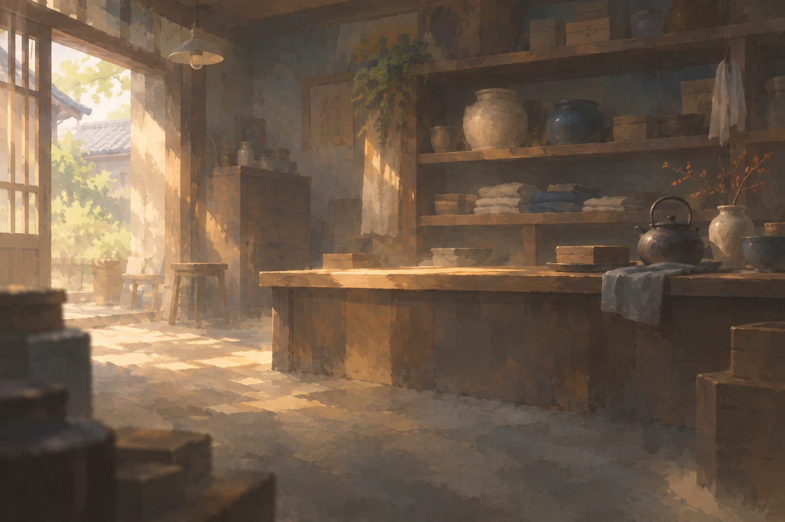
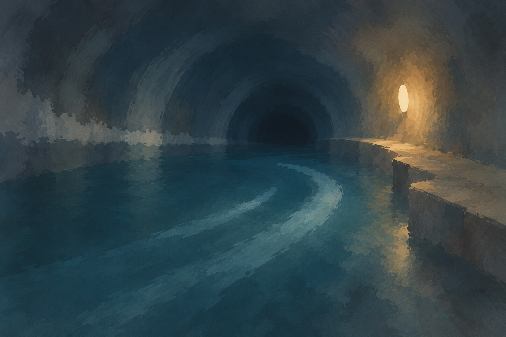

# CO-V01 初回背景2点の納品と確認

版：1.0／2026-09-20。Work `20260912-visual-direction`／枝 `design/visual-direction-20260912`。

対象は **CO-V01＋CO-V02の先行背景2点**。正式制作手順1.0に従う実装候補。用途条件、背景2点、原指示、出力確認、現行UIとの合成、受渡し資料を一式にした。依頼全体の保存・完了状況は [自Workのとりまとめへの引継ぎ](../../../作業資料/Work/20260912-visual-direction.md#coordination-handoff-co-v01) を参照。

2026-09-21 保存確認：成果 [`e22cc48`](https://github.com/eckolo/crossweave/commit/e22cc48e63c145be3d04c3e6cf382c2b60b5ec18) を自Workへ通常反映し、全内容と納品本文・画像blobを照合した。[保存確認記録](publication.json)。保存再開時の再生成・合成検査の再実行は0。

## UIへ渡す実用ファイル

両方とも生成原本を無加工で実用出力とする。コピー時のSHA-256一致を確認。PNGへ文字・数値・札枠・UI窓を焼き込んでいない。**下のPNGが素材本体**で、`確認用/`のスクリーンショットは実装しない。

| 素材ID／日本語名 | 原本＝実用出力 | 実測 | 表示時の指定 |
|---|---|---|---|
| VD-COV01-BG01 先代の古道具屋 | [antique-shop-background.png](../../../仕様案/ビジュアル・演出/素材/CO-V01/antique-shop-background.png) | 1536×1024px、3:2、PNG、RGB、1,887,829 bytes。アルファなし・不透明 | cover、50% 50%。拠点・準備用。内装案 |
| VD-COV01-BG02 夜潮の排水路／逆流する地下水路 | [night-tide-background.png](../../../仕様案/ビジュアル・演出/素材/CO-V01/night-tide-background.png) | 1536×1024px、3:2、PNG、RGB、2,033,779 bytes。アルファなし・不透明 | cover、50% 40%。SCN-001-S02と未解決の水路探索用 |

各原本のSHA-256：

- BG01：`44b8c2b5ce783363e002d07bfd4a98729d01405559cadcf5cfe14f9a7d68d6be`
- BG02：`39afc8d0831f20eae05fab0bca7d9b2ca41ce82c7944bbe518328272b1a526be`

### VD-COV01-BG01 先代の古道具屋 — 実装候補・内装案

### VD-COV01-BG02 夜潮の排水路／逆流する地下水路 — 実装候補

## 制作指示・用途条件・固定入力

- [用途条件表0.2](../../../仕様案/ビジュアル・演出/CO-V01_用途条件と初回背景.md)：UI-G-ART01〜05と今回追加の水路の対応、表示先、寸法、安全域、切抜き、透過、影、形式、文字、後続順序。
- 正確な生成指示：[BG01](../../../作業資料/ビジュアル・演出/制作元/CO-V01/VD-COV01-BG01.txt)／[BG02](../../../作業資料/ビジュアル・演出/制作元/CO-V01/VD-COV01-BG02.txt)。固定コミット `19695ce99c9b43261580e1f5263414accd539eb9`。
- 各生成出力の記録：[BG01](../../../作業資料/ビジュアル・演出/CO-V01/VD-COV01-BG01.json)／[BG02](../../../作業資料/ビジュアル・演出/CO-V01/VD-COV01-BG02.json)。元出力の所在、原本と実用ファイルの対応、実寸、形式、ハッシュ、正確な指示と参照画像のSHAを収録。
- 画像参照は正式手順1.0の [輪郭省略比較・下段③](../../../仕様案/ビジュアル・演出/見本/night-tide-lost-edges.png) のみ。店の構図や色を水路へ一致させる指示ではない。生成各1回、計2回。出力の再生成・修正・切抜き・リサイズ・透過加工は0。
- [出力・切抜き確認](asset-checks.json)、[UI出典と固定DOM](ui-source.json)、[実描画の測定](render-checks.json)。正式手順・世界観・設計・とりまとめ・UIの参照HEADは用途条件表と自Workに記載。

## 確認した範囲

| 確認 | 結果／証拠 | 適用範囲 |
|---|---|---|
| 画像ファイル | 2点のPNGを読み込み検証。指定1536×1024、3:2、RGB不透明。元出力とのSHA一致 | 原本と実用ファイルは同一。透過素材の試験ではない |
| 題材と描き方 | 店は暖色の暮らし・棚・机、水路は寒色の奥行き・水・足場・局所灯。少数の識別点を保持。人物・敵・解決内容・文字なし | 背景③の制作例。物の細部や小さな筆跡は一部残る。画風の量産再現性や個別画像の正式採用は未了 |
| 切抜きと余白 | 4幅の拠点／本文・探索の矩形を計算。水路は50% 40%に変更し、灯りと足場を保持。上下の天井・前景は切抜き許容 | 文字の背後へ隠れる部分はある。任意の別比率への適合は保証しない |
| UIとの合成 | UI0.11.1の表示コードと自然保存から4場面×4幅の静止DOMを取得。明暗2配色で32描画。全32件で16:9の枠と背景画像を確認。背景領域は用途表と一致、全32件で外枠の横はみ出しなし | **Chromiumでの静止合成の実描画・実寸測定**。現行ゲームへの素材導入・ゲームの実操作試験とは別 |
| 文字・数値・窓 | 本文、着想、札の数値、詳細窓を背景へ重ねた8画像を目視。読み取りを背景の線や色だけに依存させない。元の可読性用グラデーションを保持 | 背景を隠す量は明配色で大きい。320px本文はUIが背景の大半を覆う。採用判断や全端末の可読性判定ではない |
| UI側へ渡す確認点 | 静止合成の準備・詳細窓で、下端の操作が一部切れて見える。最狭幅の本文は内部スクロール前提 | JSDOMで作った窓位置を静止化しており、実ブラウザーでの動的再配置は未実行。素材導入後にUI担当が再確認する。本Workで配置や操作を変更しない |

店の細かな筆跡、瓶・やかんの一部の縁は比較参照の最も省略した部分より明瞭。水路の足場・水の帯は周囲より明確に残る。初回の実用条件への接続例として提出し、今回の2点のために正式手順を再選択しない。

## 日本語名付きの確認表示

[場面・幅・明暗を切り替える合成HTML](確認用/index.html)。画面部分は静止DOMで、ゲームのボタンは動かない。本文欄などのCSSスクロールと確認用の切替は別。実プレイヤーのセーブへ接続しない。

| 場面 | 明配色 | 暗配色 |
|---|---|---|
| 先代の古道具屋／拠点 1024px | [確認画像](確認用/hub-1024-light.png) | [確認画像](確認用/hub-1024-dark.png) |
| 先代の古道具屋／準備と詳細窓 1024px | [確認画像](確認用/deck-1024-light.png) | HTMLの切替で参照 |
| 夜潮の排水路／本文 1024px | [確認画像](確認用/entry-1024-light.png) | [確認画像](確認用/entry-1024-dark.png) |
| 夜潮の排水路／探索 1024px | HTMLの切替で参照 | [確認画像](確認用/explore-1024-dark.png) |
| 最狭幅320px | [古道具屋／拠点](確認用/hub-320-light.png) | [水路／本文](確認用/entry-320-dark.png) |

合成画像上部の日本語名・「実装候補」は確認表示のラベル。実用PNGの一部ではない。画像自体の原本は無加工、合成時だけCSSのcoverと既存UIのグラデーションを適用した。

## UI・設計・とりまとめへの受渡し

| 受け手 | 入力と次に行うこと |
|---|---|
| 設計Work `20260909-design-assembly` | 自枝保存成果を確認して `dev_design_tmp_assembly` へ統合。背景2PNG・用途条件・確認資料・原指示が対象。正式な画像採用や画面への接続済みとは扱わない |
| UI Work `20260910-ui-readability` | 上表の実用PNG2点を使用候補として受領。拠点／本文は `.cj-backdrop`、水路探索は `#cw-scene-base` が候補。仮のアーチ子要素は表示せず、探索の既存疑似背景は `data-illustrated="true"` に対応。元の可読性用被せ・文字・数値・枠を保持する。準備一覧への共用は背景層の接続が必要。デモの `data-vd-asset` は確認用で、正式の状態分岐を新設する指定ではない |
| UI Work：状態条件 | 水路はS02／未解決の初期水路用。港・水門・解決後・再訪・帰還へ一律適用しない。帰還の小景UI-G-ART05は現行未使用のまま。原本への文字焼込み・引伸ばし・任意の追加トリミングを避ける |
| UI Work：導入後の確認 | 実際の素材URL・レイヤー・状態分岐、詳細窓の動的再配置、最狭本文のスクロールと操作、背景を隠す既存グラデーションの強さを確認。正式画像導入後のまとまったユーザー所感確認へ進む |
| とりまとめWork `20260913-project-coordination` | [自Work内の引継ぎ](../../../作業資料/Work/20260912-visual-direction.md#coordination-handoff-co-v01)を受領し、今回の依頼範囲の完了を確認する。CO-V02全素材・動き・人物素材・UI実装・ユーザー採用は後続として区別する |

引継ぎの作成・保存と、設計・UI・とりまとめによる受領・統合は別。現時点では受領未確認。本Workから逆方向統合は行わない。

## 再現条件と残る範囲

Node24.19.0／JSDOM26.1.0で固定UI `ac610be...` の公開表示を生成し、Chromium153.0.8010.0、Noto Sans JPの日本語フォールバック、DPR1で静止合成を描画した。外部通信は遮断し、メモリー上へHTMLと画像を渡した。新たなサーバー、プレイヤーの保存領域、本体のコード変更はない。

`build-confirmation.mjs`は `UI_REPO` と `CW_JSDOM_PATH` を受け取り、固定チェックアウトから静止DOM・CSS・合成HTMLを作る。`verify-render.mjs`は `CW_PLAYWRIGHT`、`CW_CHROMIUM`、任意の `CW_CHROMIUM_MODULE`（この実行では@sparticuz/chromium153.0.0）を受け取り、HTMLをメモリー上で描画する。初回の古い展開済みChromiumは起動せず、通常の取得もタイムアウトしたため、既存の正規パッケージの圧縮実体を自作業先へ展開して復旧した。失敗した起動を検証実績には含めない。

未実施：UI枝への本体導入、実マウス・タッチ操作、動的窓配置、IndexedDB永続保存、ユーザーの個別画像採用、透過アイコン、潜水服の独立素材、逆流を伝える動き、反復生成の再現性。これらは今回の初回背景2点の提出範囲の後続であり、条件表のみで終えたという意味ではない。
