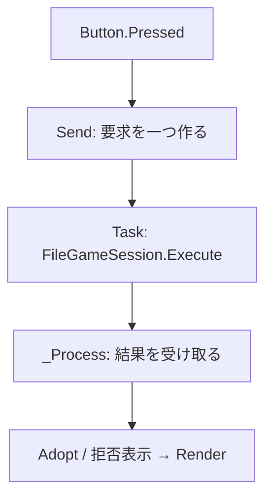

# Godot未経験者のための本編接続コード解説

対象はD04B-UI-01／RD-SAVE-02B。コードSHA `dad99fbc820cc4a49164faac3260c0a1d5d95d0b`。パスはすべてリポジトリルート相対。まず `apps/crossweave-godot/README.md` の順序でCoreとファイル保存を読み、その後この資料へ進む。

## 1. どれがGodotで、どれが本作なのか

Godotは画面に置く部品・入力・毎フレームの呼出しを提供する。C#はそれらを記述する言語、.NETはTaskやJSON、ファイル処理を提供する。本作のルールや保存の意味は、自分たちで作ったCoreとInfrastructureが担当する。

| 区分 | この実装で使うもの | この実装には含まれない意味 |
|---|---|---|
| Godot標準 | Node、Control、Button、Label、ScrollContainer、Theme、PackedScene、_Ready、_Process、_Input、_GuiInput、_Draw、signal、user:// | 所持・着想・帰還精算・要求再送などのゲーム規則 |
| C#・.NET | partial class、record、nullable、Action／Func、ラムダ、Task.Run、JsonObject、IDisposable、File、Path | どの操作で保存するか、どの表示を正しい状態とみなすか |
| 本作独自 | GameApplication、GameCommand、ApplicationDto、FileGameSession、PointerGesture、GameScreen、ViewData、UiAutomation | Godotの標準APIではない。名前が似ていても、他のGodot作品に自動である機能ではない |

特に `Render()`、`Adopt()`、`Send()` は本作のメソッド。Godotが同じ名前を見つけて自動呼出しするわけではない。`_Ready()`、`_Process()`、`_Input()`、`_Draw()` などのoverrideがGodotからの入口である。

## 2. 最初のsceneから読む

読むファイル：

1. `apps/crossweave-godot/Godot/project.godot`
2. `apps/crossweave-godot/Godot/Main.tscn`
3. `apps/crossweave-godot/Godot/Application/AppEntry.cs`
4. `apps/crossweave-godot/Godot/Application/GameScreen.cs`

`project.godot` の `run/main_scene` は、F5や通常起動で最初に開くscene。sceneはNodeの構成を保存したGodotの資源で、今回のMain.tscnはControl一つにAppEntryを付けている。Nodeは画面と処理の木の一要素、Controlはその中でGUIのサイズ・位置・マウス・フォーカスを扱う種類。

AppEntryの `_Ready()` は、Nodeがscene treeへ入り子の準備が済んだ時に呼ばれる。通常はGameScreenを一つAddChildする。過去のproof引数だけは別の `apps/crossweave-godot/Godot/Proof.tscn` をInstantiateする。代表試作の3札モデルを本編へ取り込んだわけではない。

GameScreenの `_Ready()` でフォントとThemeを設定する。同梱可変フォントの既定は極細100なので、Godot標準FontVariationで通常ウェイト400を明示する。続いて、`ProjectSettings.GlobalizePath("user://saves/local/m1.json")` で保存先を絶対パスへ変換する。`user://` はGodotの仕組みだが、`saves/local/m1.json` という配置を選んだのは本作。CoreはGodotのパスを知らない。

**この節の確認点**：新規開始のボタンを押す前にGameApplicationを作っていない。診断後、利用者が新規／再開を選び、FileGameSessionが初期保存または読込みに成功して初めて本編を採用する。

## 3. 一つの状態を持ち続ける

`GameScreen.Session` がFileGameSessionの寿命を持つ。拠点・準備・探索・帰還へ移るたびにnewしない。`Screen` は表示する画面の名前で、ゲームの確定phaseそのものとは別。

`View` はInspectやExecuteが返す公開情報のコピー。`Plan` は準備画面の未払い編集案。`selectedCard`、`selectedTarget`、詳細窓、スクロール位置、gestureは画面上の一時状態。これらを保存DTOの原本にしない。

C#の `partial class GameScreen` は一つのクラスを複数ファイルに分ける記法。同じ名前でも、Layout／Preparation／Explorationが別のsessionを持つわけではない。

| ファイル | 主な読みどころ |
|---|---|
| `apps/crossweave-godot/Godot/Application/GameScreen.cs` | Sessionの所有、開始、要求、保存結果、終了 |
| `apps/crossweave-godot/Godot/Application/GameScreen.Layout.cs` | 共通ノード、開始・拠点・帰還・確認窓 |
| `apps/crossweave-godot/Godot/Application/GameScreen.Preparation.cs` | 未払い案・三領域・予測・取得・変換 |
| `apps/crossweave-godot/Godot/Application/GameScreen.Exploration.cs` | 主体・場・手札・本文・ポインター操作 |
| `apps/crossweave-godot/Godot/Application/ViewData.cs` | 公開JSONを読む補助、表示用の金額・日本語エラー説明 |

ViewDataのMoneyは100分の1単位を文字列へ整えるだけで、支払い額を算出しない。価格や効果の計算はCoreが担当する。

## 4. Buttonから本編へ届くまで

`GameScreen.Layout.cs` のButtonメソッドを読む。ButtonはGodot標準ノード。`button.Pressed += ...` はsignalにC#の処理を接続する。右辺のラムダは「押した時にすること」を後で呼べる形で渡している。

例として出発ボタンは `Send("depart", {case_id: "SCN-001"})` を呼ぶ。Sendは現在のViewからrevisionとview_tokenを取り、新しい意図にだけRequestIdを発行する。GameCommandの型・departという命令の意味は本作独自。

FileGameSession.Executeの先は既存02A。Coreが候補状態を計算し、保存境界が実ファイルへ確定できた時だけCoreの所有メモリーが交換される。Godotは候補DTOを書かず、戻ってきた結果を扱う。

**この節の確認点**：Buttonが所持数や着想を直接増減していない。表示前の支払い、画面の再表示による帰還精算もない。

## 5. 保存中も描画し、Nodeを別スレッドから触らない

`GameScreen.Begin()` と `_Process()` を対で読む。FileGameSessionのAPIは同期なので、そのままPressed内で長く実行すると描画も止まる。そこで.NETのTask.Runで純C#の保存処理を一件だけ実行する。

workerへ渡すのはsessionと命令などの.NET値。GodotのNode、Control、Textureをworkerで操作しない。完了したTaskの結果を毎フレームの `_Process()` で受け取り、そのメインスレッド上でView交換・画面再生成を行う。

`operation != null` がBusy。Busy中はボタンを無効にし、Sendも重複要求を作らない。描画と「終了したい」という要求は受け付ける。終了要求が来た場合はcloseRequestedに記憶し、保存結果を受け取った後にAskCloseへ進む。

Godot公式の採用版資料：

- https://docs.godotengine.org/en/4.7/tutorials/performance/thread_safe_apis.html — active scene treeの操作はthread safeではない。
- https://docs.godotengine.org/en/4.7/classes/class_control.html — GUI入力、位置、mouse_filterなど。
- 固定Godot.NET同梱 `GodotSharp/Api/Debug/GodotSharp.xml` の `Node.NotificationWMCloseRequest`、`SceneTree.AutoAcceptQuit` も確認した。自動終了を止め、閉じる通知を保存寿命へ接続する。

これらはGodotの制約。Task一件＋_Processで結果交換という方式は本作が選んだ接続設計であり、Godotから強制された唯一の書き方ではない。

## 6. 保存結果で分岐する理由

`ExecuteLast()` の分岐を読む。成功／失敗だけでは、置換後に読めなくなった場合を正しく扱えない。

| 結果 | メモリーと画面の扱い | 次の操作 |
|---|---|---|
| committed | 新View全体をAdopt | 通常操作へ |
| replayed | 保存済みの同じ要求。新View全体をAdopt | 二重課金・二重行動なし |
| rejected | 旧Viewと未払いPlanを保持 | 同じ命令の再試行、または編集を続ける |
| indeterminate／blocked | staleとして通常操作を止める | 保存の読直し・再起動 |

再試行はExecuteLastを呼び、同じGameCommandを使う。Sendを再度呼んで別のRequestIdを作らない。Reloadは画面案を失う確認を出してからFileGameSession.Reloadを実行する。その後に同じ要求を照合すると、既に保存された要求ならCoreの履歴によりreplayedになる。

AdoptはViewだけでなくPlan・予測・選択も入れ替える。公開個体handleはそのrevisionの表示用参照なので、古いhandleに新しいtokenだけを付けると違う個体を指す危険があるため。

## 7. 準備は「編集」と「確定」を分ける

`Stage()`、`Unstage()`、`Compose()` はEditPlanを通じてローカルPlanだけを変える。価格・支払い・容量はRefreshComparison→PreviewPreparationの結果を見る。無効な途中案でも入力内容を捨てず、Coreの理由を表示する。

所持は公開blueprint.keyによる同種の集約で、未払い・ロック・変換可否の違いは分ける。表示枚数をまとめても、命令へ渡すのは代表一個体の公開ID。個体が移動すると次の個体が代表になる。

確認窓の「確定する」がcommit_preparationを送る。一括確定後に返ったViewで全体を作り直すため、未払いのpending IDを名前から正式IDへ推測で置換しない。ロックと変換は確定状態への別命令であり、未確定案がある間は操作を止める。

心得の日本語説明は `apps/crossweave-godot/Core/Application/Preparation.cs` のPassiveDetailsへ追加した。すでにある合成済みパラメータと採用済み表示名から作る。UIが修飾効果や枠を再計算する必要はない。DTO・ルール・価格は変わらない。

## 8. 探索の入力と描画を追う

CardTileはGodot Controlを継承し、 `_GuiInput()` で札の入力を受ける。GameScreenの `_Input()` はドラッグ中の全体移動・放し・Esc・右クリックを処理する。座標はviewportの1920×1080基準。

PointerGestureは `apps/crossweave-godot/Core/PointerGesture.cs`。Godot標準ではなく、既存の本作共通判定器である。220ms未満の短い入力は選択、保持前の12px以上の横移動はスワイプ、保持後はドラッグ。120msから保持中の表示を出す。時間にはGodotの単調時刻Time.GetTicksMsecを渡す。

選択すると公開legal_actionsからchoiceを取りPreviewActionを呼ぶ。結果は公開されたactor_changes、field_after、current_reservations_afterなど。予測中に本編の乱数や保存は進まない。対象が複数なら主体を選び、関係線と予測を確認して確定する。

InteractionCanvasの `_Draw()` は線・保持の円・ドラッグ像を描くだけ。MouseFilter.Ignoreなので下の札・Buttonを遮らない。CardTileの `_Draw()` も背景と枠だけ。文字はLabel、スクロールはScrollContainerというGodotの実ノード。TextureRectではExpandMode.IgnoreSizeをSizeより前に設定する。逆順だと元画像の最小サイズにSizeが拡大され、後からIgnoreSizeにしても戻らないため。

Renderでは古い子をRemoveChildしてからQueueFreeする。QueueFreeはフレーム末の解放予約なので、先に入力対象から外す。スクロール位置を記憶し、ひとつのViewから表示を再生成する。Render自体はExecuteもsave_draftも呼ばない。

## 9. 本文・帰還・終了

StoryReaderは段落のLabelをScrollContainerへ置く。RecordVisibleParagraphsは実際に表示領域へ来た段落を記憶する。ContinueStoryは公開sceneのtext_ids／optional_text_idsに含まれるものだけを送る。目的表示は別種の情報で、読了本文として送らない。Inspectしただけで未閲覧の任意本文を全部読了にしない。

ReturnScreenはすでにCoreが精算したreturnを表示する。本文が残れば進め、終わったらack_returnで拠点へ戻る。再訪・再挑戦は同じSessionでack_return→departを順に確定する。二操作の間で中断しても、確定済みの拠点状態が保存として残る。

終了の `_Notification(NotificationWMCloseRequest)` はAskCloseへ。未確定案があれば確認し、保存中なら完了を待つ。CloseはDispose後にSceneTree.Quitする。探索中でもwithdrawを送らない。backup復旧は最大一操作分の巻戻しと原本保全を説明した上で、利用者の明示操作で行う。

## 10. 検査コードは何をしているか

`apps/crossweave-godot/Godot/Application/UiAutomation.cs` は通常起動で生成されない。専用引数と隔離保存先がある時だけ動き、GetViewport().PushInputで実Controlの位置へInputEventを送る。ボタンのコールバックを直接呼んで成功扱いにはしていない。

旧160操作のfixtureから同じ操作意図を画面へ入力する。各命令について操作前DTOから独立したメモリーCoreへ同じ実命令を実行し、予測される確定DTOと、画面Session・実ファイルのDTOを照合する。ランダムなview_nonceだけは比較用に除く。要求履歴・乱数・所持・精算は比較に残す。本文は実表示に基づくため、旧fixtureの全読了フラグを無理に同じにしない。

自然初回とは別に合法取得fixtureを使い、通常ではまだ利用できない有料取得・変換を確認する。保存前失敗／置換後の成否不明／保存待機は02Aの内部故障点を使うが、実ファイル操作はそのまま行う。別プロセス再開では終了時DTOと完全一致を確認し、次の行動結果・乱数の続きも比較する。

`apps/crossweave-godot/UiProbe/verify.py` は固定ツールの取得、ビルド、Godot起動、別プロセス、証拠manifestをまとめる。`.github/workflows/d04b-ui-save-01.yml` が同じ入口をWindows runnerで使う。実測と未確認は `docs/検証/本編実装/d04b-ui-save-01/確認結果.md` を参照。CI成功は実マウスや実機のGPU性能の合格ではない。
